# Documentación — Obligatorio IA, Marzo 2026

**Materia:** Inteligencia Artificial — Ingeniería en Sistemas — Universidad ORT
**Entrega:** 06/07/2026
**Alumno:** Juan Cortabarría

> Este documento acompaña la entrega y deja registro del razonamiento, decisiones de diseño, justificación de hiperparámetros y resultados de cada paso. Se construye de forma incremental junto al código.

---

## 1. Contexto y consigna

La empresa ficticia *Red Destination™* nos contrata para implementar el agente inteligente del rover marciano "Out for Delivery". La consigna se divide en dos proyectos independientes:

- **Proyecto LOST** (Learning-based Orientation and Steering for Traversal): aprender a controlar el rover en `MountainCarContinuous-v0` (Gymnasium) usando **Q-Learning** tabular, con un componente de investigación que pide implementar **Dyna-Q** (Sutton & Barto, cap. 8.1–8.2).
- **Proyecto MATE** (Martian Adversarial Tactics Engine): implementar un agente para el juego *Isolation* usando **Minimax + Alpha-Beta** y **Expectimax**, con funciones de evaluación experimentables.

Como el grupo es de **2 personas**, no hay tarea adicional (Stochastic Q-Learning / MCTS quedan fuera de alcance).

### Por qué el problema es difícil

`MountainCarContinuous-v0` tiene un reward muy *sparso*:

- `−0.1·a²` por cada step (penalización por gastar energía).
- `+100` solo cuando se llega a la meta `x ≥ 0.45`.

Con política aleatoria el carro casi nunca llega a la cima — el agente cae en la "trampa de no hacer nada" (moverse cuesta energía y la meta casi nunca se alcanza). Eso justifica las decisiones centrales: **discretización adecuada**, **exploración prolongada (ε alto, decay lento)** y, sobre todo, **inicialización optimista** — la palanca que permite aprender con la **recompensa real**, sin modificar el ambiente (el reward shaping queda como un *extra*; ver §2).

---

## 2. Proyecto LOST — Mountain Car Continuous

> **Nota sobre el enfoque.** Una primera versión de este proyecto se apoyaba en *reward
> shaping*. Siguiendo la devolución de la cátedra (no es aceptable modificar las
> recompensas: equivale a cambiar el ambiente), se rehízo todo con la **recompensa real**.
> El hallazgo fue que la palanca para aprender no era el shaping sino la **exploración**
> (inicialización optimista). El shaping quedó como un **extra** (§2.10).

> **Notebook espejo.** Todo este §2 tiene su presentación interactiva en
> [`continuous_mountain_car.ipynb`](MountainCarContinuous/continuous_mountain_car.ipynb), que
> carga los artefactos y los muestra. Su intro incluye un **mapa de secciones notebook↔informe**.
> Correlato: §2.3→NB 1, §2.5→NB 2, §2.5.1→NB 2.1, §2.6–§2.7→NB 3, §2.9→NB 4 y 6, §2.8→NB 5, §2.10→NB 7, §2.11→NB 8.

### 2.1 El problema y por qué es difícil (la "trampa de no hacer nada")

En `MountainCarContinuous-v0` un auto en un valle debe llegar a la bandera de la cima. El motor **no tiene fuerza suficiente** para subir de frente: la única solución es **balancearse** (ir hacia atrás para tomar impulso y luego subir). La recompensa es **muy escasa (sparse)**:

- `−0.1·a²` por cada paso (penalización por gastar energía),
- `+100` solo al llegar a la meta (`x ≥ 0.45`).

Esto crea un problema de **exploración** (la clásica *hard exploration* de MountainCar): con exploración **ε-greedy al azar**, el agente **casi nunca descubre** el balanceo que lleva a la meta —en nuestras mediciones, **0–2 veces en todo el entrenamiento, aun con 10.000 episodios**—, así que **no tiene experiencias exitosas de las que aprender**; y como moverse cuesta energía, su política por defecto colapsa a **"quedarse quieto"** (acción 0, costo 0).

> **Aclaración importante (y respuesta a una observación de la cátedra):** esto **no se arregla con más episodios**. Lo verificamos entrenando hasta **10.000 episodios** (ε-greedy estándar): sigue en **0 %**, porque el agente **sigue sin llegar a la meta** (ver §2.5.1). Es un problema de **exploración**, no de cantidad de entrenamiento. **Q-Learning SÍ resuelve el ambiente** — lo que hace falta es una **exploración adecuada**, que conseguimos con **inicialización optimista** (§2.5), una técnica **estándar de Q-Learning** (no es otro algoritmo ni un cambio de recompensa).

### 2.2 Modelado como MDP

| Componente | Decisión |
|---|---|
| Estado | observación continua `(x, v)` → discretizada a índices de grilla |
| Acciones | fuerza continua `a ∈ [−1, 1]` → discretizada a N acciones |
| Transición | desconocida para Q-Learning; **Dyna-Q la aprende** como modelo tabular |
| Reward | el **real** del ambiente (sin modificar) |
| Fin | `terminated` = llegó a la meta; `truncated` = corte por límite de pasos (999) |

### 2.3 Discretización — `discretization.py`

Q-Learning tabular necesita espacios finitos. La clase `Discretizer` parametriza `n_bins_x`, `n_bins_v` y `n_actions`.

**Decisiones y por qué:**
- **Cortes uniformes** con `np.linspace` + `np.digitize`: simple, predecible y reproducible. Cuantiles (sklearn) tendrían sentido si la distribución de estados fuese muy desbalanceada, pero el auto recorre todo el rango con razonable uniformidad.
- **`state_shape = (n_bins + 1, …)`**: `np.digitize` puede devolver el índice `len(bins)` en el extremo; el `+1` evita un *off-by-one* en el tamaño de Q.
- **Número impar de acciones** (3, 5, …): garantiza la acción **`0.0` (no empujar)**.
- Se parametriza en una **clase** para comparar resoluciones en el grid sin reescribir el agente.

Se exploraron **discretizaciones diversas** (gruesa 20×20×3, media 40×40×5, fina 60×60×7); ver el impacto en §2.7.

### 2.4 Q-Learning — `q_learning_agent.py`

Regla de actualización off-policy TD (QL.pdf slide 6; Sutton & Barto 6.5):

```
Q(s,a) ← Q(s,a) + α·[ r + γ·max_a' Q(s',a') − Q(s,a) ]
```

**El núcleo del loop (para no abrir el archivo):**

```python
def _epsilon_greedy(self, state):
    if random.random() < self.epsilon:                       # explorar
        return random.randint(0, self.discretizer.n_actions - 1)
    return int(np.argmax(self.Q[state]))                     # explotar (greedy)

# ... por cada paso real:
action_idx = self._epsilon_greedy(state)
next_obs, reward, terminated, truncated, _ = env.step(self.discretizer.action_from_idx(action_idx))
next_state = self.discretizer.get_state(next_obs)
future = 0.0 if terminated else float(np.max(self.Q[next_state]))   # ← terminated/truncated
self.Q[state][action_idx] += self.alpha * ((reward + self.gamma * future) - self.Q[state][action_idx])
```

**Decisiones de diseño:**
- **Q-Learning (off-policy) y no SARSA**: permite explorar con ε alto sin que esa exploración deteriore la política objetivo (siempre la greedy).
- **ε-greedy con decay exponencial por episodio** (no por paso): decaer por paso apaga la exploración demasiado rápido. Con `ε₀=1.0`, `decay=0.999`, la exploración dura cientos de episodios.
- **`terminated` vs `truncated`** (API Gymnasium ≥0.26): el bootstrap futuro es `0` **solo** si `terminated` (estado terminal del MDP = meta); si `truncated` (timeout de 999 pasos), `s'` **no** es terminal y se bootstrappea normal (`γ·max Q(s')`). Tratar `truncated` como `terminated` sesga `Q` hacia abajo.

### 2.5 Aprender sin tocar la recompensa: inicialización optimista (la palanca)

Para salir de la "trampa de no hacer nada" sin modificar la recompensa, la técnica legítima es la **inicialización optimista** (Sutton & Barto §2.6): arrancar la tabla Q en un valor alto hace que las acciones **no probadas** "se vean mejores", forzando al agente a **explorarlas sistemáticamente** → muchas más chances de tropezar con la meta.

> **Intuición:** es como un explorador **optimista** que asume que detrás de toda puerta que todavía no abrió hay un tesoro. Esa expectativa lo obliga a abrir **todas** las puertas (probar todas las acciones en cada estado) al menos una vez antes de conformarse con lo que ya conoce. Recién cuando comprueba que una acción no da lo prometido, su valor `Q` "baja" al valor real. Así la exploración deja de ser pura suerte (ε-greedy al azar) y pasa a ser **sistemática**.

```python
# Q(s,a) arranca en `optimistic_init` (en vez de 0): exploración estructurada.
self.Q = np.full(discretizer.q_shape, optimistic_init, dtype=np.float64)
```

**Evidencia (medida):** con la recompensa real, sin optimismo el agente fracasa; con optimismo, resuelve el ambiente:

| Inicialización (`optimistic_init`) | Éxito en test |
|---|---|
| 0 (estándar) | **0 %** (la trampa) |
| 1 | 0 % |
| 10 | **100 %** |
| 50 | **100 %** |

Es decir: **la clave nunca fue el reward shaping, sino explorar bien.** Esto es más fiel al espíritu del problema (no se cambia el ambiente) y es un resultado más honesto.

> **La inicialización optimista es Q-Learning, no otra cosa.** No cambia el algoritmo (sigue siendo el mismo update TD off-policy), no cambia la recompensa y no agrega información del problema: solo cambia el **valor inicial** de la tabla `Q`. Es una de las técnicas de exploración estándar del propio Sutton & Barto (§2.6). Por eso decimos que **Q-Learning resuelve el ambiente**.

#### 2.5.1 Más episodios NO sustituyen a la exploración (respuesta a la cátedra)

La cátedra observó que *"1500 episodios es muy poco y deberían poder con Q-Learning"*. Lo investigamos a fondo y la conclusión es clara: **el cuello de botella es la exploración, no la cantidad de episodios.**

Corrimos Q-Learning **vanilla** (`opt=0`) vs **con inicialización optimista** (`opt=10`) a presupuestos crecientes de episodios (**1.500, 5.000 y 10.000**), con varias semillas, midiendo (a) el **éxito en test** y (b) **cuántas veces el agente llegó a la meta durante el entrenamiento** (de dónde aprende):

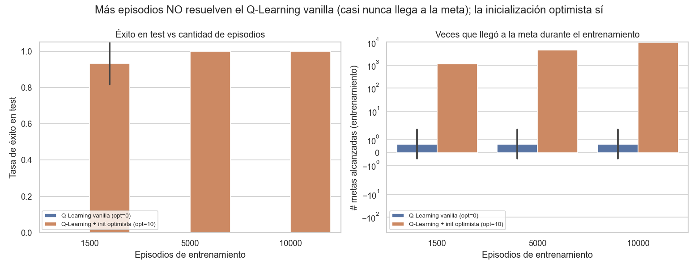

| Variante | 1.500 ep | 5.000 ep | 10.000 ep | Metas en entrenamiento |
|---|---|---|---|---|
| **Q-Learning vanilla** (`opt=0`) | 0 % | 0 % | **0 %** | **0–2 en total** (media 0,7 sobre 3 seeds) |
| **Q-Learning + init optimista** (`opt=10`) | 93 % | 100 % | 100 % | ~1.135 / ~4.631 / ~9.631 |

- **Q-Learning vanilla (ε-greedy):** se queda en **0 %** en los tres presupuestos. La causa está en la última columna: aun con **10.000 episodios**, llega a la meta apenas **0–2 veces en todo el entrenamiento**. Sin experiencias exitosas no hay nada que aprender, así que **subir los episodios no cambia nada**.
- **Q-Learning + inicialización optimista:** llega a la meta **~1.135 veces ya en 1.500 episodios** (vs 0–2 del vanilla) y resuelve el test. *Matiz honesto:* a 1.500 ep da **93 %** (una semilla cae a 80 %), y se **estabiliza en 100 % a partir de 5.000 ep** — o sea, más episodios **sí ayudan**, pero **solo una vez que la exploración funciona**.

Conclusión: aumentar el presupuesto de entrenamiento es **necesario pero no suficiente**; lo que destraba el aprendizaje es **explorar bien**. Más episodios sin exploración (vanilla) no mueven la aguja; con exploración (optimista), suben la estabilidad de 93 % a 100 %. Por eso los modelos finales usan un presupuesto holgado de **2.500 episodios**.

### 2.6 Metodología experimental: múltiples seeds, varianza y seaborn — `experiments.py`

Siguiendo la devolución de la cátedra, la experimentación se diseñó para **medir la varianza**:

- **Cada configuración se corre con varias semillas** (`SEEDS = [0,1,2,3,4]`): cada corrida siembra el agente (`random`+`numpy`) y el env de forma independiente y reproducible.
- **Comparación apareada:** las mismas semillas para todas las variantes (las diferencias no se deben a seeds distintas).
- **Evaluación consistente:** el test se mide sobre un conjunto **fijo** de episodios sembrados (`TEST_SEEDS`), igual para todas las configs (refleja la política, no la suerte del reset).
- **Visualizaciones con `seaborn`:** **boxplots** de las métricas finales y **curvas con banda de error** (dispersión entre semillas).

> **¿Por qué medir varianza y no un solo número?** Una sola corrida puede salir bien **por suerte de la semilla**. Si una configuración resuelve con la semilla 0 pero falla con la 3, no es una buena configuración: es **inestable**. Correr varias semillas y mirar la dispersión nos dice si el resultado es **confiable y repetible**, no un golpe de suerte.
>
> **Cómo leer los gráficos:**
> - **Boxplot:** la **caja** abarca el 50 % central de las semillas, la **línea** del medio es la mediana y los **puntos** sueltos son casos extremos (*outliers*). Una **caja chica y arriba** = configuración **buena y estable**; una caja larga o con puntos abajo = **inestable** (anda en unas semillas y en otras no).
> - **Curva con banda de error:** la línea es el promedio entre semillas y la **banda** es la dispersión (±1 desvío). Banda **angosta** = el comportamiento es **consistente** entre corridas.

### 2.7 Exploración de hiperparámetros (grid OAT con varianza) — `grid_search.py`

Estrategia **one-at-a-time (OAT)**: desde una config base, se varía **un** hiperparámetro a la vez (interpretable). Se exploraron **inicialización optimista, discretización, α, γ y ε-decay**, cada uno con las **5 seeds** (recompensa real, sin shaping).

**Qué controla cada hiperparámetro, qué valores probamos y qué esperábamos:**

| Hiperparámetro | Qué controla (en palabras simples) | Valores probados | Qué esperábamos |
|---|---|---|---|
| **α** (tasa de aprendizaje) | Cuánto pesa **cada nueva experiencia** al corregir `Q`. Bajo = aprende de a poquito; alto = se "fía" mucho del último dato | 0.05 / 0.1 / 0.3 | Muy bajo → lento; muy alto → inestable (sobre-reacciona al ruido) |
| **γ** (factor de descuento) | Cuánto **valora el futuro** vs lo inmediato. Cerca de 1 = más previsor | 0.95 / 0.99 / 0.999 | Acá la recompensa (+100) llega **al final**, así que necesitamos γ **alto** para que ese premio "se sienta" desde lejos |
| **ε + decay** (exploración) | Probabilidad de moverse **al azar** en vez de elegir lo mejor conocido. Arranca en 1.0 y **baja** cada episodio (`decay`) hasta `ε_min` | decay 0.995 / 0.999 | Decay **lento** (0.999) = explora más tiempo antes de "cerrarse" a explotar |
| **Inicialización optimista** | Valor inicial de `Q` (§2.5): empuja a probar acciones nuevas | 0 / 1 / 10 / 50 | Esperábamos que **sin** optimismo cayera en la trampa, y **con** optimismo resolviera |
| **Discretización** (bins × acciones) | La **resolución** de la grilla de estados/acciones | 20×20×3 / 40×40×5 / 60×60×7 | Más fina = más precisa pero **más celdas que llenar** → aprende más lento |

> **Por qué OAT y no probar todas las combinaciones:** variar un parámetro por vez (dejando el resto fijo) deja ver **el efecto aislado** de cada uno, y es **barato**. Un grid completo (todas las combinaciones × 5 seeds) sería enorme y difícil de leer; OAT alcanza para entender qué mueve la aguja.

**Efecto de la inicialización optimista** (curvas con banda de error):

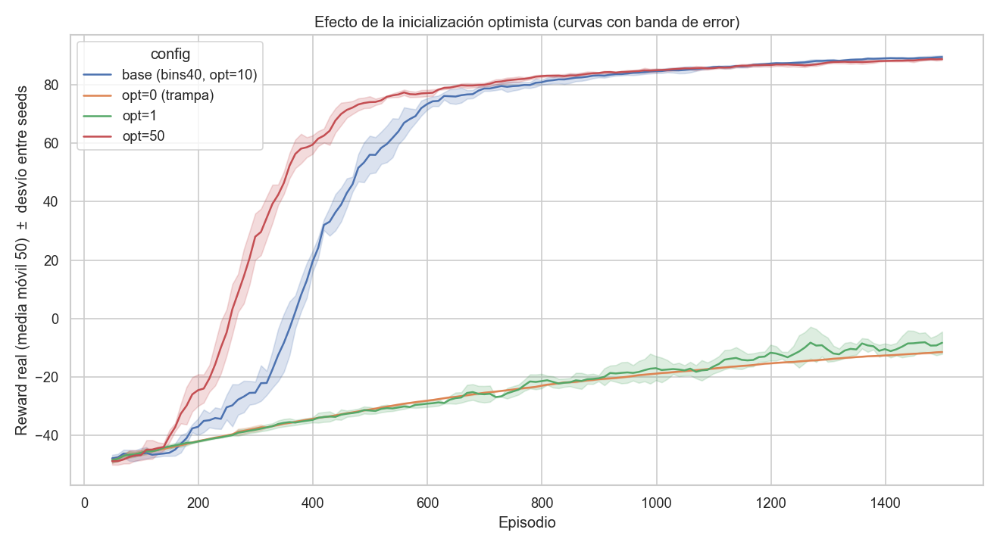

**Éxito en test por configuración** (boxplots, 5 seeds):

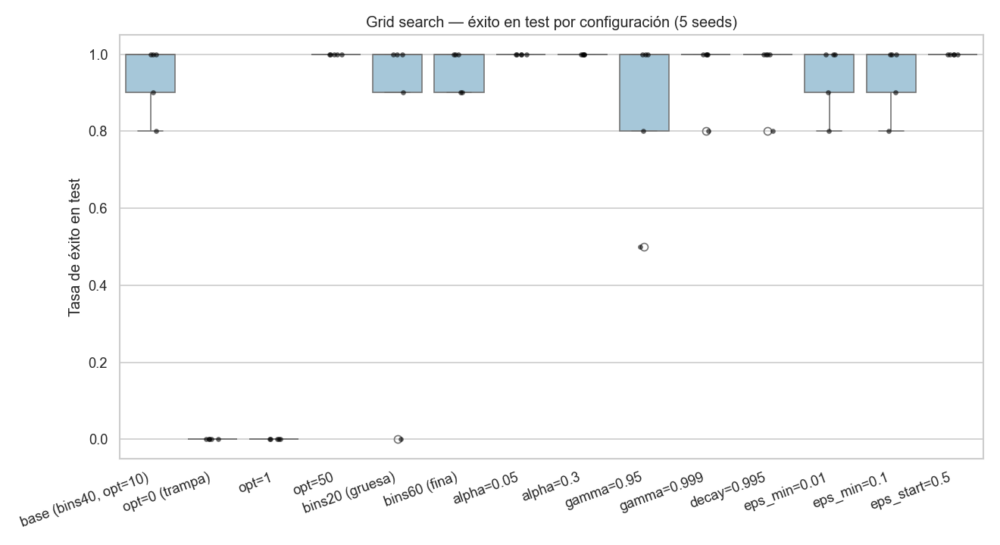

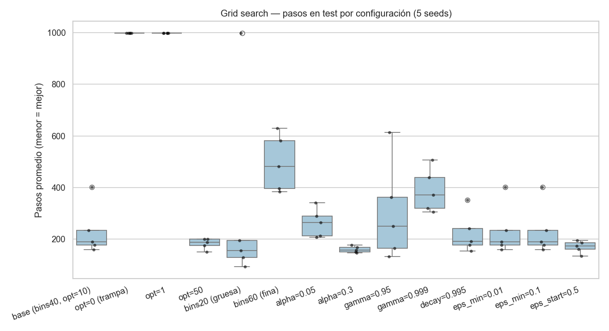

**Resultados (mediana / varianza sobre 5 seeds):**

| Config (OAT) | éxito mediana | éxito **mín** | reward **std** | pasos mediana | conv. (ep) |
|---|---|---|---|---|---|
| **α=0.3** ⭐ | 100 % | **100 %** | **0.56** | 157 | 1117 |
| opt=50 | 100 % | 100 % | 1.08 | 188 | 381 |
| α=0.05 | 100 % | 100 % | 1.93 | 265 | 727 |
| base (bins40, opt=10, **γ=0.99**) | 100 % | 80 % | 11.31 | 190 | 520 |
| decay=0.995 | 100 % | 80 % | 14.10 | 191 | 318 |
| bins60 (fina) | 100 % | 90 % | 5.39 | 481 | 1070 |
| gamma=0.999 | 100 % | 80 % | 8.29 | 371 | 1500 |
| gamma=0.95 | 100 % | **50 %** | 27.83 | 250 | 411 |
| bins20 (gruesa) | 100 % | **0 %** | 62.72 | 155 | 846 |
| opt=0 / opt=1 | **0 %** | 0 % | 0.00 | 999 | no conv. |

(`conv.` = primer episodio con éxito ≥ 90 % en ventana móvil de 50, sobre un presupuesto de 1500 ep.)

**Lectura (el análisis de varianza es la clave):**
- **La inicialización optimista es decisiva:** `opt=0` y `opt=1` fracasan (0 %); `opt≥10` resuelve.
- **Elegir por la mediana sola engañaría.** `bins20 (gruesa)` tiene la mejor mediana de pasos (155) **pero una seed da 0 %** (`std`=62.72): es **inestable**. Lo mismo, en menor grado, `gamma=0.95`.
- **El descuento γ importa pero no es crítico:** `γ=0.95` (descuenta mucho el futuro) es el peor de los γ (mín 50 %), mientras que `γ=0.99` (base) y `γ=0.999` resuelven; subir a `0.999` da políticas más largas (371 pasos) sin mejorar la robustez. Confirma lo esperado: con el premio recién al final, **conviene un γ alto**.
- La **elección robusta** es la que resuelve en **todas** las seeds con **baja varianza**: **`α=0.3`** (éxito mín 100 %, `std`=0.56, 157 pasos). Por eso el criterio de selección prioriza `mín(éxito)` y `varianza`, no la mediana.
- **Trade-off que elegimos a conciencia (transparencia):** `α=0.3` paga su estabilidad con una **convergencia lenta** (~1117 ep, casi al límite del presupuesto de 1500); `opt=50` converge **3× más rápido** (381 ep) con robustez parecida. Nos quedamos con `α=0.3` porque el **modelo final se entrena con presupuesto holgado (5000 ep)**, donde la velocidad deja de importar y pesa más la **calidad y estabilidad** de la política. Si el objetivo fuera entrenar rápido, `opt=50` sería preferible.

### 2.8 Dyna-Q + comparación con Q-Learning (componente de investigación) — `dyna_q_agent.py`, `compare_dyna_q.py`

**Dyna-Q** (Sutton & Barto §8.2) = Q-Learning + un **modelo aprendido del ambiente** + `n` pasos de **planning** (actualizaciones simuladas) por cada paso real:

```python
self._q_update(state, a, reward, next_state, terminated)    # (d) update con experiencia REAL
self.model[(state, a)] = (reward, next_state, terminated)   # (e) guardar transición
self._planning()   # (f) n updates SIMULADOS con la MISMA regla, muestreando del modelo
```

Comparación `planning_steps ∈ {0, 5, 25}` (0 = Q-Learning puro), recompensa real, 5 seeds, apareado:

| Variante | éxito (mín) | reward std | pasos mediana | convergencia (ep) | tiempo |
|---|---|---|---|---|---|
| Q-Learning (n=0) | 100 % | 0.94 | 203 | 520 | 7 s |
| **Dyna-Q (n=5)** | 100 % | 1.53 | **105** | **349** | 22 s |
| Dyna-Q (n=25) | **10 %** | 66.90 | 238 | 544 | 64 s |

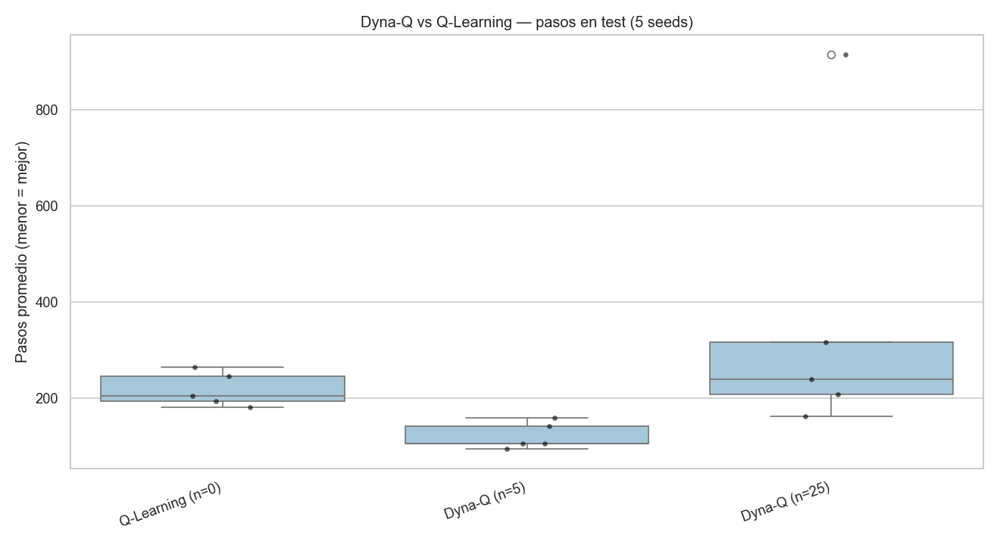

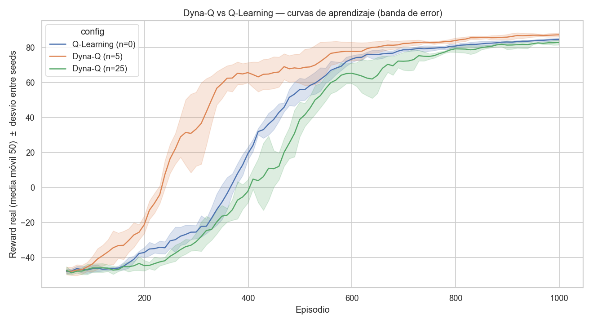

**Conclusión (matizada, con varianza):**
- **Planning moderado (n=5) ayuda:** converge antes (349 vs 520 episodios) y da **mejor política** (105 vs 203 pasos), al costo de ~3× más cómputo. Es el beneficio que predice el libro: el planning **amortiza** cada experiencia real.
- **Demasiado planning (n=25) perjudica:** se vuelve **inestable** (una seed casi falla, `std`=66.9), porque replicar transiciones de un **modelo imperfecto** amplifica el ruido, y el costo crece lineal.
- Q-Learning solo es **el más estable y barato**, pero converge más lento y a una política menos eficiente.

### 2.9 Modelos finales y visualización de la política

Modelos entregables (recompensa real, sin shaping, 5000 episodios):

| Modelo | Config | éxito test | reward | pasos | cobertura Q |
|---|---|---|---|---|---|
| `q_learning_best.pkl` | α=0.3, opt=10, n=0 | 100 % | 91.6 | 141 | ~60 % |
| `dyna_q_best.pkl` | n=5, opt=10 | 100 % | **94.2** | **83.3** | ~62 % |

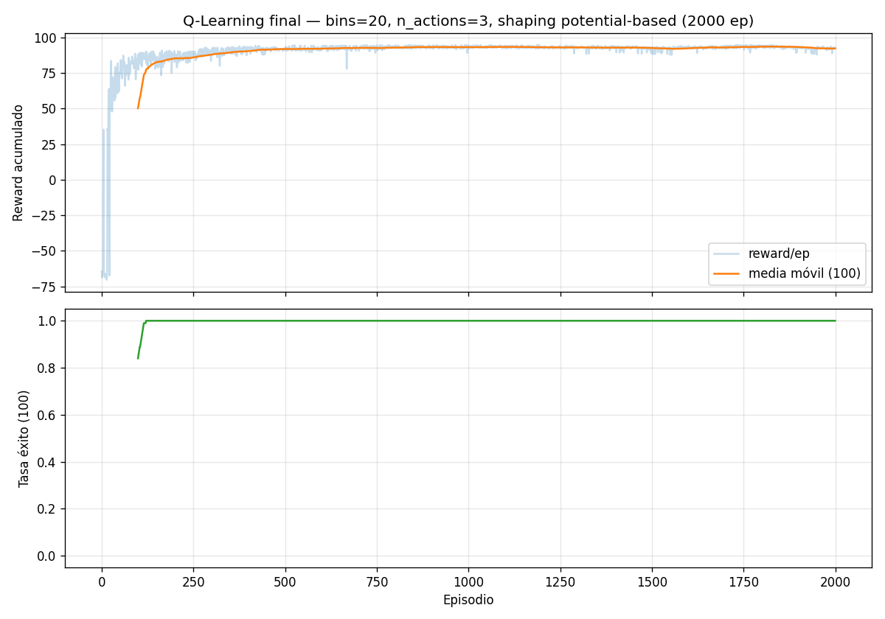

**Verificación de la política** (`visualize_policy.py`): el mapa de `π(s)` en el espacio `(x, v)` muestra el patrón clásico **"pump-and-go"** — cuando `v < 0` predomina empujar hacia atrás (**−1**, 55.3 %) para acumular momento, y cuando `v > 0` predomina empujar hacia adelante (**+1**, 56.1 %). Las celdas no visitadas (~35 %) se **enmascaran honestamente**.

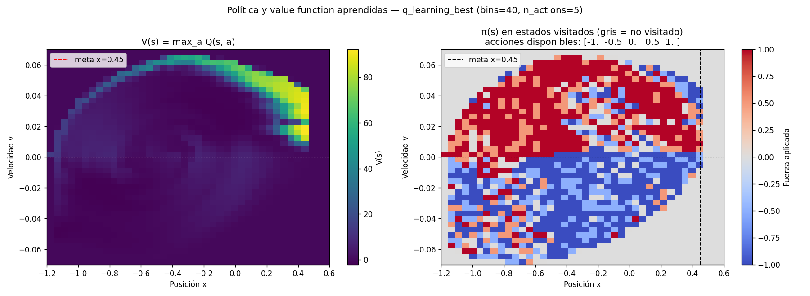

### 2.10 Reward shaping (EXTRA, no parte del núcleo) — `shaping_experiment.py`

Como **adicional** (la cátedra lo permite **solo como extra**), se exploró *reward shaping* **potential-based** (Ng, Harada & Russell, 1999): se suma a la recompensa un término `F(s,s') = γ·Φ(s') − Φ(s)` con potencial `Φ(s)=coef·|v|` (premia **ganar velocidad**, que es lo que hace falta para balancearse). Por el **teorema NHR-99**, esta forma **no cambia la política óptima**; solo **acelera** la propagación de la señal. El punto clave: el shaping **modifica la recompensa** (= cambia el ambiente), por eso **no se usa en el núcleo** — todo §2.1–§2.9 se obtuvo con la **recompensa real**.

**Experimento honesto (4 variantes × 5 seeds; se mide con la recompensa real).** Dos preguntas: ¿el shaping **rescata** al vanilla (opt=0, que da 0 %)? ¿**acelera** al optimista (opt=10)?

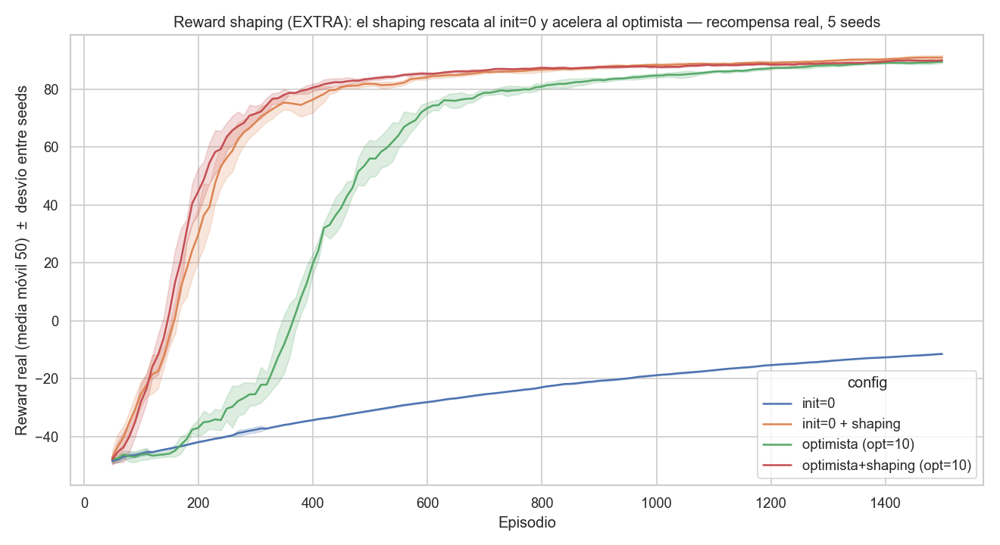

| Variante | éxito **mín** | reward **std** | pasos mediana | convergencia (ep) |
|---|---|---|---|---|
| vanilla (opt=0) | **0 %** | 0.00 | 999 | no converge |
| **shaping (opt=0)** | 90 % | 4.92 | 169 | **246** |
| optimista (opt=10) — *núcleo* ⭐ | 80 % | 11.31 | 190 | 520 |
| **optimista+shaping (opt=10)** | **100 %** | **1.85** | **146** | **222** |

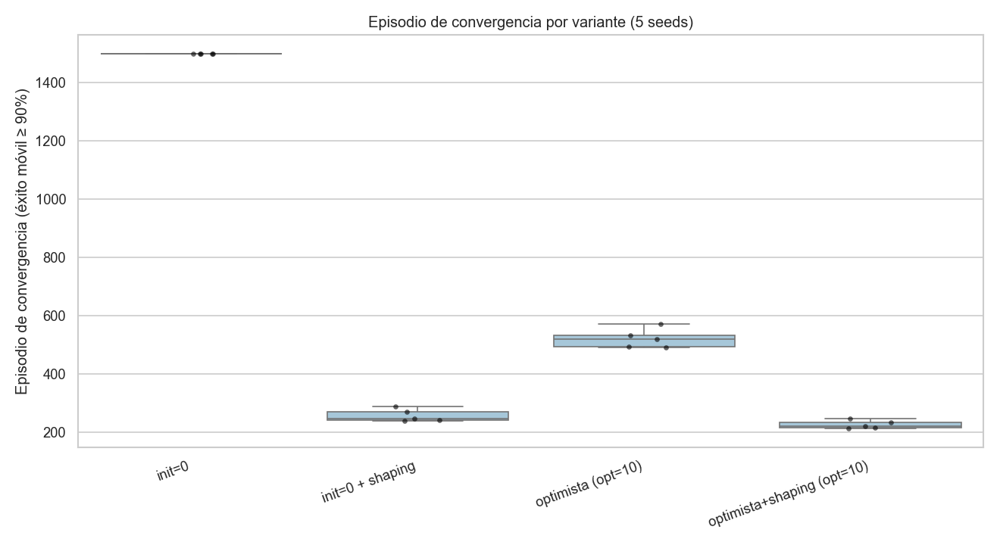

**Lectura:**
- **El shaping rescata al vanilla:** `opt=0` solo da 0 %, pero **con shaping resuelve** (mín 90 %, converge en 246 ep). O sea, la exploración también se puede destrabar **guiando la recompensa** — pero al costo de **cambiar el ambiente**.
- **El shaping acelera al optimista:** sumar shaping al `opt=10` **reduce la convergencia a menos de la mitad** (520 → 222 ep), lo hace **más estable** (std 11.31 → 1.85; mín 80 % → 100 %) y da **mejor política** (190 → 146 pasos).
- **Por qué igual queda como extra:** funciona muy bien, pero **modifica la recompensa**. Nuestro núcleo resuelve el problema **sin tocar el ambiente** (inicialización optimista); este experimento es la prueba de que el shaping es un **atajo válido pero no necesario** — exactamente el lugar que le da la cátedra.

### 2.11 Conclusiones (personales), limitaciones y fuentes

**Conclusiones nuestras:**
- La dificultad real de `MountainCarContinuous` con la recompensa original **no es la discretización ni la regla de Q-Learning, sino la exploración**: hay que escapar de la "trampa de no hacer nada". La **inicialización optimista** lo logra **sin tocar el ambiente**, y resuelve el problema al 100 %.
- **Más episodios no sustituyen a la exploración** (§2.5.1): Q-Learning vanilla sigue en 0 % aun con **10.000 episodios** porque casi nunca llega a la meta; lo que destraba el aprendizaje es **explorar bien**, no entrenar más tiempo.
- **El análisis de varianza cambió nuestra elección**: la config con mejor mediana (`bins20`) era inestable; la robusta es `α=0.3`. Reportar varianza (boxplots) no es un adorno: evita conclusiones falsas.
- **Dyna-Q confirma el libro con matices**: planning moderado (n=5) acelera y mejora; en exceso (n=25) desestabiliza. No es "Dyna-Q siempre mejor", sino "depende de cuánto planning".
- El reward shaping (extra) **funciona pero es un atajo** (§2.10): medido, **rescata al vanilla** (0 %→100 %) y **acelera al optimista** (520→222 ep), pero **modifica la recompensa**. Nuestro núcleo resuelve sin tocar el ambiente; quitarlo del núcleo nos hizo entender qué resolvía de verdad el problema (la exploración).

**Limitaciones (honestas):**
- **5 semillas es modesto.** Alcanza para distinguir lo robusto de lo afortunado, pero para intervalos de confianza finos convendrían 20–30.
- **El grid es OAT (one-at-a-time), no exhaustivo.** Variar un hiperparámetro por vez no captura **interacciones** (p. ej. α alto + γ alto); un grid completo o una búsqueda bayesiana lo cubrirían, a más costo.
- **Q-Learning tabular no escala.** La discretización sufre la **maldición de la dimensionalidad**: grillas más finas multiplican las celdas a llenar (y el tiempo). Además **discretizamos las acciones** (`[−1,1]` → N), perdiendo precisión frente a un actor continuo.
- **El criterio de convergencia es una convención** ("éxito móvil ≥ 90 %"); otros umbrales darían números algo distintos, aunque las conclusiones **relativas** se mantienen.

**Trabajo futuro:**
- Repetir el estudio con **20–30 semillas** e intervalos de confianza.
- Probar **aproximación de funciones (DQN)** y control continuo (DDPG/SAC) para comparar contra el enfoque tabular, sin discretizar.
- Búsqueda de hiperparámetros que considere **interacciones** (no OAT).

**Fuentes:** Sutton & Barto, *Reinforcement Learning: An Introduction* (2ª ed.) — Q-Learning §6.5, inicialización optimista §2.6, Dyna-Q §8.2; documentación de **Gymnasium** (`MountainCarContinuous-v0`, semántica `terminated`/`truncated`); **seaborn** (boxplots y bandas de error). Material del curso (`QL.pdf`).

---

## 3. Proyecto MATE — Isolation

El segundo proyecto cambia de paradigma: ya no hay un ambiente estocástico que se aprende por refuerzo, sino un **juego adversarial de dos jugadores** sobre el que hay que **buscar** la mejor jugada. La consigna pide tres cosas concretas: (1) implementar **Minimax con Alpha-Beta** *y* **Expectimax**, decidiendo cuál conviene y analizando el impacto de la poda; (2) implementar **funciones de evaluación** y experimentar con combinaciones y ponderaciones; (3) definir pruebas y dejar un **registro completo** de resultados.

> La justificación extendida de cada decisión vive en [`Documentacion/DocumentacionMATE.md`](Documentacion/DocumentacionMATE.md); la planificación paso a paso en [`Documentacion/PlanificacionMATE.md`](Documentacion/PlanificacionMATE.md); y la bitácora de avances en [`Documentacion/avancesMATE.md`](Documentacion/avancesMATE.md). Esta sección resume y consolida todo eso.

### 3.1 Descripción del problema y del simulador

**Isolation** es un juego de tablero **adversarial**, de **suma cero** y **dos jugadores alternados**. En su turno, cada jugador **mueve su ficha** a una casilla adyacente libre **y destruye** una casilla del tablero. **Pierde quien se queda sin movimientos legales.** Es exactamente el escenario de juegos de suma cero que modela el teórico (`MiniMax.md`, lám. 2–4).

El simulador viene **dado y completo** en [`Isolation/`](Isolation/). Mapeado al formalismo del teórico:

| Concepto del teórico | Implementación dada |
|----------------------|---------------------|
| Estado inicial `s_start` | `Board(board_size=(4,4))` con dos fichas colocadas al azar (`place_players`) |
| `Acciones(s)` | `board.get_possible_actions(player)` → lista de `(direction, cell_to_destroy)` |
| `Suc(s,a)` | `board.clone()` + `board.play(action, player)` |
| `EsFinal(s)` | `board.is_end(player) -> (bool, ganador)` |
| `Utilidad(s)` | derivada del ganador: +1 / −1 |
| `Jugador(s)` | el `current_player` del `IsolationEnv` (alterna 1 ↔ 2) |

**Tablero (`board.py`):** matriz NumPy `4×4` con `0`=vacía, `1`=jugador 1 (B), `2`=jugador 2 (R), `3`=celda destruida (X). Hay **8 direcciones** de movimiento (ortogonales + diagonales).

**Interfaz del agente (`agent.py`):** toda implementación define `next_action(obs)` (recibe el `Board`, devuelve `(direction, cell_to_destroy)`) y `heuristic_utility(board)` (evalúa un estado no terminal).

**Oponentes provistos:**
- **`RandomAgent`** — elige una acción legal al azar (genuinamente **estocástico**).
- **`Stratagem`** — agente ofuscado que, deofuscado, resulta ser un **Minimax de profundidad 3** cuya heurística suma cuatro componentes (diferencia de celdas destruidas alrededor de cada ficha, distancia negativa al centro, distancia negativa al rival, diferencia de movilidad). Es el **baseline fuerte** a vencer y nos sirvió de referencia para diseñar nuestras heurísticas.

#### Por qué el problema es difícil

El *branching factor* es altísimo: cada acción combina **dirección × celda a destruir**, así que en apertura hay **~100 acciones por ply** (≤8 direcciones × ~13 celdas destruibles). A profundidad 3 eso son del orden de **10⁶ nodos**, y crece exponencialmente. Esto motiva fuertemente la poda **Alpha-Beta** y una **profundidad acotada**. Además, `place_players()` coloca las fichas con `random.shuffle` **sin semilla**, lo que introduce varianza y una **ventaja de primer jugador** que hay que controlar en los experimentos.

### 3.2 Marco teórico aplicado

Toda la solución se basa en `MiniMax.md` (Sergio Yovine, ORT) y Russell & Norvig, *AIMA* 3ª ed., cap. 5:

- **Minimax con profundidad limitada** (lám. 13): el agente maximiza, el oponente minimiza, y al llegar al corte de profundidad se evalúa con `Eval(s)` en lugar de la utilidad real:

  ```
  V_max,min(s,d) = Utilidad(s)                    si EsFinal(s)
                 = Eval(s)                        si d = 0
                 = max_a V(Suc(s,a), d−1)         si Jugador(s) = Agente
                 = min_a V(Suc(s,a), d−1)         si Jugador(s) = Oponente
  ```

- **Alpha-Beta Pruning** (AIMA 5.3): poda ramas que no pueden afectar la decisión, devolviendo **exactamente el mismo movimiento** que Minimax pero expandiendo menos nodos.
- **Expectimax** (lám. 8): si el oponente juega una **estrategia estocástica**, sus nodos dejan de ser `min` y pasan a ser **nodos de azar**: `Σ_a σ(s,a)·V(Suc(s,a))`. El agente sigue maximizando.
- **Buena función de evaluación** (lám. 16): debe (1) ordenar los terminales como la utilidad real (`Eval(win) > Eval(loss)`), (2) ser **barata** y (3) correlacionar con la probabilidad de ganar.

### 3.3 Minimax con profundidad fija y Alpha-Beta

**Archivos:** [`Isolation/minimax_agent.py`](Isolation/minimax_agent.py), [`Isolation/search.py`](Isolation/search.py)

`search.py` provee el núcleo funcional: `successors(board, player)` (genera `(acción, board_hijo)` con `clone`+`play`), `is_terminal`, `utility(winner, agent_player)` (±1 desde la perspectiva del agente) y un `NodeCounter`. Sobre él, `MinimaxAgent` implementa `V_max,min(s,d)` con un método recursivo `_minimax(board, player_to_move, depth)` que devuelve `(mejor_acción, valor)` —misma estructura que `Stratagem`— y `next_action` elige el `argmax` en la raíz.

**Decisión — profundidad fija (no iterative deepening).** Es exactamente el modelo del teórico (lám. 13). El tablero 4×4 es acotado, así que una profundidad moderada (3–4) ya da buen juego sin un esquema de tiempo. Iterative deepening + time limit agregarían código y riesgo sin estar pedidos; quedan como mejora opcional. Se priorizó **fidelidad al material de estudio**.

**Decisión — Alpha-Beta como flag + ordenamiento de movimientos.** La poda se implementó **sobre el mismo núcleo**, activada por `use_alpha_beta`, con un parámetro `move_ordering` (default `True`) que ordena los sucesores por su evaluación: en nodos MAX explora primero los de **mayor** valor, en nodos MIN los de **menor**. La poda es máxima cuando se exploran primero las jugadas más prometedoras. Tener el flag on/off permite el **análisis de impacto** que pide la consigna de forma rigurosa.

**Verificación de corrección (clave).** Antes de confiar en los resultados, se verificó que Alpha-Beta es equivalente a Minimax. Sobre **292 estados** (40 seeds × 4 aperturas × profundidades {2,3}):
- **0** diferencias de valor en la raíz (la poda nunca cambia la decisión);
- **0** diferencias de acción con `move_ordering=False` (mismo orden de sucesores → mismo desempate → misma jugada);
- **0** casos con `nodos(AB) > nodos(Minimax)` (Minimax recorre el árbol completo, AB un subconjunto);
- poda global del **89.8 %** de los nodos.

> Sutileza documentada: con `move_ordering=True`, ante **empates de valor** Alpha-Beta puede elegir otra jugada igualmente óptima (mismo valor). Por eso la equivalencia *de acción* se exige solo con el ordenamiento desactivado; la equivalencia *de valor* se cumple siempre.

#### Experimento E1 — Impacto de Alpha-Beta

Medición controlada: sobre 6 posiciones, a igual profundidad y mismo estado, se comparó Minimax **con** y **sin** poda, contando **nodos visitados** y **tiempo** de una decisión aislada (`next_action`).

| Profundidad | Nodos Minimax | Nodos Alpha-Beta | Reducción | Tiempo/jugada (mm → AB) |
|---|---|---|---|---|
| 1 | 24.5 | 24.5 | 0 % | ~0 s |
| 2 | 436 | 87 | **80 %** | 0.010 → 0.011 s |
| 3 | 3 653 | 934 | **74 %** | 0.083 → 0.064 s |
| 4 | 13 785 | 1 235 | **91 %** | 0.28 → 0.08 s |

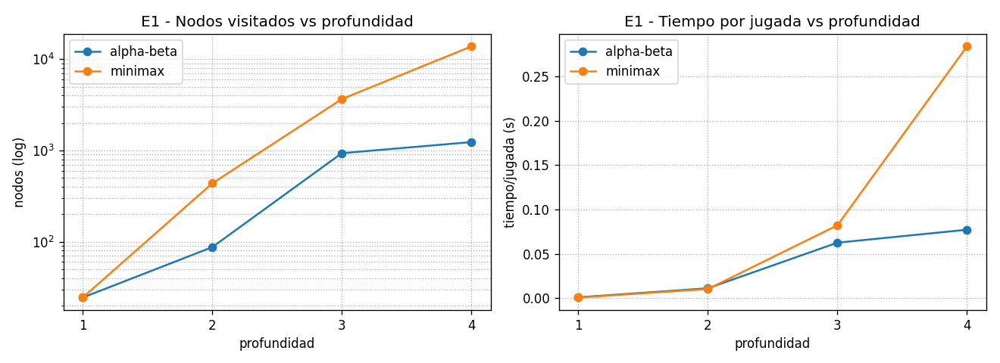

**Lectura:** la reducción **crece con la profundidad** y se vuelve dramática a d=4 (≈11× menos nodos, ≈4× menos tiempo). A d=1 no hay poda (los hijos son hojas, ambos visitan lo mismo). Alpha-Beta es, literalmente, la palanca que vuelve viable buscar más hondo con el branching factor ~100/ply de Isolation. (E1 mide búsquedas aisladas, por eso es independiente del diseño experimental de los demás.)

### 3.4 Funciones de evaluación

**Archivo:** [`Isolation/evaluation.py`](Isolation/evaluation.py)

Una biblioteca de componentes combinables por pesos, todas con firma `(board, player) -> float` y **desde la perspectiva del jugador** (positivo = bueno):

| ID | Heurística | Definición | Origen |
|----|-----------|-----------|--------|
| h1 | Movilidad propia | nº de casillas adyacentes libres del agente | clásica de Isolation |
| h2 | Diferencia de movilidad | `mov_propia − mov_rival` | diferencia de movilidad de `Stratagem` |
| h3 | Control de centro | `−dist_Manhattan(agente, centro)` | `Y` de `Stratagem` |
| h4 | Acorralar | celdas destruidas alrededor del rival − alrededor mío | `X` de `Stratagem` |

`weighted_eval(weights)` devuelve una `eval_fn` combinada `Eval(s) = Σ wᵢ·hᵢ(s)`, inyectable a los agentes por su parámetro `eval_fn`.

**Por qué estas componentes.** En Isolation **perder = quedarse sin movimientos**, así que la **movilidad** (h1) es la señal más directamente correlacionada con ganar (criterio 3 de la lám. 16), y la **diferencia de movilidad** (h2) captura la naturaleza de suma cero. El **control de centro** (h3) preserva movilidad futura (desde el centro hay más casillas alcanzables) y **acorralar** (h4) ataca directamente la condición de derrota del rival. Las cuatro **replican y generalizan** la heurística de `Stratagem`, lo que da un punto de comparación honesto y permite buscar ponderaciones que la superen.

**Medida de movilidad:** se cuenta el número de **casillas adyacentes libres** (estilo `Board.has_valid_moves`), **no** `len(get_possible_actions)`, que infla la cuenta al multiplicar por cada celda destruible.

**Convención de signo.** Tanto `heuristic_utility` como la utilidad terminal se expresan desde la perspectiva del agente (+1 gana, −1 pierde). Mantener un único marco evita errores de signo en los nodos `min` y de azar, y es coherente con `Stratagem`.

### 3.5 Expectimax

**Archivo:** [`Isolation/expectimax_agent.py`](Isolation/expectimax_agent.py)

Misma estructura que Minimax, pero los nodos del **rival** son **nodos de azar**: `Σ σ(s,a)·V(Suc(s,a))` con `σ` **uniforme** sobre las acciones legales (lám. 8). El agente sigue maximizando. Acepta la misma `eval_fn` que `MinimaxAgent`.

**Por qué sin Alpha-Beta.** Los nodos de azar **promedian** todas las ramas (no hay un corte por cota como en un nodo MIN), así que la poda de tipo Alpha-Beta no aplica directamente. Por eso esta clase no expone ese flag.

**Hipótesis a confirmar (no asumir).** Minimax supone un rival **adversarial/óptimo** (su valor es una cota inferior garantizada, lám. 12); Expectimax supone un rival **estocástico uniforme**. De ahí:
- **vs `RandomAgent`** (genuinamente estocástico): el modelo de Expectimax es **correcto** → debería rendir bien.
- **vs `Stratagem`** (Minimax determinista, *no* uniforme): el modelo de Expectimax es **incorrecto** → se espera que **Minimax rinda igual o mejor**.

La respuesta a *"¿cuál técnica es mejor?"* es por tanto **"depende del oponente"**, y se decide con evidencia (§3.7).

> **Hallazgo de integración:** `Stratagem` tiene el nombre de su parámetro `__init__` **ofuscado**, así que debe instanciarse **posicional** (`Stratagem(2)`), no con `player=2`. Quedó anotado para que los experimentos no tropiecen.

### 3.6 Metodología experimental

**Diseño apareado (decisión clave de rigor).** Como existe una **ventaja de primer jugador** fuerte (§3.9) y la colocación inicial es aleatoria, cada **seed** se juega **dos veces**: una con nuestro agente de jugador 1 y otra de jugador 2, **sobre la misma colocación inicial**. Así, cada comparación enfrenta exactamente las mismas posiciones desde ambos lados, y el resultado no depende de quién arrancó ni de qué posiciones tocaron. Es más riguroso que solo alternar lados con seeds distintos (el enfoque inicial, en el que el agente de jugador 1 veía posiciones distintas que el de jugador 2).

**Qué se mide:**
- **Win rate** por matchup (promediado sobre las partidas del diseño apareado).
- **Nodos por jugada de nuestro agente** (`a_nodes_per_move`) — costo aislado, eje del análisis de Alpha-Beta.
- **Tiempo por jugada de nuestro agente** (`a_avg_move_time`) — `play_match` mide el tiempo de **cada jugador por separado**, así el costo de nuestro agente no queda contaminado por el del rival (p. ej. el lento Minimax d=3 de Stratagem).
- **Largo de partida** (plies).

**Parámetros de la corrida final** (todo el registro en [`Isolation/results.csv`](Isolation/results.csv), **1568 filas**; tiempo total ≈ 15 min, dominado por los ~560 partidos vs Stratagem):

| Parámetro | Valor |
|---|---|
| Seeds por matchup | `N_RANDOM=100`, `N_SELF=100`, `N_STRAT=40`, `N_HEUR=30` (cada seed = 2 partidas) |
| Seeds | `1000 + k` |
| Pesos base (agentes "principales" E1–E5) | `{h1:1, h2:2, h3:0.5, h4:1}` |
| Profundidad por defecto | 2 (salvo donde se barre la profundidad) |

> **Por qué esos pesos base y por qué no sesgan la decisión.** E1–E5 usan una ponderación neutra `{1,2,0.5,1}` (las cuatro componentes, con énfasis en la diferencia de movilidad), elegida *antes* de conocer el torneo. La comparación de técnicas (Minimax vs Expectimax) y el análisis de Alpha-Beta son **robustos** a esta elección: ambos agentes comparten la *misma* `eval_fn`, así que los pesos no cambian *qué* técnica gana ni cuánto poda Alpha-Beta. El experimento **E6** explora **por separado** cuál ponderación es la mejor, y el `.pkl` adopta esa.

### 3.7 Resultados y la decisión técnica

#### E2 — Sanity check vs RandomAgent

| Matchup | Win rate |
|---|---|
| Minimax → Random | **96 %** |
| Expectimax → Random | **94.5 %** |

Ambas técnicas **dominan** al azar (200 partidas c/u). Sanity check superado.

#### E3 / E4 — Minimax vs Expectimax (la decisión técnica)

**vs Stratagem (80 partidas por celda, 40 por lado), por profundidad:**

| Técnica | d=2 | d=3 (parejo con Stratagem) |
|---|---|---|
| Minimax | 39 % | **46 %** |
| Expectimax | 48 % | 34 % |

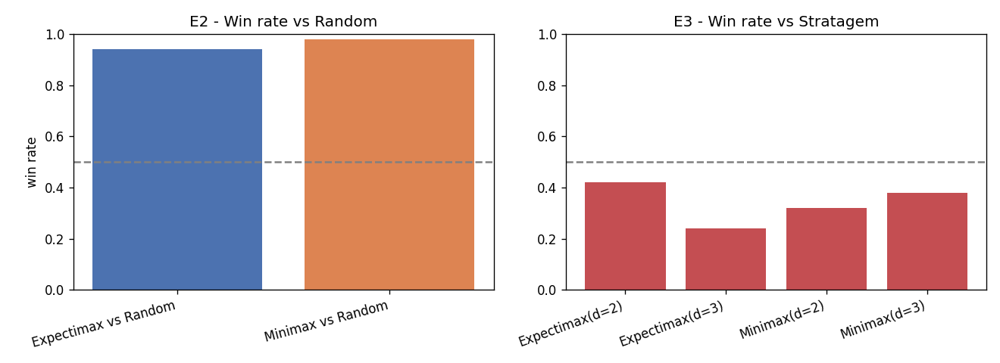

**Enfrentamiento directo (E4, d=2, 200 partidas):** Minimax 44 % / Expectimax 56 % — leve ventaja de Expectimax a profundidad baja.

**Costo por agente a d=3:** Expectimax cuesta **0.59 s y ~24 100 nodos por jugada**, contra **0.13 s y ~1 300 nodos** de Minimax: **~4.5× más lento y ~18× más nodos**, porque sus nodos de azar **no podan**. A profundidad igualada, Expectimax es a la vez **más débil y más caro**.

**Conclusión — "¿cuál técnica es mejor?": depende del oponente y de la profundidad.**
- Frente a un rival **estocástico** (Random), ambas dominan.
- Frente a un rival **determinista** (Stratagem), **a profundidad igualada (d=3) gana Minimax** (46 % vs 34 %) y además es mucho más barato. Profundizar **mejora** a Minimax (39 %→46 %) pero **empeora** a Expectimax (48 %→34 %): propagar más hondo un modelo de oponente *uniforme* —que es **incorrecto** para Stratagem— degrada el juego. **Esto confirma la predicción teórica.**
- La inversión a d=2 (Expectimax por encima) muestra que la ventaja de Minimax **requiere profundidad suficiente**; con poco lookahead ninguna técnica modela bien al rival.

> Este fue un hallazgo no trivial: en una primera pasada rápida (N chico, d=2 contra el d=3 de Stratagem) Expectimax parecía superar a Minimax vs Stratagem, lo que **contradecía la hipótesis**. Al medir a **profundidad igualada (d=3)** y con el diseño apareado, se vio que era un **artefacto de profundidad**: la teoría se cumple. *Las conclusiones se ajustaron a la evidencia, no al revés.*

#### E5 — Efecto de la profundidad

Minimax vs Stratagem, barriendo profundidad (80 partidas por profundidad):

| Profundidad | 1 | 2 | 3 |
|---|---|---|---|
| Win rate | 27 % | 39 % | **46 %** |

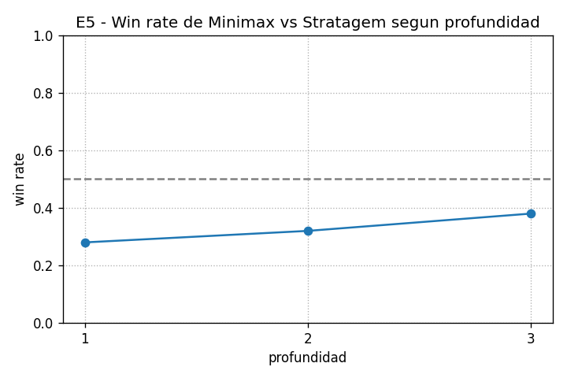

**Monótonamente creciente**: buscar más hondo ayuda de forma consistente.

#### E6 — Torneo de heurísticas (ponderaciones)

Round-robin de 4 ponderaciones con Minimax (60 partidas/par). Las cuatro se eligieron para probar la hipótesis de que **la movilidad alcanza**: una con solo movilidad, dos que le agregan una componente, y una con las cuatro.

| Ponderación | Win rate promedio |
|---|---|
| **`solo_mov_diff`** (solo h2) | **0.700** |
| `mov+centro` (h2+h3) | 0.578 |
| `balanceada` (h1+h2+h3+h4) | 0.483 |
| `mov+acorralar` (h2+h4) | 0.239 |

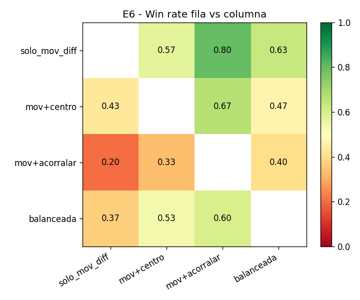

**La diferencia de movilidad sola (h2) es la combinación más fuerte.** Es la señal más directamente ligada a la condición de derrota, y agregarle otras componentes (sobre todo "acorralar") tiende a **diluirla**. Esto valida empíricamente la elección de h2 como núcleo de la evaluación.

### 3.8 Modelo computado (`mate_best_config.pkl`)

Minimax/Expectimax **no entrenan** un modelo como Q-Learning, pero la experimentación **computa** la mejor configuración de agente. Eso es lo que serializamos, de la forma más simple posible (un `dict`):

```python
{
  "tecnica": "minimax",
  "profundidad": 3,
  "pesos": {"h2": 1.0},          # solo_mov_diff, la mejor de E6
  "metricas": {"win_vs_stratagem_d3": 0.463, "win_vs_random": 0.96, "e6_winrate": 0.70},
}
```

**Por qué entregamos `.pkl` igual.** La cláusula de *Auditoría* pide, **en general**, *"los modelos computados (.pkl o formatos similares)"*; la penalización estricta solo nombra el primer ejercicio (LOST). La redacción es **ambigua respecto de MATE** y el costo de cubrirse es mínimo, así que entregamos `.pkl`. Serializar la mejor configuración cumple el requisito y hace **reproducible** el agente ganador (se reconstruye cargando el `.pkl`). Se evaluó precalcular una tabla de política de todos los estados del 4×4 (análogo a una Q-table), pero se **descartó por sobrecomplicación**.

> El `.pkl` está excluido por `.gitignore` (`*.pkl`); el notebook lo regenera en dos líneas, y debe **incluirse en el `.zip`** de entrega.

### 3.9 Verificación y notas de advertencia

Además de la equivalencia Alpha-Beta (§3.3, 292 estados), la verificación dejó estos hallazgos:

- **Bug del oponente `Stratagem` como jugador 2 (no es nuestro código).** Su Minimax interno evalúa **su propia derrota como 0 en vez de −1** cuando juega de jugador 2 (verificado con un test directo: `Stratagem(1)` la evalúa bien en −1, `Stratagem(2)` la evalúa en 0). Consecuencia: es **algo más débil de jugador 2**. No lo corregimos (no se modifican archivos dados); con el diseño apareado el efecto queda balanceado entre las variantes comparadas.
- **Ventaja de primer jugador (medida, ahora controlada).** En Isolation 4×4 arrancar **importa mucho**: nuestro agente gana **48 % cuando arranca** vs **35 % cuando arranca el rival** (≈13 pts). El diseño apareado **neutraliza** este sesgo de forma controlada (cada seed por ambos lados sobre la misma posición).
- **Costo de `get_possible_actions`.** El simulador genera un `clone()` por cada dirección y recorre todas las celdas para listar destrucciones; en búsqueda profunda este costo **domina**. Es una limitación del simulador dado; se mitiga limitando la profundidad y con Alpha-Beta.
- **Explosión combinatoria.** El branching factor ~100/ply hace lenta la búsqueda profunda; mitigado con Alpha-Beta, ordenamiento de movimientos y profundidad acotada (3–4).

#### Cómo se ejecuta

El núcleo está en archivos `.py` (cada uno con su *smoke test* en `__main__`: `poetry run python <archivo>.py`), y los experimentos E1–E6 + gráficos + guardado del `.pkl` viven en [`Isolation/isolation.ipynb`](Isolation/isolation.ipynb), que corre de punta a punta (`poetry run jupyter nbconvert --to notebook --execute --inplace isolation.ipynb`, **0 errores**). Entorno Poetry separado: `poetry install --no-root`.

### 3.10 Mapeo a la consigna

| Requisito de la consigna | Dónde se cubre |
|--------------------------|----------------|
| Minimax con Alpha-Beta + análisis de impacto | §3.2, §3.3 + experimento E1 |
| Expectimax + decidir mejor técnica | §3.5, §3.7 (E2–E4) |
| Funciones de evaluación, combinaciones y ponderaciones | §3.4 + experimento E6 |
| Definir pruebas + registro completo de resultados | §3.6, §3.7; `results.csv` (1568 filas) |
| Resumen del abordaje (simulador, parámetros, tiempo de ejecución, resultados) | §3.1, §3.6, §3.7 |
| Apoyo visual (gráficos + comentarios) | §3.3, §3.7 (4 gráficos en `Isolation/plots/`) |
| Notas de advertencia (dificultades) | §3.9 |
| Modelos computados (`.pkl` / formato similar) | §3.8 (`mate_best_config.pkl`) |

---

## 4. Uso de IA Generativa

Conforme exige la consigna (p. 1 del PDF), declaro cómo usé **Claude Code** (agente de Anthropic en la terminal/IDE) como herramienta de apoyo. Lo importante: **fue una herramienta dirigida**, no un piloto automático — el alcance, las decisiones técnicas y la **verificación** quedaron de mi lado.

- **Herramienta utilizada:** Claude (Anthropic) a través de **Claude Code**.

### 4.1 Cómo se armó la planificación inicial

Antes de codear, **planifiqué por escrito** (esos documentos quedan en `Documentacion/`):
- **LOST — `planificacionLOST_v2.md`:** arranca documentando la **letra inicial** (el *scaffold* `q_learning_agent.py` y el `pyproject.toml` provistos) y **qué desviaciones** hice respecto de él y por qué (§0); sigue con el mapeo *consigna → requisitos* y un plan por **fases 0–6** (entorno → factibilidad sin shaping → grid con varianza → Dyna-Q → visualizaciones → shaping extra → documentación).
- **MATE — `PlanificacionMATE.md`:** alcance, tareas con estimación, orden, **diseño de los experimentos E1–E6**, heurísticas, riesgos y checklist; con bitácora de avances fechada en `avancesMATE.md`.

Claude Code ayudó a **redactar y estructurar** esos planes a partir de la consigna y los PDFs de teoría; yo fijé las restricciones (no modificar el simulador / no tocar las recompensas en el núcleo).

### 4.2 Cómo se resolvió (flujo iterativo)

Ciclo **plan → implementar → probar → experimentar → graficar → documentar**, fase por fase:
- **Implementación** de los agentes desde el **pseudocódigo de Sutton & Barto** (LOST) y la **API del simulador provisto** (MATE), sin modificar lo dado; cada componente con su **smoke test**.
- Experimentación con **múltiples semillas** → JSON → gráficos seaborn (boxplots / bandas de error).
- **Loop de devoluciones de la cátedra** (clave): cambiaron el rumbo y se tradujeron en cambios trazables en plan + código + docs. En LOST: (1) *"no es aceptable cambiar las recompensas"* → **rework sin reward shaping** (la palanca real era la inicialización optimista); (2) *"1500 episodios es muy poco"* → experimento **episodios-vs-exploración** (§2.5.1).

### 4.3 Control humano y verificación

Todo lo generado fue **revisado, ejecutado y verificado**: los números de las tablas se **cruzaron contra los `.json` y `.pkl` reales**, los notebooks **corren end-to-end sin errores**, y las **decisiones** (qué config elegir, qué responder a la cátedra) fueron mías. Los errores que pueda haber son responsabilidad del alumno.
