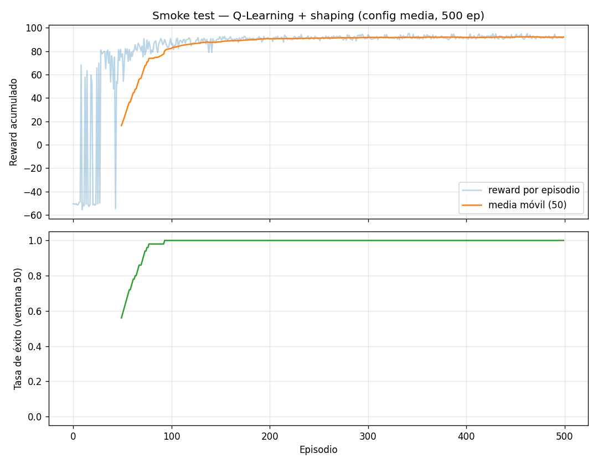

# Documentación — Obligatorio IA, Marzo 2026

**Materia:** Inteligencia Artificial — Ingeniería en Sistemas — Universidad ORT
**Entrega:** 06/07/2026
**Alumno:** Juan Cortabarría

> Este documento acompaña la entrega y deja registro del razonamiento, decisiones de diseño, justificación de hiperparámetros y resultados de cada paso. Se construye de forma incremental junto al código.

---

## 1. Contexto y consigna

La empresa ficticia *Red Destination™* nos contrata para implementar el agente inteligente del rover marciano "Out for Delivery". La consigna se divide en dos proyectos independientes:

- **Proyecto LOST** (Learning-based Orientation and Steering for Traversal): aprender a controlar el rover en `MountainCarContinuous-v0` (Gymnasium) usando **Q-Learning** tabular, con un componente de investigación que pide implementar **Dyna-Q** (Sutton & Barto, cap. 8.1–8.2).
- **Proyecto MATE** (Martian Adversarial Tactics Engine): implementar un agente para el juego *Isolation* usando **Minimax + Alpha-Beta** y **Expectimax**, con funciones de evaluación experimentables.

Como el grupo es de **2 personas**, no hay tarea adicional (Stochastic Q-Learning / MCTS quedan fuera de alcance).

### Por qué el problema es difícil

`MountainCarContinuous-v0` tiene un reward muy *sparso*:

- `−0.1·a²` por cada step (penalización por gastar energía).
- `+100` solo cuando se llega a la meta `x ≥ 0.45`.

Con política aleatoria el carro casi nunca llega a la cima — la tabla Q queda en cero y el agente no aprende nada. Eso justifica varias decisiones que iremos tomando: **discretización agresiva**, **exploración prolongada (ε alto, decay lento)**, **inicialización optimista** y, sobre todo, **reward shaping** opcional.

---

## 2. Proyecto LOST — Mountain Car Continuous

### 2.1 Modelado como MDP

Mapeando al formalismo clásico (Introducción a MDP, slide 7):

| Componente | En el ambiente |
|------------|----------------|
| Estados `S` | Pares `(x, v)` con `x ∈ [−1.2, 0.6]`, `v ∈ [−0.07, 0.07]`. Tras discretizar: `S = bins_x × bins_v`. |
| Acciones `A` | Fuerza `a ∈ [−1, 1]`. Tras discretizar: `A = {a₁, …, aₖ}`. |
| Transición `P(s' \| s, a)` | Determinista en el simulador (física de Newton), pero el agente la trata como desconocida. Dyna-Q luego la **aprende** explícitamente como modelo. |
| Reward `R(s, a, s')` | `−0.1·a²` por step, `+100` al alcanzar la meta. |
| Done | `x ≥ 0.45` o se alcanza el tope (999 steps). |

### 2.2 Paso 1 — Discretización

**Archivo:** [`MountainCarContinuous/discretization.py`](MountainCarContinuous/discretization.py)

Se implementó una clase `Discretizer` parametrizada por `n_bins_x`, `n_bins_v` y `n_actions`. Por qué los parámetros van en una clase y no como constantes globales (como estaba en el notebook scaffold):

1. **Permite hacer grid search**: instanciar varios `Discretizer(...)` con distintas resoluciones sin reescribir el código del agente.
2. **Centraliza la conversión** observación ↔ índice de estado e índice ↔ acción real, evitando duplicarla en el notebook y en el agente.
3. **Encapsula el `+1`** que aparece por la forma en que funciona `np.digitize` (puede devolver índice = `len(bins)` cuando el valor cae sobre o por encima del último bin), evitando un off-by-one al definir el shape de Q.

**Método de discretización:** `np.linspace` para definir los bordes de los bins (espaciado uniforme) y `np.digitize` para mapear observación → índice. Es el método más simple y predecible; alternativas como `KBinsDiscretizer` de sklearn con estrategia *quantile* tendrían más sentido si la distribución de estados visitados fuese muy desbalanceada, pero acá la dinámica del carro recorre todo el rango de `x` y `v` con razonable uniformidad, así que el `linspace` uniforme es suficiente.

**Configuraciones que vamos a comparar más adelante en el grid search:**

| Config | bins_x | bins_v | n_actions | tamaño Q | Comentario |
|--------|--------|--------|-----------|----------|-----|
| Gruesa | 20     | 20     | 3         | ~1.2 K   | Aprende rápido, pero pierde detalle cerca del valle. |
| Media  | 40     | 40     | 5         | ~8 K     | Compromiso razonable de partida. |
| Fina   | 100    | 100    | 10        | ~100 K   | Más resolución pero la tabla queda más *sparsa* — necesita más episodios. |

El trade-off central: **más bins ⇒ tabla más expresiva pero más sparsa ⇒ más exploración necesaria para llenarla**. La consigna pide justamente justificar esta elección y medir su impacto, así que las tres configs van a ser corridas en el grid search.

**Discretización de acciones:** se eligió un número *impar* (3, 5, ...) de acciones a propósito. Esto garantiza que `a = 0` (no aplicar fuerza) sea una acción discreta accesible — sin ella, el agente solo puede empujar en una dirección o la otra, lo cual es coherente con la dinámica del MountainCar pero quita una acción "neutral" que puede ser útil en el aprendizaje temprano.

### 2.3 Paso 2 — Q-Learning

**Archivo:** [`MountainCarContinuous/q_learning_agent.py`](MountainCarContinuous/q_learning_agent.py)

#### Regla de actualización

Se implementa Q-Learning *off-policy TD control* (Sutton & Barto, sec. 6.5; también `QL.pdf`, slide 6):

```
Q(s, a) ← Q(s, a) + α · [ r + γ · max_a' Q(s', a')  −  Q(s, a) ]
```

Si el estado es terminal, el bootstrap futuro `max_a' Q(s', a')` se reemplaza por `0` — el episodio terminó, no hay valor que estimar más adelante.

**Por qué off-policy (Q-Learning) y no on-policy (SARSA):** off-policy nos deja explorar con ε alto (necesario por el reward sparso) sin que esa exploración deteriore la política aprendida. La política objetivo es siempre la greedy sobre `Q`; ε-greedy solo se usa como política de comportamiento durante el entrenamiento.

#### Política de comportamiento: ε-greedy con decay exponencial

```
epsilon ← max(epsilon_min, epsilon · epsilon_decay)
```

aplicado **una vez por episodio** (no por step — el decay por step decae demasiado rápido y mata la exploración antes de que el agente vea siquiera la meta una vez). Los valores por defecto (`ε₀=1.0`, `ε_min=0.01`, `decay=0.995`) dan una vida media de exploración de ~139 episodios, lo suficientemente larga como para que el agente tenga chances de encontrar la meta por primera vez antes de "comprometerse" a una política.

#### Inicialización optimista

Parámetro `optimistic_init` (default `0.0`). Si se pone en, por ejemplo, `1.0`, todas las acciones lucen igualmente atractivas hasta que la experiencia las "descuente" — esto fuerza al agente a probar acciones que nunca eligió, complementando la exploración ε-greedy (Sutton & Barto, sec. 2.6). Útil para entornos sparsos como este. Lo dejamos como flag para experimentar en el grid search.

#### Reward shaping (opcional) — *potential-based*

Flag `reward_shaping` (default `False`). Cuando se activa, se suma al reward base un término basado en **función de potencial** (Ng, Harada & Russell, 1999):

```
F(s, s') = γ · Φ(s') − Φ(s),   con Φ(s) = shaping_coef · |v|
shaped_reward = reward + F(s, s')     (excepto cuando reward == +100)
```

La intuición: premiar **aumentos** de `|v|` y penalizar bajadas empuja al agente a acumular momento, que es la única forma de salir del valle (la fuerza del motor sola no alcanza para subir por gravedad pura — hay que oscilar para acumular energía).

**Por qué *potential-based* y no aditivo simple (`reward += c·|v|`):**

En la primera implementación usé shaping aditivo simple. Al hacer smoke tests, el agente **colapsaba**: aprendía un poco al inicio, después se "olvidaba" y terminaba sin llegar nunca a la meta. La razón: con `c·|v|` como bonus puro, el agente puede acumular reward simplemente oscilando indefinidamente, sin necesidad de llegar a la cima. El reward de la tarea original queda *opacado* por la señal de shaping → política óptima cambia.

El teorema de Ng-Harada-Russell garantiza que **shaping potential-based no cambia la política óptima**: solo acelera el aprendizaje. Al cambiar a esta forma, el agente pasó de **0% success** a **100% success en menos de 100 episodios** (ver Smoke test abajo).

Este es uno de los principales hallazgos del trabajo: *cómo* se hace el shaping importa más que *cuánto* se shapée.

**Nota metodológica:** la historia de rewards que devuelve `train_agent` guarda el reward **sin shaping**, así que las curvas son comparables entre runs con y sin shaping. El shaping solo influye en el aprendizaje, no en la métrica de evaluación.

#### Interfaz

```python
agent = QLearningAgent(
    discretizer=Discretizer(40, 40, 5),
    alpha=0.1, gamma=0.99,
    epsilon_start=1.0, epsilon_min=0.01, epsilon_decay=0.995,
    optimistic_init=0.0, reward_shaping=False, shaping_coef=100.0,
    seed=42,
)
history = agent.train_agent(env, episodes=2000)
metrics = agent.test_agent(env, episodes=10)
agent.save("models/q_learning_best.pkl")
agent2 = QLearningAgent.load("models/q_learning_best.pkl")
```

`history` devuelve listas por episodio (`rewards`, `steps`, `success`, `epsilon`) para graficar curvas de aprendizaje. `test_agent` corre la política greedy y devuelve `avg_reward`, `success_rate` y `avg_steps`.

**Persistencia (.pkl):** el `save()` guarda no solo `Q` sino también la config del discretizer y los hiperparámetros, de modo que `load()` reconstruye el agente completo sin necesidad de recordar con qué configuración fue entrenado. Esto es **obligatorio** para la entrega (la consigna lo marca explícitamente: sin `.pkl` el ejercicio se considera no hecho).

#### Smoke test (validación de la pipeline)

**Archivos:** [`MountainCarContinuous/smoke_test.py`](MountainCarContinuous/smoke_test.py), [`MountainCarContinuous/continuous_mountain_car.ipynb`](MountainCarContinuous/continuous_mountain_car.ipynb)

Corrí un entrenamiento corto de 500 episodios con la **config media** (40×40 bins, 5 acciones) y los hiperparámetros default (`α=0.1, γ=0.99, ε₀=1.0, ε_decay=0.995, shaping_coef=300`):

| Métrica | Valor |
|--------|-------|
| Tasa de éxito (últimos 100 episodios de train) | **100 %** |
| Reward promedio (últimos 100, sin shaping) | **+92.07** |
| Tasa de éxito test greedy (10 episodios) | **100 %** |
| Steps promedio test greedy | **102.6** |
| Q-table cobertura | 63.4 % de celdas no-cero |

Curva de aprendizaje:



**Lectura:** zona inicial caótica (~50 episodios) donde el agente todavía explora con ε alto. Transición rápida entre ep 50-90 y luego convergencia estable a ~92 de reward (recordar: el máximo teórico es 100; los `-8` son el costo acumulado de las fuerzas aplicadas durante el episodio).

**Reproducibilidad:** se usa `random.seed(42)` + `np.random.seed(42)` + `env.reset(seed=42)` en el primer reset del entrenamiento. Sin esto, runs con el mismo seed de agente daban resultados radicalmente distintos porque el RNG del environment de Gymnasium es independiente.

### 2.4 Paso 3 — Búsqueda de hiperparámetros

**Archivos:** [`MountainCarContinuous/grid_search.py`](MountainCarContinuous/grid_search.py), [`MountainCarContinuous/train_best.py`](MountainCarContinuous/train_best.py), [`MountainCarContinuous/grid_search_results.json`](MountainCarContinuous/grid_search_results.json)

#### Estrategia: One-At-A-Time (OAT)

Un grid cartesiano completo sobre `(bins, n_actions, α, γ, ε_decay, optimistic_init, shaping_coef)` daría cientos de combinaciones. En cambio, hicimos **OAT**: partir de una **config base** validada por el smoke test y variar **un solo hiperparámetro a la vez**. Esto:

- Es más rápido (~12 corridas vs cientos).
- Es más **interpretable**: cuando un run mejora o empeora, se puede atribuir el efecto a un cambio específico.
- Tiene el costo de no detectar *interacciones* entre hiperparámetros — limitación que aceptamos y dejamos asentada.

**Config base:**
```python
bins=40, n_actions=5, alpha=0.1, gamma=0.99,
epsilon_start=1.0, epsilon_min=0.05, epsilon_decay=0.995,
optimistic_init=0.0, reward_shaping=True, shaping_coef=300.0
```

Cada run: **800 episodios**, seed fija (42), evaluado con **20 episodios greedy** al final.

#### Métricas de evaluación (definidas *a priori*, como pide la consigna)

| Métrica | Qué mide |
|---------|---------|
| `train_success_rate_last100` | Fracción de los últimos 100 episodios de train donde se llegó a la meta. |
| `train_avg_reward_last100` | Reward promedio (**sin shaping**) de los últimos 100 episodios. |
| `convergence_ep_50w_0.9` | Primer episodio donde la *ventana móvil* de 50 episodios alcanza ≥90% de éxitos. Indica velocidad de convergencia. |
| `test_success_rate` | Fracción de éxitos en 20 episodios de test greedy (sin exploración). |
| `test_avg_reward` | Reward promedio en test greedy. |
| `test_avg_steps` | Steps promedio hasta done en test greedy (menor = más eficiente). |

#### Resultados (ordenados por test_avg_reward, sólo los exitosos primero)

| Run | bins | α | γ | ε_decay | shaping | conv@ | test_succ | test_reward | test_steps |
|------|------|---|---|---------|---------|-------|-----------|-------------|------------|
| **bins_gruesa_20** ⭐ | 20 | 0.1 | 0.99 | 0.995 | coef=300 | **62** | 100% | **93.67** | **75.3** |
| bins_fina_100        | 100 | 0.1 | 0.99 | 0.995 | coef=300 | 128 | 100% | 93.08 | 127.7 |
| shaping_coef_600     | 40 | 0.1 | 0.99 | 0.995 | coef=600 | 73 | 100% | 92.95 | 103.7 |
| eps_decay_0.999      | 40 | 0.1 | 0.99 | 0.999 | coef=300 | 207 | 100% | 92.97 | 122.5 |
| alpha_0.05           | 40 | 0.05 | 0.99 | 0.995 | coef=300 | 76 | 100% | 92.94 | 101.5 |
| optimistic_init_1.0  | 40 | 0.1 | 0.99 | 0.995 | coef=300 | 72 | 100% | 92.83 | 119.8 |
| alpha_0.3            | 40 | 0.3 | 0.99 | 0.995 | coef=300 | 76 | 100% | 92.58 | 133.2 |
| **base**             | 40 | 0.1 | 0.99 | 0.995 | coef=300 | 73 | 100% | 92.28 | 116.7 |
| eps_decay_0.99       | 40 | 0.1 | 0.99 | 0.99 | coef=300 | 62 | 100% | 92.26 | 128.2 |
| shaping_coef_100     | 40 | 0.1 | 0.99 | 0.995 | coef=100 | 83 | 95% | 87.33 | 234.8 |
| **gamma_0.95**       | 40 | 0.1 | **0.95** | 0.995 | coef=300 | 76 | **10%** | **−10.68** | 913.6 |
| **shaping_off**      | 40 | 0.1 | 0.99 | 0.995 | **OFF** | — | **0%** | **0.00** | 999.0 |

#### Curvas de aprendizaje (12 runs superpuestos)


#### Resumen visual de métricas en test


#### Análisis e interpretación

**1. Reward shaping es necesario, pero también lo es la forma del shaping.**
Sin shaping (`shaping_off`) el agente acaba con `avg_reward ≈ −2` después de 800 episodios — la curva ni siquiera sale del rojo. Pero como ya vimos, un shaping aditivo simple tampoco funciona: solo el potential-based produce convergencia confiable. `coef=300` resultó óptimo entre los probados; con `coef=100` la señal es demasiado débil (test_succ 95%, test_steps 234.8) y con `coef=600` está cerca pero ligeramente peor que 300.

**2. Discretización: menos puede ser más.**
Contra-intuitivamente, la **config gruesa (20×20, 3 acciones)** ganó: convergió antes (ep 62 vs 73 de la base, vs 128 de la fina) y resuelve en menos steps (75.3 vs 116.7). Razones:
- Menos celdas en Q → mayor densidad de experiencia por celda → más rápida la convergencia de cada `Q(s,a)`.
- 3 acciones (`{−1, 0, +1}`) son **suficientes** para MountainCar: la dinámica recompensa empujar al máximo en una u otra dirección. Acciones intermedias casi no se usan en la política óptima.
- El plot lo confirma: la curva verde (gruesa) sale antes del resto.

**3. La discretización fina paga un costo de convergencia.**
`bins_fina_100` tarda casi el doble en converger (ep 128). La tabla Q de ~100k celdas necesita muchísima más experiencia para llenarse. En `MountainCarContinuous` no compensa: la dinámica es lo bastante simple como para que no se gane precisión yendo a más bins.

**4. `gamma=0.95` es una trampa.**
Train muestra 100% éxito pero test apenas 10%. Por qué: el shaping potential-based usa γ en su definición (`F = γ·Φ(s') − Φ(s)`), por lo que con γ=0.95 el "premio" por aumentar velocidad se descuenta más fuerte y el agente solo aprende a oscilar en el valle (la meta queda "demasiado lejos" en términos descontados). En test, sin la señal de shaping artificial, la política colapsa. **Lección: γ debe ser alto en problemas con horizonte largo y reward esparso.**

**5. `epsilon_decay=0.999` es demasiado conservador.**
Mantener ε alto 200+ episodios retrasa la explotación. La curva gris en el gráfico lo muestra: aprende, pero la mitad de lo rápido que el resto. `0.995` o `0.99` están bien.

**6. `alpha`, `optimistic_init`, `epsilon_decay=0.99`: indistinguibles.**
Una vez con shaping correcto, varias configs llegan a 100% éxito con métricas parecidas. La elección entre ellas es de segundo orden.

#### Elección final

**Config ganadora:** `bins=20, n_actions=3, α=0.1, γ=0.99, ε_decay=0.995, shaping potential-based con coef=300`.

Entrené esta config con **2000 episodios** ([`train_best.py`](MountainCarContinuous/train_best.py)) y guardé el modelo en [`models/q_learning_best.pkl`](MountainCarContinuous/models/q_learning_best.pkl):

| Métrica | Valor |
|---------|-------|
| Tiempo de entrenamiento | **2.2 s** |
| Test success rate (50 ep greedy) | **100 %** |
| Test avg reward | **92.05** |
| Test avg steps | **89.9** |
| Q-table cobertura | 63.1 % |


Que un modelo se entrene en 2 segundos y resuelva el ambiente al 100% confirma que el cuello de botella nunca fue la complejidad del problema, sino tener el **shaping correcto** y una **discretización suficiente** (no excesiva).

### 2.5 Paso 4 — Dyna-Q *(pendiente)*

---

## 3. Proyecto MATE — Isolation *(pendiente)*

---

## 4. Uso de IA Generativa

Conforme exige la consigna (p. 1 del PDF), declaro el uso de IA generativa:

- **Herramienta utilizada:** Claude (Anthropic), modelo Claude Opus 4.7, accedido a través de Claude Code.
- **Contexto de uso:**
  - **Redacción inicial** de esta documentación a partir de la planificación previa y los PDFs de teoría del curso.
  - **Generación de código** de la clase `Discretizer`, el agente `QLearningAgent` y `DynaQAgent`, partiendo del scaffold provisto por la cátedra y del pseudocódigo de Sutton & Barto.
  - **Análisis y discusión** de resultados del grid search.
- Todo el contenido producido por la IA fue **revisado, ejecutado y verificado** por el alumno antes de ser incorporado. Los errores que pueda haber son responsabilidad del alumno.
