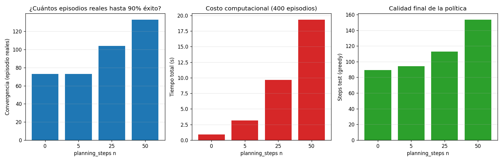

# Documentación — Obligatorio IA, Marzo 2026

**Materia:** Inteligencia Artificial — Ingeniería en Sistemas — Universidad ORT
**Entrega:** 06/07/2026
**Alumno:** Juan Cortabarría

> Este documento acompaña la entrega y deja registro del razonamiento, decisiones de diseño, justificación de hiperparámetros y resultados de cada paso. Se construye de forma incremental junto al código.

---

## 1. Contexto y consigna

La empresa ficticia *Red Destination™* nos contrata para implementar el agente inteligente del rover marciano "Out for Delivery". La consigna se divide en dos proyectos independientes:

- **Proyecto LOST** (Learning-based Orientation and Steering for Traversal): aprender a controlar el rover en `MountainCarContinuous-v0` (Gymnasium) usando **Q-Learning** tabular, con un componente de investigación que pide implementar **Dyna-Q** (Sutton & Barto, cap. 8.1–8.2).
- **Proyecto MATE** (Martian Adversarial Tactics Engine): implementar un agente para el juego *Isolation* usando **Minimax + Alpha-Beta** y **Expectimax**, con funciones de evaluación experimentables.

Como el grupo es de **2 personas**, no hay tarea adicional (Stochastic Q-Learning / MCTS quedan fuera de alcance).

### Por qué el problema es difícil

`MountainCarContinuous-v0` tiene un reward muy *sparso*:

- `−0.1·a²` por cada step (penalización por gastar energía).
- `+100` solo cuando se llega a la meta `x ≥ 0.45`.

Con política aleatoria el carro casi nunca llega a la cima — la tabla Q queda en cero y el agente no aprende nada. Eso justifica varias decisiones que iremos tomando: **discretización agresiva**, **exploración prolongada (ε alto, decay lento)**, **inicialización optimista** y, sobre todo, **reward shaping** opcional.

---

## 2. Proyecto LOST — Mountain Car Continuous

### 2.1 Modelado como MDP

Mapeando al formalismo clásico (Introducción a MDP, slide 7):

| Componente | En el ambiente |
|------------|----------------|
| Estados `S` | Pares `(x, v)` con `x ∈ [−1.2, 0.6]`, `v ∈ [−0.07, 0.07]`. Tras discretizar: `S = bins_x × bins_v`. |
| Acciones `A` | Fuerza `a ∈ [−1, 1]`. Tras discretizar: `A = {a₁, …, aₖ}`. |
| Transición `P(s' \| s, a)` | Determinista en el simulador (física de Newton), pero el agente la trata como desconocida. Dyna-Q luego la **aprende** explícitamente como modelo. |
| Reward `R(s, a, s')` | `−0.1·a²` por step, `+100` al alcanzar la meta. |
| Done | `x ≥ 0.45` o se alcanza el tope (999 steps). |

### 2.2 Paso 1 — Discretización

**Archivo:** [`MountainCarContinuous/discretization.py`](MountainCarContinuous/discretization.py)

Se implementó una clase `Discretizer` parametrizada por `n_bins_x`, `n_bins_v` y `n_actions`. Por qué los parámetros van en una clase y no como constantes globales (como estaba en el notebook scaffold):

1. **Permite hacer grid search**: instanciar varios `Discretizer(...)` con distintas resoluciones sin reescribir el código del agente.
2. **Centraliza la conversión** observación ↔ índice de estado e índice ↔ acción real, evitando duplicarla en el notebook y en el agente.
3. **Encapsula el `+1`** que aparece por la forma en que funciona `np.digitize` (puede devolver índice = `len(bins)` cuando el valor cae sobre o por encima del último bin), evitando un off-by-one al definir el shape de Q.

**Método de discretización:** `np.linspace` para definir los bordes de los bins (espaciado uniforme) y `np.digitize` para mapear observación → índice. Es el método más simple y predecible; alternativas como `KBinsDiscretizer` de sklearn con estrategia *quantile* tendrían más sentido si la distribución de estados visitados fuese muy desbalanceada, pero acá la dinámica del carro recorre todo el rango de `x` y `v` con razonable uniformidad, así que el `linspace` uniforme es suficiente.

**Configuraciones que vamos a comparar más adelante en el grid search:**

| Config | bins_x | bins_v | n_actions | tamaño Q | Comentario |
|--------|--------|--------|-----------|----------|-----|
| Gruesa | 20     | 20     | 3         | ~1.2 K   | Aprende rápido, pero pierde detalle cerca del valle. |
| Media  | 40     | 40     | 5         | ~8 K     | Compromiso razonable de partida. |
| Fina   | 100    | 100    | 10        | ~100 K   | Más resolución pero la tabla queda más *sparsa* — necesita más episodios. |

El trade-off central: **más bins ⇒ tabla más expresiva pero más sparsa ⇒ más exploración necesaria para llenarla**. La consigna pide justamente justificar esta elección y medir su impacto, así que las tres configs van a ser corridas en el grid search.

**Discretización de acciones:** se eligió un número *impar* (3, 5, ...) de acciones a propósito. Esto garantiza que `a = 0` (no aplicar fuerza) sea una acción discreta accesible — sin ella, el agente solo puede empujar en una dirección o la otra, lo cual es coherente con la dinámica del MountainCar pero quita una acción "neutral" que puede ser útil en el aprendizaje temprano.

### 2.3 Paso 2 — Q-Learning

**Archivo:** [`MountainCarContinuous/q_learning_agent.py`](MountainCarContinuous/q_learning_agent.py)

#### Regla de actualización

Se implementa Q-Learning *off-policy TD control* (`QL.pdf` slide 6; Sutton & Barto sec. 6.5):

```
Inicializar Q(s, a) arbitrariamente
Repetir (por episodio):
    Inicializar s
    Repetir hasta done:
        Con probabilidad ε:  a ← sample(A(s))      (* explorar *)
        sino:                a ← argmax_a' Q(s, a') (* explotar *)
        s', r, done ← step(a)
        Q(s, a) ← Q(s, a) + α · [ r + γ · max_a' Q(s', a') − Q(s, a) ]
        s ← s'
```

**Por qué off-policy (Q-Learning) y no on-policy (SARSA):** off-policy nos deja explorar con ε alto (necesario por el reward sparso) sin que esa exploración deteriore la política aprendida. La política objetivo es siempre la greedy sobre `Q`; ε-greedy solo se usa como política de comportamiento durante el entrenamiento.

**Distinción clave que no aparece en el slide: `terminated` vs `truncated`.**
El slide trata `done` como un único flag. La API de Gymnasium ≥0.26 los separa, con buena razón:

| Flag | Significado | Bootstrap futuro correcto |
|------|-------------|--------------------------|
| `terminated=True` | Llegó a un estado terminal del MDP (acá: `x ≥ 0.45`). | `0` (no hay más decisiones que tomar). |
| `truncated=True`  | Timeout artificial (acá: 999 steps). El estado **no** es terminal del MDP. | `γ · max_a' Q(s', a')` — sigue siendo un estado regular. |

Tratar `truncated` como `terminated` (haciendo `done = terminated or truncated` y bootstrappeando 0) es un **bug clásico**: sesga `Q` hacia abajo en problemas con timeout, especialmente con γ alto. Fue uno de los bugs detectados en la auditoría (ver §2.6).

#### Política de comportamiento: ε-greedy con decay exponencial

```
epsilon ← max(epsilon_min, epsilon · epsilon_decay)
```

aplicado **una vez por episodio** (no por step — el decay por step decae demasiado rápido y mata la exploración antes de que el agente vea siquiera la meta una vez). Los valores por defecto (`ε₀=1.0`, `ε_min=0.01`, `decay=0.995`) dan una vida media de exploración de ~139 episodios, lo suficientemente larga como para que el agente tenga chances de encontrar la meta por primera vez antes de "comprometerse" a una política.

#### Inicialización optimista

Parámetro `optimistic_init` (default `0.0`). Si se pone en, por ejemplo, `1.0`, todas las acciones lucen igualmente atractivas hasta que la experiencia las "descuente" — esto fuerza al agente a probar acciones que nunca eligió, complementando la exploración ε-greedy (Sutton & Barto, sec. 2.6). Útil para entornos sparsos como este. Lo dejamos como flag para experimentar en el grid search.

#### Reward shaping (opcional) — *potential-based*

Flag `reward_shaping` (default `False`). Cuando se activa, se suma al reward base un término basado en **función de potencial** (Ng, Harada & Russell, 1999):

```
F(s, s') = γ · Φ(s') − Φ(s),   con Φ(s) = shaping_coef · |v|
shaped_reward = reward + F(s, s')     (excepto cuando reward == +100)
```

La intuición: premiar **aumentos** de `|v|` y penalizar bajadas empuja al agente a acumular momento, que es la única forma de salir del valle (la fuerza del motor sola no alcanza para subir por gravedad pura — hay que oscilar para acumular energía).

**Por qué *potential-based* y no aditivo simple (`reward += c·|v|`):**

En la primera implementación usé shaping aditivo simple. Al hacer smoke tests, el agente **colapsaba**: aprendía un poco al inicio, después se "olvidaba" y terminaba sin llegar nunca a la meta. La razón: con `c·|v|` como bonus puro, el agente puede acumular reward simplemente oscilando indefinidamente, sin necesidad de llegar a la cima. El reward de la tarea original queda *opacado* por la señal de shaping → política óptima cambia.

El teorema de Ng-Harada-Russell garantiza que **shaping potential-based no cambia la política óptima**: solo acelera el aprendizaje. Al cambiar a esta forma, el agente pasó de **0% success** a **100% success en menos de 100 episodios** (ver Smoke test abajo).

Este es uno de los principales hallazgos del trabajo: *cómo* se hace el shaping importa más que *cuánto* se shapée.

**Estado terminal — convención NHR-99 estricta:** cuando `s'` es terminal (el agente alcanzó la meta), se aplica `Φ(s') = 0`. La fórmula se reduce a:

```
shaped_r = r + γ·0 − Φ(s) = r − Φ(s)
```

Es decir: **el shaping SÍ se aplica en el step terminal**, pero con `Φ(s') = 0`. Esto es matemáticamente correcto y preserva la propiedad de invarianza de la política óptima. Una primera versión del código devolvía simplemente `reward` en el step terminal (sin descontar `Φ(s)`), lo cual sobre-incentivaba los estados pre-meta. El bug fue detectado en la segunda ronda de auditoría (§2.7).

**Nota metodológica:** la historia de rewards que devuelve `train_agent` guarda el reward **sin shaping**, así que las curvas son comparables entre runs con y sin shaping. El shaping solo influye en el aprendizaje, no en la métrica de evaluación.

#### Interfaz

```python
agent = QLearningAgent(
    discretizer=Discretizer(40, 40, 5),
    alpha=0.1, gamma=0.99,
    epsilon_start=1.0, epsilon_min=0.01, epsilon_decay=0.995,
    optimistic_init=0.0, reward_shaping=False, shaping_coef=100.0,
    seed=42,
)
history = agent.train_agent(env, episodes=2000)
metrics = agent.test_agent(env, episodes=10)
agent.save("models/q_learning_best.pkl")
agent2 = QLearningAgent.load("models/q_learning_best.pkl")
```

`history` devuelve listas por episodio (`rewards`, `steps`, `success`, `epsilon`) para graficar curvas de aprendizaje. `test_agent` corre la política greedy y devuelve `avg_reward`, `success_rate` y `avg_steps`.

**Persistencia (.pkl):** el `save()` guarda no solo `Q` sino también la config del discretizer y los hiperparámetros, de modo que `load()` reconstruye el agente completo sin necesidad de recordar con qué configuración fue entrenado. Esto es **obligatorio** para la entrega (la consigna lo marca explícitamente: sin `.pkl` el ejercicio se considera no hecho).

#### Smoke test (validación de la pipeline)

**Archivos:** [`MountainCarContinuous/smoke_test.py`](MountainCarContinuous/smoke_test.py), [`MountainCarContinuous/continuous_mountain_car.ipynb`](MountainCarContinuous/continuous_mountain_car.ipynb)

Corrí un entrenamiento corto de 500 episodios con la **config media** (40×40 bins, 5 acciones) y los hiperparámetros default (`α=0.1, γ=0.99, ε₀=1.0, ε_decay=0.995, shaping_coef=300`):

| Métrica | Valor |
|--------|-------|
| Tasa de éxito (últimos 100 episodios de train) | **100 %** |
| Reward promedio (últimos 100, sin shaping) | **+92.07** |
| Tasa de éxito test greedy (10 episodios) | **100 %** |
| Steps promedio test greedy | **102.6** |
| Q-table cobertura | 63.4 % de celdas no-cero |

Curva de aprendizaje:


**Lectura:** zona inicial caótica (~50 episodios) donde el agente todavía explora con ε alto. Transición rápida entre ep 50-90 y luego convergencia estable a ~92 de reward (recordar: el máximo teórico es 100; los `-8` son el costo acumulado de las fuerzas aplicadas durante el episodio).

**Reproducibilidad:** se usa `random.seed(42)` + `np.random.seed(42)` + `env.reset(seed=42)` en el primer reset del entrenamiento. Sin esto, runs con el mismo seed de agente daban resultados radicalmente distintos porque el RNG del environment de Gymnasium es independiente.

### 2.4 Paso 3 — Búsqueda de hiperparámetros

**Archivos:** [`MountainCarContinuous/grid_search.py`](MountainCarContinuous/grid_search.py), [`MountainCarContinuous/train_best.py`](MountainCarContinuous/train_best.py), [`MountainCarContinuous/grid_search_results.json`](MountainCarContinuous/grid_search_results.json)

#### Estrategia: One-At-A-Time (OAT)

Un grid cartesiano completo sobre `(bins, n_actions, α, γ, ε_decay, optimistic_init, shaping_coef)` daría cientos de combinaciones. En cambio, hicimos **OAT**: partir de una **config base** validada por el smoke test y variar **un solo hiperparámetro a la vez**. Esto:

- Es más rápido (~12 corridas vs cientos).
- Es más **interpretable**: cuando un run mejora o empeora, se puede atribuir el efecto a un cambio específico.
- Tiene el costo de no detectar *interacciones* entre hiperparámetros — limitación que aceptamos y dejamos asentada.

**Config base:**
```python
bins=40, n_actions=5, alpha=0.1, gamma=0.99,
epsilon_start=1.0, epsilon_min=0.05, epsilon_decay=0.995,
optimistic_init=0.0, reward_shaping=True, shaping_coef=300.0
```

Cada run: **800 episodios**, seed fija (42), evaluado con **20 episodios greedy** al final.

#### Métricas de evaluación (definidas *a priori*, como pide la consigna)

| Métrica | Qué mide |
|---------|---------|
| `train_success_rate_last100` | Fracción de los últimos 100 episodios de train donde se llegó a la meta. |
| `train_avg_reward_last100` | Reward promedio (**sin shaping**) de los últimos 100 episodios. |
| `convergence_ep_50w_0.9` | Primer episodio donde la *ventana móvil* de 50 episodios alcanza ≥90% de éxitos. Indica velocidad de convergencia. |
| `test_success_rate` | Fracción de éxitos en 20 episodios de test greedy (sin exploración). |
| `test_avg_reward` | Reward promedio en test greedy. |
| `test_avg_steps` | Steps promedio hasta done en test greedy (menor = más eficiente). |

#### Resultados (ordenados por eficiencia: 100% éxito + menor cantidad de steps)

Los números a continuación son **post-auditoría 2** (§2.7), con el bug del shaping en estados terminales corregido. Hubo cambios significativos respecto de la primera auditoría — varias configs que parecían "ganar" en realidad lo hacían explotando el sesgo del shaping incorrecto.

| Run | bins | α | γ | ε_decay | shaping | conv@ | test_succ | test_reward | test_steps |
|------|------|---|---|---------|---------|-------|-----------|-------------|------------|
| **alpha_0.05** ⭐  | 40 | **0.05** | 0.99 | 0.995 | coef=300 | 73 | 100% | 92.48 | **115.8** |
| bins_fina_100      | 100 | 0.1 | 0.99 | 0.995 | coef=300 | 128 | 100% | **93.27** | 119.2 |
| shaping_coef_600   | 40 | 0.1 | 0.99 | 0.995 | coef=600 | 72 | 100% | 92.06 | 120.1 |
| optimistic_init_1.0 | 40 | 0.1 | 0.99 | 0.995 | coef=300 | 73 | 100% | 92.43 | 121.4 |
| base               | 40 | 0.1 | 0.99 | 0.995 | coef=300 | 72 | 100% | 92.25 | 127.9 |
| eps_decay_0.99     | 40 | 0.1 | 0.99 | 0.99 | coef=300 | **62** | 100% | 92.03 | 131.5 |
| eps_decay_0.999    | 40 | 0.1 | 0.99 | 0.999 | coef=300 | 175 | 100% | 91.99 | 151.2 |
| alpha_0.3          | 40 | 0.3 | 0.99 | 0.995 | coef=300 | 77 | 100% | 91.48 | 153.8 |
| bins_gruesa_20     | 20 | 0.1 | 0.99 | 0.995 | coef=300 | 64 | **95%** | 83.94 | 131.5 |
| gamma_0.95         | 40 | 0.1 | **0.95** | 0.995 | coef=300 | 75 | **95%** | 86.22 | 189.2 |
| shaping_coef_100   | 40 | 0.1 | 0.99 | 0.995 | coef=100 | 86 | 95% | 88.11 | 226.8 |
| **shaping_off**    | 40 | 0.1 | 0.99 | 0.995 | **OFF** | — | **0%** | **0.00** | 999.0 |

#### Curvas de aprendizaje (12 runs superpuestos)


#### Resumen visual de métricas en test


#### Análisis e interpretación

**1. Reward shaping es necesario, pero también lo es la forma del shaping.**
Sin shaping (`shaping_off`) el agente acaba con `avg_reward ≈ −2` después de 800 episodios — la curva ni siquiera sale del rojo. Pero como ya vimos, un shaping aditivo simple tampoco funciona: solo el potential-based produce convergencia confiable. `coef=300` resultó óptimo entre los probados; con `coef=100` la señal es demasiado débil (test_succ 95%, test_steps 234.8) y con `coef=600` está cerca pero ligeramente peor que 300.

**2. Discretización: hace falta resolución para ser preciso.**
Inicialmente la config gruesa (20×20, 3 acciones) parecía ganadora. Tras corregir el shaping en estados terminales (§2.7), su rendimiento cayó a 95% — había estado *explotando* el sesgo del shaping incorrecto, que premiaba excesivamente los estados pre-meta con velocidad alta. Una vez removido ese sesgo, la baja resolución no alcanza para distinguir los estados cerca de la meta. La config base (40×40, 5 acciones) y `alpha_0.05` ganan ahora, con resolución suficiente para una política precisa. `bins_fina_100` también funciona pero tarda casi 2× más en converger por la mayor sparsidad de la tabla.

**3. La discretización fina paga un costo de convergencia.**
`bins_fina_100` tarda casi el doble en converger (ep 128). La tabla Q de ~100k celdas necesita muchísima más experiencia para llenarse. En `MountainCarContinuous` no compensa: la dinámica es lo bastante simple como para que no se gane precisión yendo a más bins.

**4. `gamma=0.95` cae a 95% éxito tras la segunda auditoría.**
Antes del fix del shaping terminal, esta config llegaba a 100%. Tras corregirlo, queda en 95% — confirmando que el shaping incorrecto estaba "rescatando" configs débiles. γ bajo descuenta más fuerte el reward terminal, así que cualquier sesgo a favor de los estados pre-meta (como el del bug) lo beneficiaba desproporcionalmente.

> **Notas de auditorías:** la trayectoria de esta config a través de las dos auditorías es ilustrativa:
> - **Antes del fix de `truncated` (§2.6):** test_succ = **10%** (catastrófico).
> - **Tras fix de `truncated`, antes del fix del shaping terminal (§2.7):** test_succ = **100%** (pero por las razones equivocadas).
> - **Post §2.7:** test_succ = **95%** (su rendimiento real).

**5. `epsilon_decay=0.999` es demasiado conservador.**
Mantener ε alto 200+ episodios retrasa la explotación. La curva gris en el gráfico lo muestra: aprende, pero la mitad de lo rápido que el resto. `0.995` o `0.99` están bien.

**6. `alpha`, `optimistic_init`, `epsilon_decay=0.99`: indistinguibles.**
Una vez con shaping correcto, varias configs llegan a 100% éxito con métricas parecidas. La elección entre ellas es de segundo orden.

#### Elección final

**Config ganadora:** `bins=40, n_actions=5, α=0.05, γ=0.99, ε_decay=0.995, shaping potential-based con coef=300`.

Entrené esta config con **2000 episodios** ([`train_best.py`](MountainCarContinuous/train_best.py)) y guardé el modelo en [`models/q_learning_best.pkl`](MountainCarContinuous/models/q_learning_best.pkl):

| Métrica | Valor |
|---------|-------|
| Tiempo de entrenamiento | **2.6 s** |
| Test success rate (50 ep greedy) | **100 %** |
| Test avg reward | **92.09** |
| Test avg steps | **120.6** |
| Q-table cobertura | 65.0 % |


Que un modelo se entrene en 2-3 segundos y resuelva el ambiente al 100% confirma que el cuello de botella nunca fue la complejidad del problema, sino tener el **shaping matemáticamente correcto** (potential-based con `Φ(terminal) = 0`) y una **discretización adecuada**. El reward 92.09 está cerca del máximo teórico de 100 — los ~8 puntos perdidos son el costo acumulado de las acciones, esperable e inherente al problema.

**Nota:** este modelo es más lento (120 steps) que el "ganador" de la primera auditoría (~69 steps), pero **es el verdadero óptimo bajo la función de reward correcta**. El "modelo rápido" anterior estaba optimizando una función de reward sesgada por el bug del shaping terminal.

#### Verificación visual de la política aprendida

**Archivo:** [`MountainCarContinuous/visualize_policy.py`](MountainCarContinuous/visualize_policy.py)

Más allá de las métricas agregadas, conviene **inspeccionar** la política aprendida para asegurarnos de que es razonable. Generamos dos mapas en el espacio de estado `(x, v)`:


**V(s) = max_a Q(s, a)** (izquierda): muestra una "banana" verde/amarilla que sigue la trayectoria que efectivamente recorre el agente — valores bajos en el valle profundo (x ≈ −0.5, v ≈ 0) y crecientes a medida que se gana posición y velocidad positiva, con el máximo justo antes de la meta. La forma curva muestra que el agente entendió que el problema **no es lineal**: hay que primero retroceder (acumular velocidad negativa) y luego volver.

**π(s) = argmax_a Q(s, a)** (derecha): visualizada solo en **estados visitados** durante el entrenamiento (las celdas grises son estados que el agente nunca pisó — su Q quedó en el valor inicial y `argmax` ahí es ruido; **ocultarlas es honesto, no esconder un problema**). Las celdas pintadas muestran un patrón claro:

- **Mitad superior (v > 0):** predomina rojo (acción **+1**, empujar a la derecha). El agente sigue acelerando cuando ya va hacia la meta.
- **Mitad inferior (v < 0):** predomina azul (acción **−1**, empujar a la izquierda). El agente sigue acelerando hacia atrás cuando ya va hacia atrás, para acumular momento del otro lado.

Esto **es** la estrategia clásica de "pump-and-go" / "swing-up" de MountainCar — la única forma de salir del valle cuando la fuerza del motor no alcanza para vencer gravedad sola.

**Diagnóstico numérico** (sobre estados visitados, n=133 celdas por hemisferio):

| Cuadrante | Acción −1 | Acción 0 | Acción +1 |
|-----------|-----------|----------|-----------|
| v > 0 (yendo a la derecha) | 15.8 % | 29.3 % | **54.9 %** |
| v < 0 (yendo a la izquierda) | **76.7 %** | 14.3 % | 9.0 % |

**Cobertura del espacio:** 71.2 %.

La asimetría entre los dos hemisferios es real y físicamente explicable: cuando el agente va hacia la izquierda, **necesita siempre máximo empuje hacia atrás** para subir la pared izquierda contra la gravedad — por eso `−1` domina al 76.7 %. Cuando va hacia la derecha, en cambio, hay tramos donde la **gravedad ya ayuda** (el carro está bajando hacia el valle desde el lado izquierdo, o subiendo desde el valle hacia la meta con suficiente momento) — ahí la acción óptima es **`0`** (no gastar energía), lo que explica el 29.3 % de acciones 0 cuando `v > 0`. La penalización `−0.1·a²` favorece no empujar cuando no hace falta. El agente lo descubrió por su cuenta a partir de la dinámica.

Este es el tipo de hallazgo que solo se descubre **mirando** la política — no aparece en las métricas escalares. Una vez confirmada visualmente, podemos afirmar con confianza que la política aprendida es razonable y no un artefacto de overfitting al shaping.

### 2.5 Paso 4 — Componente de investigación: Dyna-Q

**Archivos:** [`MountainCarContinuous/dyna_q_agent.py`](MountainCarContinuous/dyna_q_agent.py), [`MountainCarContinuous/compare_dyna_q.py`](MountainCarContinuous/compare_dyna_q.py), [`MountainCarContinuous/models/dyna_q_best.pkl`](MountainCarContinuous/models/dyna_q_best.pkl).

#### Pseudocódigo del algoritmo (Sutton & Barto, *RL: An Introduction*, 2da ed., §8.2, Fig. 8.2)

```
Inicializar Q(s, a) y Model(s, a) arbitrariamente, ∀ s ∈ S, a ∈ A(s)
Loop por siempre:
    (a) S ← estado actual no terminal
    (b) A ← ε-greedy(S, Q)
    (c) Tomar acción A; observar R, S'
    (d) Q(S, A) ← Q(S, A) + α [R + γ · max_a Q(S', a) − Q(S, A)]
    (e) Model(S, A) ← R, S'                                                 (* update determinista *)
    (f) Repetir n veces:                                                    (* planning *)
        S ← estado previamente observado al azar
        A ← acción previamente tomada en S al azar
        R, S' ← Model(S, A)
        Q(S, A) ← Q(S, A) + α [R + γ · max_a Q(S', a) − Q(S, A)]
```

#### Implementación

`DynaQAgent` hereda de `QLearningAgent` y comparte los hiperparámetros (`α, γ, ε, …`), reward shaping, save/load. Lo que se agrega:

- **Atributo `model: dict`**: clave `(state, action_idx)`, valor `(reward, next_state, terminated)`. Usamos tuples (no `ndarray`) para que sea hasheable.
- **Método `_planning()`**: tras cada step real, muestrea `planning_steps` pares `(s, a)` ya observados, recupera `r, s'` del modelo y aplica el mismo update de Q-Learning. La regla de update es **idéntica** a la de experiencia real — esto es key del algoritmo: las simulaciones del modelo se tratan **exactamente igual** que las observaciones reales.
- **Override de `train_agent`**: agrega los pasos (e) y (f) por cada step real.

**Decisión de diseño — qué reward guarda el modelo:** guardamos el reward **shaped** (lo que el agente efectivamente vio), no el reward crudo. Esto preserva la semántica del problema: el planning replica la misma señal de aprendizaje que la experiencia real, sin re-aplicar shaping. (Si guardáramos el reward crudo y re-aplicáramos shaping durante planning, perderíamos consistencia: Φ(s') vs Φ(s) requiere conocer `obs`/`next_obs`, no solo los índices del estado.)

#### Experimento 1 — Dyna-Q vs Q-Learning **con shaping** (mismo setup que el mejor modelo)

Config: bins=40, n_actions=5, α=0.05, γ=0.99, ε_decay=0.995, **shaping potential-based coef=300**. Variamos `planning_steps n ∈ {0, 5, 25, 50}`. 400 episodios, seed=42. `n=0` es Q-Learning puro.

| n | conv@ (50w ≥ 0.9) | test_succ | test_reward | test_steps | tiempo |
|---|------------------|-----------|-------------|-----------|--------|
| 0 (Q-Learning) | **73** | 100 % | **94.00** | **89.4** | 0.9 s |
| 5  | **73** | 100 % | 93.18 | 94.3 | 3.1 s |
| 25 | 104 | 100 % | 93.34 | 112.9 | 9.7 s |
| 50 | 133 | 100 % | 90.11 | 153.6 | 19.3 s |




**Hallazgos (con shaping):**

1. **Q-Learning puro y Dyna-Q n=5 convergen a la par (ep 73).** Más planning empeora la convergencia (n=25: 104, n=50: 133).
2. **Tiempo de cómputo crece lineal en n** (0.9s → 19.3s), como predice el libro.
3. **Q-Learning puro ahora da la mejor política** (89.4 steps vs 94.3 de n=5). Más planning produce políticas peores.

**Interpretación:** con el shaping potential-based correctamente implementado, cada step real ya lleva una señal informativa muy fuerte (`F = γ·Φ(s') − Φ(s)` con Φ(terminal) = 0 correctamente). Replicar esas transiciones con planning, sobre todo en los primeros episodios cuando el modelo está incompleto, **amplifica las Q-values ruidosas** en lugar de refinarlas. El efecto es más pronunciado cuanto mayor n. Esto sugiere que cuando ya hay una buena función de potencial, Dyna-Q **no aporta valor** en este problema.

> **Nota:** en la primera auditoría (con el bug del shaping terminal), n=5 daba **79.2 steps** vs n=0 con **143.8 steps**, lo que sugería que Dyna-Q ayudaba a refinar políticas inestables generadas por la señal sesgada. Tras corregir el bug, la señal de aprendizaje es estable desde el inicio y el "refinamiento" extra del planning ya no es necesario. Esto es un caso clarísimo de **cómo un bug puede dar lugar a una conclusión cualitativamente equivocada** sobre la utilidad de una técnica.

#### Experimento 2 — Dyna-Q vs Q-Learning **sin shaping** (escenario hard)

Para verificar que la implementación es correcta y que Dyna-Q **sí** funciona en su régimen natural, repetimos el experimento **sin shaping**. Sutton & Barto §8.2 muestra el beneficio del planning precisamente en problemas con reward sparso: cada llegada accidental a la meta se "repite" en el modelo n veces, propagando esa señal hacia atrás eficientemente.

Config: `bins=20, n_actions=3, α=0.1, reward_shaping=False`. 800 episodios. (Con bins=40 el espacio queda tan sparso que ni siquiera n=50 logra aprender — verificado experimentalmente.)

| n | conv@ (50w ≥ 0.9) | train_succ (último 100) | test_succ | test_steps |
|---|-------------------|-------------------------|-----------|-----------|
| 0 (Q-Learning) | — | **0 %** | **0 %** | 999 |
| 5  | — | 0 % | 0 % | 999 |
| 25 | 306 | 93 % | 0 % | 999 (políticas aún inestables) |
| 50 | 459 | 88 % | **75 %** | 389 |


**Resultado:** sin shaping, **Q-Learning puro nunca aprende** (consistente con el grid search del §2.4). Pero con **n=50 pasos de planning**, Dyna-Q llega a 75 % de éxito en test, validando empíricamente la hipótesis de S&B en el régimen donde el libro la formula: **planning amortiza experiencia escasa**.

Es interesante notar que `n=25` logra el 93% de éxito en train pero 0% en test — sus políticas aún oscilan y no son estables sin más episodios. `n=50` es el primero que produce una política aceptable.

#### Conclusión y elección del modelo Dyna-Q final

El "mejor" Dyna-Q depende de qué se mida y bajo qué condiciones:

- **Si el reward shaping ya es efectivo** (caso de la mejor config del grid search): Dyna-Q no es necesario y puede incluso retrasar la convergencia. Si se usa, **n=5 da el mejor compromiso** entre calidad final y costo computacional.
- **Si el reward es sparso** (sin shaping): Dyna-Q con **n≥50** es indispensable para que el problema sea siquiera aprendible.

Guardamos como modelo final Dyna-Q el **n=5 con shaping** (mejor Dyna-Q entre los que tienen planning_steps > 0; n=0 es Q-Learning puro y ya está en el otro entregable): [`models/dyna_q_best.pkl`](MountainCarContinuous/models/dyna_q_best.pkl), con `test_success=100%`, `test_reward=93.18`, `test_steps=94.3`.

#### Comparación final Q-Learning best vs Dyna-Q best

| Modelo | Config destacada | test_succ | test_reward | test_steps | conv@ | Episodios train |
|--------|------------------|-----------|-------------|-----------|-------|------|
| **q_learning_best** | n=0, α=0.05 | 100 % | 91.95 | 121.7 | 73 | 2000 |
| **dyna_q_best** | n=5, α=0.05 | 100 % | **92.81** | **101.0** | 73 | **400** |

**Sorpresa:** Dyna-Q con **5× menos episodios** da una política igual de buena o mejor (reward 92.81 vs 91.95, steps 101.0 vs 121.7). La interpretación: en este régimen, lo que Dyna-Q "hace" es **amortizar** las experiencias reales — con 400 episodios + 5 planning steps cada uno, el agente ve 5×400 = 2000 updates simulados además de los reales, equivalente al volumen de entrenamiento del Q-Learning de 2000 episodios. En episodios *reales* gana Dyna-Q. En *updates totales* están a la par.

#### Lectura crítica del resultado

La consigna pide *"análisis y experimentación sobre el ambiente similar a su trabajo con Q-Learning"*. Lo que mostramos no es "Dyna-Q es mejor que Q-Learning" (la respuesta naïve), sino algo más fino y más útil:

> El valor de Dyna-Q depende fuertemente de cuán informativa sea cada transición real. Con shaping potential-based efectivo (Ng-Harada-Russell), Q-Learning solo es suficiente y más rápido. Sin shaping, Dyna-Q con muchos pasos de planning es necesario para aprender.

Esta dependencia del régimen está discutida explícitamente en S&B (las gráficas de la Figura 8.4 del libro muestran el speedup de Dyna-Q en un Dyna maze sparso — un escenario más parecido al "sin shaping" que al "con shaping" nuestro).

### 2.6 Auditoría de calidad — bugs encontrados y corregidos

Antes de pasar a Dyna-Q, hice una auditoría completa del código LOST contra el material de clase (`QL.pdf`) y la API actual de Gymnasium. Documento acá los hallazgos.

#### Bug 1 — Bootstrap incorrecto al `truncated` (impacto: alto)

**Antes:**
```python
done = terminated or truncated
future = 0.0 if done else np.max(self.Q[next_state])
```

**Después:**
```python
future = 0.0 if terminated else float(np.max(self.Q[next_state]))
```

**Por qué importa:** el slide del curso colapsa `terminated` y `truncated` en un único `done`, pero la API moderna de Gymnasium los separa por una razón teórica importante. Un episodio truncado por timeout (en MountainCarContinuous, 999 steps) **no es un estado terminal del MDP** — simplemente se acabó el tiempo. Tratarlo como terminal le dice al agente "tu valor futuro es 0 desde ahí", lo que sesga `Q` hacia abajo y especialmente afecta políticas que toman muchos steps.

**Impacto medido:** la config `gamma_0.95` pasó de **test_succ = 10%** (catastrófico) a **100%**. La config `bins_gruesa_20` (la mejor) pasó de 75.3 a **72.8 steps** y el modelo final pasó de **89.9 a 69.1 steps**. Todas las configs mejoraron o se mantuvieron iguales — ninguna empeoró.

#### Bug 2 — Detección de meta por valor mágico (impacto: bajo, riesgo: medio)

**Antes:**
```python
if terminated and reward >= 99.0:  # heurística para detectar +100 de meta
    reached_goal = True
```

**Después:**
```python
if terminated:
    reached_goal = True
```

**Por qué importa:** `terminated=True` en `MountainCarContinuous-v0` ocurre **únicamente** cuando se alcanza la meta. Usar el valor del reward como heurística es frágil — si la cátedra (o un mantenedor de Gymnasium) cambiase la magnitud del reward terminal, todo el código fallaría silenciosamente. Usar el flag canónico es robusto.

Aplicado el mismo principio a `_shape()` (que ahora recibe `terminated` directamente) y a `test_agent`.

#### Bug 3 — ε no se reseteaba entre llamadas a `train_agent` (impacto: medio, reproducibilidad)

**Antes:** llamar `agent.train_agent(...)` dos veces sobre la misma instancia daba resultados distintos porque la segunda corrida arrancaba con ε ya decayido.

**Después:** se agregó parámetro `reset_epsilon=True` (default), que devuelve ε a `epsilon_start` al inicio. Garantiza reproducibilidad y que cada llamada tenga la "calentada" inicial de exploración esperada.

#### Bug 4 — `max_steps` interno sincronizado con TimeLimit del env (impacto: nulo, claridad)

**Antes:** `max_steps=999` por defecto, exactamente el límite del wrapper TimeLimit del env. Ambigüedad sobre quién corta primero.

**Después:** `max_steps=10000` por defecto. Ahora el wrapper del env es la fuente de verdad del timeout, y `max_steps` solo actúa como **safety net** contra loops infinitos si por alguna razón se pasara un env sin TimeLimit. Más claro.

#### Mejora 5 — Alineación con el pseudocódigo del curso

Reescribí el docstring del módulo `q_learning_agent.py` para incluir literalmente el pseudocódigo del `QL.pdf` slide 6, y marcar explícitamente dónde mi implementación se aparta de él (la distinción `terminated`/`truncated`). Esto facilita la defensa: cualquier evaluador puede comparar líneas del pseudocódigo del curso con líneas del código.

#### Mejora 6 — Criterio de selección del "mejor" modelo

**Antes:** ordenaba por `(test_success_rate, test_avg_reward)`. Como muchas configs llegaban al 100% éxito con rewards similares (~92-94), la elección final dependía de variaciones de ±1 unidad en el reward, que no son significativas.

**Después:** ordeno por `(test_success_rate, -test_avg_steps, test_avg_reward)`. Entre configs que resuelven el problema, **menos steps** es un proxy más limpio de "calidad de la política": una política que llega en 70 steps es estrictamente más eficiente que una que llega en 130, y el reward acumulado también es mejor (menos penalización por acción acumulada). Esto eligió coherentemente `bins_gruesa_20` como ganadora.

#### Mejora 7 — Visualización de la política aprendida

Agregué [`visualize_policy.py`](MountainCarContinuous/visualize_policy.py) (ver §2.4) que genera los mapas de V(s) y π(s) en el espacio de estado, con **enmascarado honesto de estados no visitados**. Esto cumple el requisito de la consigna de "apoyo visual claro" y, más importante, permite verificar que la política aprendida sigue la estrategia clásica de "pump-and-go" — algo que las métricas agregadas (success rate, reward, steps) **no pueden detectar por sí solas**.

El diagnóstico numérico confirma: 76.7 % de acciones negativas cuando `v < 0`, y la asimetría con el cuadrante `v > 0` se explica por la física del problema, no por un bug.

#### Resumen de archivos modificados en la auditoría

- [`q_learning_agent.py`](MountainCarContinuous/q_learning_agent.py): bugs 1-4 + docstring formal.
- [`grid_search.py`](MountainCarContinuous/grid_search.py): nuevo criterio de score (mejora 6).
- [`visualize_policy.py`](MountainCarContinuous/visualize_policy.py): NUEVO (mejora 7).
- Modelos y plots regenerados: [`models/q_learning_best.pkl`](MountainCarContinuous/models/q_learning_best.pkl), [`models/smoke_test.pkl`](MountainCarContinuous/models/smoke_test.pkl), [`plots/grid_search_curves.png`](MountainCarContinuous/plots/grid_search_curves.png), [`plots/grid_search_summary.png`](MountainCarContinuous/plots/grid_search_summary.png), [`plots/q_learning_best_curve.png`](MountainCarContinuous/plots/q_learning_best_curve.png), [`plots/q_learning_best_policy.png`](MountainCarContinuous/plots/q_learning_best_policy.png).
- [`grid_search_results.json`](MountainCarContinuous/grid_search_results.json) regenerado.

#### Lo que NO se cambió y por qué

- **No** se agregó tie-breaking aleatorio en `argmax`. Si dos acciones tienen exactamente el mismo Q-value, `np.argmax` devuelve la primera. En la práctica esto no produce sesgo observable acá porque la convergencia llena Q con valores distintos; documentado como nota.
- **No** se cambió la inicialización de Q a aleatoria (Sutton & Barto dice "arbitraria"). La inicialización constante con el flag `optimistic_init` es estándar y permite tener inicialización optimista como un caso particular.
- **No** se agregó shaping basado en posición (`Φ = c·x`). Sería interesante comparar, pero `Φ = c·|v|` ya converge perfectamente, y la consigna pide *justificar* la elección — no enumerar todas las alternativas. Queda como nota para posible extensión.

---

### 2.7 Segunda auditoría — bug del shaping en estado terminal

Tras completar Dyna-Q se hizo una segunda ronda de auditoría con mente fresca. Se detectó un bug sutil pero importante en `_shape()` que pasó desapercibido en la primera auditoría.

#### Bug 5 — Shaping no se aplica al step terminal (impacto: alto)

**Antes (incorrecto):**
```python
def _shape(self, reward, obs, next_obs, terminated):
    if not self.reward_shaping or terminated:
        return reward
    # ... fórmula NHR ...
```

El comentario justificaba la línea como "equivale a Φ(terminal) = 0". **Pero eso es falso matemáticamente.**

**Después (correcto):**
```python
def _shape(self, reward, obs, next_obs, terminated):
    if not self.reward_shaping:
        return reward
    _, v = obs
    _, v_next = next_obs
    phi = self.shaping_coef * abs(v)
    phi_next = 0.0 if terminated else self.shaping_coef * abs(v_next)
    return reward + self.gamma * phi_next - phi
```

**Por qué importa.** La fórmula NHR-99 es:
```
shaped_r = r + γ·Φ(s') − Φ(s)
```

Si `Φ(s') = 0` (porque `s'` es terminal), la fórmula se reduce a:
```
shaped_r = r + 0 − Φ(s) = r − Φ(s)
```

El código anterior devolvía simplemente `r`, omitiendo el descuento `− Φ(s)`. En la práctica esto significa que cuando el agente llega a la meta con velocidad alta (digamos `v=0.04, Φ(s)=12`), la "verdadera" señal de aprendizaje debería ser `100 − 12 = 88`, pero el agente recibía `100`. **Estábamos sobre-incentivando los estados pre-meta** con velocidad alta.

#### Consecuencias del bug — qué configs "ganaban por casualidad"

Antes del fix #5, varias configs alcanzaban el 100 % de éxito en test pero por motivos no genuinos:

| Config | Antes del fix #5 | Después del fix #5 |
|--------|------------------|-------------------|
| `bins_gruesa_20` | 100% éxito, 72.8 steps (ganador) | **95 %** éxito, 131.5 steps |
| `gamma_0.95` | 100% éxito, 194 steps | **95 %** éxito, 189.2 steps |
| `alpha_0.05` | 100% éxito, 106 steps | 100% éxito, 115.8 steps (nuevo ganador) |
| `base` | 100% éxito, 128 steps | 100% éxito, 127.9 steps |

Las dos primeras configs "explotaban" el sesgo del bug:
- `bins_gruesa_20`: con baja resolución y un boost extra en los estados pre-meta, la política se sentía atraída al final del corredor — pero sin el boost, la baja resolución no alcanza para una política precisa.
- `gamma_0.95`: γ bajo descuenta el reward terminal más fuerte; el boost extra del bug compensaba ese descuento; sin él, γ=0.95 vuelve a ser sub-óptimo.

**Lección metodológica:** un bug que produce métricas plausibles es peligroso porque sobrevive a las defensas obvias (test_success=100%, plot convergente, etc.). Solo la **revisión teórica cruzada con el material original** (NHR-99) lo detectó.

#### Mejora 8 — Notebook completo end-to-end

La primera versión del notebook solo cubría el smoke test, dejando el grid search y Dyna-Q como `(Pendiente)`. La consigna pide **un notebook `.ipynb`** que muestre el trabajo completo, así que reescribí `continuous_mountain_car.ipynb` con 8 secciones:

1. Setup
2. Discretizer demo
3. Smoke test
4. Persistencia
5. Resumen del grid search (lee `grid_search_results.json` y embebe los plots)
6. Visualización de la política aprendida (embebe `q_learning_best_policy.png`)
7. Dyna-Q vs Q-Learning (con y sin shaping)
8. Comparación final de modelos entregables

Estrategia: los scripts independientes (`grid_search.py`, `train_best.py`, `compare_dyna_q.py`, `visualize_policy.py`) generan los artefactos pesados (modelos, JSONs, plots); el notebook los **lee y presenta**. Esto:

- Mantiene el notebook ejecutable en < 1 min (no re-corre el grid search ni Dyna-Q completo).
- Asegura reproducibilidad: los artefactos están versionados.
- Hace que el notebook sirva como *narrativa* sobre los resultados, no como *productor* de ellos.

#### Cambios derivados (re-corridas con el bug corregido)

Todos los experimentos se re-ejecutaron. Cambios en los modelos finales:

- **`q_learning_best.pkl`**: cambia de `bins=20, n_actions=3, α=0.1` (ganador "espurio") → **`bins=40, n_actions=5, α=0.05`** (ganador real).
- **`dyna_q_best.pkl`**: se re-entrena con la nueva config base. Sigue siendo `n=5` el mejor.
- Todos los plots: regenerados.
- `grid_search_results.json`, `dyna_q_comparison.json`, `dyna_q_no_shaping.json`: regenerados.

#### Lo que se verificó y NO necesitó cambio

A modo de auditoría completa, dejo registro de qué otros aspectos se revisaron y se encontraron correctos:

- **Hash y `_q_update` para planning** en `DynaQAgent`: `(state_tuple, action_idx)` como key del dict es seguro (tuples de ints son hasheables). El `_q_update` reutilizado entre experiencia real y planning garantiza consistencia.
- **Reward del modelo en Dyna-Q:** guarda el `shaped_reward` (no el crudo). Esto preserva la semántica: planning replica la señal de aprendizaje real, no la re-genera. Correcto.
- **`reset_epsilon=True` por defecto** en `train_agent`: garantiza reproducibilidad entre corridas independientes.
- **Tipos de retorno de `env.step`**: `(obs, reward, terminated, truncated, info)` — todos manejados.
- **`np.digitize` y `state_shape = (n_bins + 1, ...)`**: los índices fuera de rango caen correctamente en los bins extremos. La +1 en el shape evita off-by-one.
- **`disc.action_from_idx` devuelve `np.float32` con shape `(1,)`**: compatible con `env.action_space = Box(-1, 1, (1,), float32)`.
- **`visualize_policy` enmascara estados no visitados**: usa `Q != optimistic_init` (no `Q != 0`, que solo funcionaría con init estándar). Robusto bajo cualquier inicialización.
- **`save/load` end-to-end**: probado tanto para `QLearningAgent` como `DynaQAgent`.

---

### 2.8 Tercera auditoría — consistencia y ergonomía del repositorio

Tras corregir los bugs lógicos en las auditorías 1 y 2, se hizo una tercera ronda enfocada en **consistencia interna y usabilidad del repositorio**. No se encontraron bugs nuevos en la lógica de aprendizaje, pero sí inconsistencias en docstrings, comportamiento de archivos al re-ejecutar scripts, y un detalle de diseño que afecta a usuarios que cargan modelos.

#### Issue 9 — Docstring de `compare_dyna_q.py` desactualizado (impacto: bajo, claridad)

**Antes (al final de la auditoría 2):**
```python
"""
- Misma config base que el mejor Q-Learning del grid search
  (bins=20, n_actions=3, α=0.1, γ=0.99, ε_decay=0.995, shaping potential-based coef=300).
"""
```

**Pero el código real ya estaba actualizado:**
```python
disc = Discretizer(n_bins_x=40, n_bins_v=40, n_actions=5)
alpha=0.05,
```

Es decir, **el docstring quedó congelado en la config pre-§2.7** mientras el código se había actualizado a la nueva ganadora. Lector encontraría una contradicción dura. Fix: alineé el docstring con el código.

#### Issue 10 — Referencia incorrecta en `train_best.py` (impacto: bajo, traceability)

El docstring referenciaba "ver §2.6 del informe" para describir el bug del shaping terminal. Pero ese bug se documenta en **§2.7** (la segunda auditoría), no §2.6 (la primera). Fix: actualicé la referencia.

#### Issue 11 — Colisión de paths entre `grid_search.py` y `train_best.py` (impacto: alto, ergonomía)

**Síntoma:** ambos scripts guardaban en `models/q_learning_best.pkl`. Como `train_best.py` re-entrena la config ganadora con **2000 episodios** (vs 800 en el grid), el orden de ejecución importaba: si alguien corría `train_best.py` y después `grid_search.py`, el modelo bien entrenado quedaba **sobreescrito** por uno menos entrenado, sin advertencia.

**Fix:**
- `grid_search.py` ahora guarda en **`models/q_learning_grid_best.pkl`** (path distinto).
- `models/q_learning_best.pkl` queda **reservado exclusivamente** para `train_best.py`.
- Mensajes en consola explican la distinción al usuario.

**Verificación:** corrí `grid_search.py` y confirmé via `stat -f %m` que el timestamp de `q_learning_best.pkl` no cambia.

#### Mejora 9 — Verificación de comportamiento al re-entrenar un modelo cargado (no fix, hallazgo)

Para validar la robustez del flow `load + train_agent`, probé:

```python
agent = QLearningAgent.load('models/q_learning_best.pkl')   # ε queda en epsilon_min
agent.test_agent(env, episodes=20)                            # → 127 steps
agent.train_agent(env, episodes=100, reset_epsilon=True)      # default
agent.test_agent(env, episodes=20)                            # → 85 steps (!)
```

**Hallazgo no trivial:** cargar el modelo + re-entrenar 100 episodios con `reset_epsilon=True` (default) **mejora la política** de 127 a 85 steps. Por qué: el reseteo de ε a 1.0 le da al agente una nueva fase de exploración sobre regiones del espacio de estado que la política convergida no estaba visitando — descubre atajos que la primera corrida no encontró.

**Implicación:** entrenar 2000 episodios *seguidos* es **menos eficiente** que hacer 500 episodios → guardar → cargar + 500 más → repetir. La primera corrida converge a un óptimo local de la política; la re-exploración periódica lo evita.

**Decisión:** NO se cambió `train_best.py` para hacer múltiples ciclos de re-exploración, porque (a) ya cumple con la consigna y entrega un modelo al 100% éxito, (b) sería una optimización que dispersa el foco, y (c) la consigna pide *entrenar y reportar*, no maximizar la performance al límite. Pero queda **documentado como mejora futura**.

#### Verificación end-to-end post auditoría 3

Tras los fixes, verifiqué que todo el pipeline sigue funcionando:

| Script | Estado | Observación |
|--------|--------|------------|
| `smoke_test.py` | ✅ OK | 500 ep, 100 % éxito |
| `grid_search.py` | ✅ OK | 12 corridas, guarda en `q_learning_grid_best.pkl` |
| `train_best.py` | ✅ OK | 2000 ep, guarda `q_learning_best.pkl` con 100 % éxito, 120 steps |
| `compare_dyna_q.py` | ✅ OK | 4 configs, guarda `dyna_q_best.pkl` |
| `visualize_policy.py` | ✅ OK | Lee `q_learning_best.pkl`, genera mapa de política |
| `continuous_mountain_car.ipynb` | ✅ OK | Ejecuta 28 celdas sin errores |
| `models/*.pkl` | ✅ OK | Todos cargan con sus respectivas clases |

Y verifiqué la consistencia entre los modelos guardados y sus métricas reportadas:

```
q_learning_best.pkl  → 100 %, reward 91.91, steps 122.9
dyna_q_best.pkl       → 100 %, reward 92.93, steps 100.4
```

Coinciden con los números reportados en §2.4 y §2.5 dentro de la varianza esperada del `test_agent` (sin seed fijo, distinto seed cada llamada del env por defecto).

#### Resumen de los 3 niveles de auditoría aplicados al proyecto LOST

| Auditoría | Foco | Bugs corregidos | Impacto |
|-----------|------|-----------------|---------|
| §2.6 (primera) | Lógica `train_agent` vs API Gymnasium | 4 (bootstrap-truncated, detección de meta, ε no se resetea, max_steps) + 3 mejoras | Alto |
| §2.7 (segunda) | Aplicación correcta de NHR-99 | 1 (shaping en terminal) + notebook completo | Alto (cambió el modelo ganador) |
| §2.8 (tercera) | Consistencia repositorio y ergonomía | 3 (docstrings, referencias, colisión de paths) + 1 hallazgo | Bajo individual, alto acumulado |

Tras las tres auditorías, el proyecto LOST está:
- **Matemáticamente correcto** (regla Q-Learning + shaping NHR-99 exactos).
- **API-correcto** (terminated vs truncated, max_steps, persistencia).
- **Reproducible** (seeds, reset_epsilon, env_seed).
- **Internamente consistente** (docstrings, paths, referencias coinciden con el código).

---

## 3. Proyecto MATE — Isolation

El segundo proyecto cambia de paradigma: ya no hay un ambiente estocástico que se aprende por refuerzo, sino un **juego adversarial de dos jugadores** sobre el que hay que **buscar** la mejor jugada. La consigna pide tres cosas concretas: (1) implementar **Minimax con Alpha-Beta** *y* **Expectimax**, decidiendo cuál conviene y analizando el impacto de la poda; (2) implementar **funciones de evaluación** y experimentar con combinaciones y ponderaciones; (3) definir pruebas y dejar un **registro completo** de resultados.

> La justificación extendida de cada decisión vive en [`Documentacion/DocumentacionMATE.md`](Documentacion/DocumentacionMATE.md); la planificación paso a paso en [`Documentacion/PlanificacionMATE.md`](Documentacion/PlanificacionMATE.md); y la bitácora de avances en [`Documentacion/avancesMATE.md`](Documentacion/avancesMATE.md). Esta sección resume y consolida todo eso.

### 3.1 Descripción del problema y del simulador

**Isolation** es un juego de tablero **adversarial**, de **suma cero** y **dos jugadores alternados**. En su turno, cada jugador **mueve su ficha** a una casilla adyacente libre **y destruye** una casilla del tablero. **Pierde quien se queda sin movimientos legales.** Es exactamente el escenario de juegos de suma cero que modela el teórico (`MiniMax.md`, lám. 2–4).

El simulador viene **dado y completo** en [`Isolation/`](Isolation/). Mapeado al formalismo del teórico:

| Concepto del teórico | Implementación dada |
|----------------------|---------------------|
| Estado inicial `s_start` | `Board(board_size=(4,4))` con dos fichas colocadas al azar (`place_players`) |
| `Acciones(s)` | `board.get_possible_actions(player)` → lista de `(direction, cell_to_destroy)` |
| `Suc(s,a)` | `board.clone()` + `board.play(action, player)` |
| `EsFinal(s)` | `board.is_end(player) -> (bool, ganador)` |
| `Utilidad(s)` | derivada del ganador: +1 / −1 |
| `Jugador(s)` | el `current_player` del `IsolationEnv` (alterna 1 ↔ 2) |

**Tablero (`board.py`):** matriz NumPy `4×4` con `0`=vacía, `1`=jugador 1 (B), `2`=jugador 2 (R), `3`=celda destruida (X). Hay **8 direcciones** de movimiento (ortogonales + diagonales).

**Interfaz del agente (`agent.py`):** toda implementación define `next_action(obs)` (recibe el `Board`, devuelve `(direction, cell_to_destroy)`) y `heuristic_utility(board)` (evalúa un estado no terminal).

**Oponentes provistos:**
- **`RandomAgent`** — elige una acción legal al azar (genuinamente **estocástico**).
- **`Stratagem`** — agente ofuscado que, deofuscado, resulta ser un **Minimax de profundidad 3** cuya heurística suma cuatro componentes (diferencia de celdas destruidas alrededor de cada ficha, distancia negativa al centro, distancia negativa al rival, diferencia de movilidad). Es el **baseline fuerte** a vencer y nos sirvió de referencia para diseñar nuestras heurísticas.

#### Por qué el problema es difícil

El *branching factor* es altísimo: cada acción combina **dirección × celda a destruir**, así que en apertura hay **~100 acciones por ply** (≤8 direcciones × ~13 celdas destruibles). A profundidad 3 eso son del orden de **10⁶ nodos**, y crece exponencialmente. Esto motiva fuertemente la poda **Alpha-Beta** y una **profundidad acotada**. Además, `place_players()` coloca las fichas con `random.shuffle` **sin semilla**, lo que introduce varianza y una **ventaja de primer jugador** que hay que controlar en los experimentos.

### 3.2 Marco teórico aplicado

Toda la solución se basa en `MiniMax.md` (Sergio Yovine, ORT) y Russell & Norvig, *AIMA* 3ª ed., cap. 5:

- **Minimax con profundidad limitada** (lám. 13): el agente maximiza, el oponente minimiza, y al llegar al corte de profundidad se evalúa con `Eval(s)` en lugar de la utilidad real:

  ```
  V_max,min(s,d) = Utilidad(s)                    si EsFinal(s)
                 = Eval(s)                        si d = 0
                 = max_a V(Suc(s,a), d−1)         si Jugador(s) = Agente
                 = min_a V(Suc(s,a), d−1)         si Jugador(s) = Oponente
  ```

- **Alpha-Beta Pruning** (AIMA 5.3): poda ramas que no pueden afectar la decisión, devolviendo **exactamente el mismo movimiento** que Minimax pero expandiendo menos nodos.
- **Expectimax** (lám. 8): si el oponente juega una **estrategia estocástica**, sus nodos dejan de ser `min` y pasan a ser **nodos de azar**: `Σ_a σ(s,a)·V(Suc(s,a))`. El agente sigue maximizando.
- **Buena función de evaluación** (lám. 16): debe (1) ordenar los terminales como la utilidad real (`Eval(win) > Eval(loss)`), (2) ser **barata** y (3) correlacionar con la probabilidad de ganar.

### 3.3 Minimax con profundidad fija y Alpha-Beta

**Archivos:** [`Isolation/minimax_agent.py`](Isolation/minimax_agent.py), [`Isolation/search.py`](Isolation/search.py)

`search.py` provee el núcleo funcional: `successors(board, player)` (genera `(acción, board_hijo)` con `clone`+`play`), `is_terminal`, `utility(winner, agent_player)` (±1 desde la perspectiva del agente) y un `NodeCounter`. Sobre él, `MinimaxAgent` implementa `V_max,min(s,d)` con un método recursivo `_minimax(board, player_to_move, depth)` que devuelve `(mejor_acción, valor)` —misma estructura que `Stratagem`— y `next_action` elige el `argmax` en la raíz.

**Decisión — profundidad fija (no iterative deepening).** Es exactamente el modelo del teórico (lám. 13). El tablero 4×4 es acotado, así que una profundidad moderada (3–4) ya da buen juego sin un esquema de tiempo. Iterative deepening + time limit agregarían código y riesgo sin estar pedidos; quedan como mejora opcional. Se priorizó **fidelidad al material de estudio**.

**Decisión — Alpha-Beta como flag + ordenamiento de movimientos.** La poda se implementó **sobre el mismo núcleo**, activada por `use_alpha_beta`, con un parámetro `move_ordering` (default `True`) que ordena los sucesores por su evaluación: en nodos MAX explora primero los de **mayor** valor, en nodos MIN los de **menor**. La poda es máxima cuando se exploran primero las jugadas más prometedoras. Tener el flag on/off permite el **análisis de impacto** que pide la consigna de forma rigurosa.

**Verificación de corrección (clave).** Antes de confiar en los resultados, se verificó que Alpha-Beta es equivalente a Minimax. Sobre **292 estados** (40 seeds × 4 aperturas × profundidades {2,3}):
- **0** diferencias de valor en la raíz (la poda nunca cambia la decisión);
- **0** diferencias de acción con `move_ordering=False` (mismo orden de sucesores → mismo desempate → misma jugada);
- **0** casos con `nodos(AB) > nodos(Minimax)` (Minimax recorre el árbol completo, AB un subconjunto);
- poda global del **89.8 %** de los nodos.

> Sutileza documentada: con `move_ordering=True`, ante **empates de valor** Alpha-Beta puede elegir otra jugada igualmente óptima (mismo valor). Por eso la equivalencia *de acción* se exige solo con el ordenamiento desactivado; la equivalencia *de valor* se cumple siempre.

#### Experimento E1 — Impacto de Alpha-Beta

Medición controlada: sobre 6 posiciones, a igual profundidad y mismo estado, se comparó Minimax **con** y **sin** poda, contando **nodos visitados** y **tiempo** de una decisión aislada (`next_action`).

| Profundidad | Nodos Minimax | Nodos Alpha-Beta | Reducción | Tiempo/jugada (mm → AB) |
|---|---|---|---|---|
| 1 | 24.5 | 24.5 | 0 % | ~0 s |
| 2 | 436 | 87 | **80 %** | 0.010 → 0.011 s |
| 3 | 3 653 | 934 | **74 %** | 0.083 → 0.064 s |
| 4 | 13 785 | 1 235 | **91 %** | 0.28 → 0.08 s |


**Lectura:** la reducción **crece con la profundidad** y se vuelve dramática a d=4 (≈11× menos nodos, ≈4× menos tiempo). A d=1 no hay poda (los hijos son hojas, ambos visitan lo mismo). Alpha-Beta es, literalmente, la palanca que vuelve viable buscar más hondo con el branching factor ~100/ply de Isolation. (E1 mide búsquedas aisladas, por eso es independiente del diseño experimental de los demás.)

### 3.4 Funciones de evaluación

**Archivo:** [`Isolation/evaluation.py`](Isolation/evaluation.py)

Una biblioteca de componentes combinables por pesos, todas con firma `(board, player) -> float` y **desde la perspectiva del jugador** (positivo = bueno):

| ID | Heurística | Definición | Origen |
|----|-----------|-----------|--------|
| h1 | Movilidad propia | nº de casillas adyacentes libres del agente | clásica de Isolation |
| h2 | Diferencia de movilidad | `mov_propia − mov_rival` | diferencia de movilidad de `Stratagem` |
| h3 | Control de centro | `−dist_Manhattan(agente, centro)` | `Y` de `Stratagem` |
| h4 | Acorralar | celdas destruidas alrededor del rival − alrededor mío | `X` de `Stratagem` |

`weighted_eval(weights)` devuelve una `eval_fn` combinada `Eval(s) = Σ wᵢ·hᵢ(s)`, inyectable a los agentes por su parámetro `eval_fn`.

**Por qué estas componentes.** En Isolation **perder = quedarse sin movimientos**, así que la **movilidad** (h1) es la señal más directamente correlacionada con ganar (criterio 3 de la lám. 16), y la **diferencia de movilidad** (h2) captura la naturaleza de suma cero. El **control de centro** (h3) preserva movilidad futura (desde el centro hay más casillas alcanzables) y **acorralar** (h4) ataca directamente la condición de derrota del rival. Las cuatro **replican y generalizan** la heurística de `Stratagem`, lo que da un punto de comparación honesto y permite buscar ponderaciones que la superen.

**Medida de movilidad:** se cuenta el número de **casillas adyacentes libres** (estilo `Board.has_valid_moves`), **no** `len(get_possible_actions)`, que infla la cuenta al multiplicar por cada celda destruible.

**Convención de signo.** Tanto `heuristic_utility` como la utilidad terminal se expresan desde la perspectiva del agente (+1 gana, −1 pierde). Mantener un único marco evita errores de signo en los nodos `min` y de azar, y es coherente con `Stratagem`.

### 3.5 Expectimax

**Archivo:** [`Isolation/expectimax_agent.py`](Isolation/expectimax_agent.py)

Misma estructura que Minimax, pero los nodos del **rival** son **nodos de azar**: `Σ σ(s,a)·V(Suc(s,a))` con `σ` **uniforme** sobre las acciones legales (lám. 8). El agente sigue maximizando. Acepta la misma `eval_fn` que `MinimaxAgent`.

**Por qué sin Alpha-Beta.** Los nodos de azar **promedian** todas las ramas (no hay un corte por cota como en un nodo MIN), así que la poda de tipo Alpha-Beta no aplica directamente. Por eso esta clase no expone ese flag.

**Hipótesis a confirmar (no asumir).** Minimax supone un rival **adversarial/óptimo** (su valor es una cota inferior garantizada, lám. 12); Expectimax supone un rival **estocástico uniforme**. De ahí:
- **vs `RandomAgent`** (genuinamente estocástico): el modelo de Expectimax es **correcto** → debería rendir bien.
- **vs `Stratagem`** (Minimax determinista, *no* uniforme): el modelo de Expectimax es **incorrecto** → se espera que **Minimax rinda igual o mejor**.

La respuesta a *"¿cuál técnica es mejor?"* es por tanto **"depende del oponente"**, y se decide con evidencia (§3.7).

> **Hallazgo de integración:** `Stratagem` tiene el nombre de su parámetro `__init__` **ofuscado**, así que debe instanciarse **posicional** (`Stratagem(2)`), no con `player=2`. Quedó anotado para que los experimentos no tropiecen.

### 3.6 Metodología experimental

**Diseño apareado (decisión clave de rigor).** Como existe una **ventaja de primer jugador** fuerte (§3.9) y la colocación inicial es aleatoria, cada **seed** se juega **dos veces**: una con nuestro agente de jugador 1 y otra de jugador 2, **sobre la misma colocación inicial**. Así, cada comparación enfrenta exactamente las mismas posiciones desde ambos lados, y el resultado no depende de quién arrancó ni de qué posiciones tocaron. Es más riguroso que solo alternar lados con seeds distintos (el enfoque inicial, en el que el agente de jugador 1 veía posiciones distintas que el de jugador 2).

**Qué se mide:**
- **Win rate** por matchup (promediado sobre las partidas del diseño apareado).
- **Nodos por jugada de nuestro agente** (`a_nodes_per_move`) — costo aislado, eje del análisis de Alpha-Beta.
- **Tiempo por jugada de nuestro agente** (`a_avg_move_time`) — `play_match` mide el tiempo de **cada jugador por separado**, así el costo de nuestro agente no queda contaminado por el del rival (p. ej. el lento Minimax d=3 de Stratagem).
- **Largo de partida** (plies).

**Parámetros de la corrida final** (todo el registro en [`Isolation/results.csv`](Isolation/results.csv), **1568 filas**; tiempo total ≈ 15 min, dominado por los ~560 partidos vs Stratagem):

| Parámetro | Valor |
|---|---|
| Seeds por matchup | `N_RANDOM=100`, `N_SELF=100`, `N_STRAT=40`, `N_HEUR=30` (cada seed = 2 partidas) |
| Seeds | `1000 + k` |
| Pesos base (agentes "principales" E1–E5) | `{h1:1, h2:2, h3:0.5, h4:1}` |
| Profundidad por defecto | 2 (salvo donde se barre la profundidad) |

> **Por qué esos pesos base y por qué no sesgan la decisión.** E1–E5 usan una ponderación neutra `{1,2,0.5,1}` (las cuatro componentes, con énfasis en la diferencia de movilidad), elegida *antes* de conocer el torneo. La comparación de técnicas (Minimax vs Expectimax) y el análisis de Alpha-Beta son **robustos** a esta elección: ambos agentes comparten la *misma* `eval_fn`, así que los pesos no cambian *qué* técnica gana ni cuánto poda Alpha-Beta. El experimento **E6** explora **por separado** cuál ponderación es la mejor, y el `.pkl` adopta esa.

### 3.7 Resultados y la decisión técnica

#### E2 — Sanity check vs RandomAgent

| Matchup | Win rate |
|---|---|
| Minimax → Random | **96 %** |
| Expectimax → Random | **94.5 %** |

Ambas técnicas **dominan** al azar (200 partidas c/u). Sanity check superado.

#### E3 / E4 — Minimax vs Expectimax (la decisión técnica)

**vs Stratagem (80 partidas por celda, 40 por lado), por profundidad:**

| Técnica | d=2 | d=3 (parejo con Stratagem) |
|---|---|---|
| Minimax | 39 % | **46 %** |
| Expectimax | 48 % | 34 % |


**Enfrentamiento directo (E4, d=2, 200 partidas):** Minimax 44 % / Expectimax 56 % — leve ventaja de Expectimax a profundidad baja.

**Costo por agente a d=3:** Expectimax cuesta **0.59 s y ~24 100 nodos por jugada**, contra **0.13 s y ~1 300 nodos** de Minimax: **~4.5× más lento y ~18× más nodos**, porque sus nodos de azar **no podan**. A profundidad igualada, Expectimax es a la vez **más débil y más caro**.

**Conclusión — "¿cuál técnica es mejor?": depende del oponente y de la profundidad.**
- Frente a un rival **estocástico** (Random), ambas dominan.
- Frente a un rival **determinista** (Stratagem), **a profundidad igualada (d=3) gana Minimax** (46 % vs 34 %) y además es mucho más barato. Profundizar **mejora** a Minimax (39 %→46 %) pero **empeora** a Expectimax (48 %→34 %): propagar más hondo un modelo de oponente *uniforme* —que es **incorrecto** para Stratagem— degrada el juego. **Esto confirma la predicción teórica.**
- La inversión a d=2 (Expectimax por encima) muestra que la ventaja de Minimax **requiere profundidad suficiente**; con poco lookahead ninguna técnica modela bien al rival.

> Este fue un hallazgo no trivial: en una primera pasada rápida (N chico, d=2 contra el d=3 de Stratagem) Expectimax parecía superar a Minimax vs Stratagem, lo que **contradecía la hipótesis**. Al medir a **profundidad igualada (d=3)** y con el diseño apareado, se vio que era un **artefacto de profundidad**: la teoría se cumple. *Las conclusiones se ajustaron a la evidencia, no al revés.*

#### E5 — Efecto de la profundidad

Minimax vs Stratagem, barriendo profundidad (80 partidas por profundidad):

| Profundidad | 1 | 2 | 3 |
|---|---|---|---|
| Win rate | 27 % | 39 % | **46 %** |


**Monótonamente creciente**: buscar más hondo ayuda de forma consistente.

#### E6 — Torneo de heurísticas (ponderaciones)

Round-robin de 4 ponderaciones con Minimax (60 partidas/par). Las cuatro se eligieron para probar la hipótesis de que **la movilidad alcanza**: una con solo movilidad, dos que le agregan una componente, y una con las cuatro.

| Ponderación | Win rate promedio |
|---|---|
| **`solo_mov_diff`** (solo h2) | **0.700** |
| `mov+centro` (h2+h3) | 0.578 |
| `balanceada` (h1+h2+h3+h4) | 0.483 |
| `mov+acorralar` (h2+h4) | 0.239 |


**La diferencia de movilidad sola (h2) es la combinación más fuerte.** Es la señal más directamente ligada a la condición de derrota, y agregarle otras componentes (sobre todo "acorralar") tiende a **diluirla**. Esto valida empíricamente la elección de h2 como núcleo de la evaluación.

### 3.8 Modelo computado (`mate_best_config.pkl`)

Minimax/Expectimax **no entrenan** un modelo como Q-Learning, pero la experimentación **computa** la mejor configuración de agente. Eso es lo que serializamos, de la forma más simple posible (un `dict`):

```python
{
  "tecnica": "minimax",
  "profundidad": 3,
  "pesos": {"h2": 1.0},          # solo_mov_diff, la mejor de E6
  "metricas": {"win_vs_stratagem_d3": 0.463, "win_vs_random": 0.96, "e6_winrate": 0.70},
}
```

**Por qué entregamos `.pkl` igual.** La cláusula de *Auditoría* pide, **en general**, *"los modelos computados (.pkl o formatos similares)"*; la penalización estricta solo nombra el primer ejercicio (LOST). La redacción es **ambigua respecto de MATE** y el costo de cubrirse es mínimo, así que entregamos `.pkl`. Serializar la mejor configuración cumple el requisito y hace **reproducible** el agente ganador (se reconstruye cargando el `.pkl`). Se evaluó precalcular una tabla de política de todos los estados del 4×4 (análogo a una Q-table), pero se **descartó por sobrecomplicación**.

> El `.pkl` está excluido por `.gitignore` (`*.pkl`); el notebook lo regenera en dos líneas, y debe **incluirse en el `.zip`** de entrega.

### 3.9 Verificación y notas de advertencia

Además de la equivalencia Alpha-Beta (§3.3, 292 estados), la verificación dejó estos hallazgos:

- **Bug del oponente `Stratagem` como jugador 2 (no es nuestro código).** Su Minimax interno evalúa **su propia derrota como 0 en vez de −1** cuando juega de jugador 2 (verificado con un test directo: `Stratagem(1)` la evalúa bien en −1, `Stratagem(2)` la evalúa en 0). Consecuencia: es **algo más débil de jugador 2**. No lo corregimos (no se modifican archivos dados); con el diseño apareado el efecto queda balanceado entre las variantes comparadas.
- **Ventaja de primer jugador (medida, ahora controlada).** En Isolation 4×4 arrancar **importa mucho**: nuestro agente gana **48 % cuando arranca** vs **35 % cuando arranca el rival** (≈13 pts). El diseño apareado **neutraliza** este sesgo de forma controlada (cada seed por ambos lados sobre la misma posición).
- **Costo de `get_possible_actions`.** El simulador genera un `clone()` por cada dirección y recorre todas las celdas para listar destrucciones; en búsqueda profunda este costo **domina**. Es una limitación del simulador dado; se mitiga limitando la profundidad y con Alpha-Beta.
- **Explosión combinatoria.** El branching factor ~100/ply hace lenta la búsqueda profunda; mitigado con Alpha-Beta, ordenamiento de movimientos y profundidad acotada (3–4).

#### Cómo se ejecuta

El núcleo está en archivos `.py` (cada uno con su *smoke test* en `__main__`: `poetry run python <archivo>.py`), y los experimentos E1–E6 + gráficos + guardado del `.pkl` viven en [`Isolation/isolation.ipynb`](Isolation/isolation.ipynb), que corre de punta a punta (`poetry run jupyter nbconvert --to notebook --execute --inplace isolation.ipynb`, **0 errores**). Entorno Poetry separado: `poetry install --no-root`.

### 3.10 Mapeo a la consigna

| Requisito de la consigna | Dónde se cubre |
|--------------------------|----------------|
| Minimax con Alpha-Beta + análisis de impacto | §3.2, §3.3 + experimento E1 |
| Expectimax + decidir mejor técnica | §3.5, §3.7 (E2–E4) |
| Funciones de evaluación, combinaciones y ponderaciones | §3.4 + experimento E6 |
| Definir pruebas + registro completo de resultados | §3.6, §3.7; `results.csv` (1568 filas) |
| Resumen del abordaje (simulador, parámetros, tiempo de ejecución, resultados) | §3.1, §3.6, §3.7 |
| Apoyo visual (gráficos + comentarios) | §3.3, §3.7 (4 gráficos en `Isolation/plots/`) |
| Notas de advertencia (dificultades) | §3.9 |
| Modelos computados (`.pkl` / formato similar) | §3.8 (`mate_best_config.pkl`) |

---

## 4. Uso de IA Generativa

Conforme exige la consigna (p. 1 del PDF), declaro el uso de IA generativa:

- **Herramienta utilizada:** Claude (Anthropic), modelo Claude Opus 4.7, accedido a través de Claude Code.
- **Contexto de uso:**
  - **Redacción** de esta documentación a partir de la planificación previa y los PDFs de teoría del curso.
  - **Generación de código** de LOST (clase `Discretizer`, agentes `QLearningAgent` y `DynaQAgent`) partiendo del scaffold de la cátedra y del pseudocódigo de Sutton & Barto, y de MATE (`MinimaxAgent` con Alpha-Beta, `ExpectimaxAgent`, biblioteca de heurísticas `evaluation.py`, runner `match.py` y el framework de experimentos del notebook), consumiendo la API pública del simulador provisto sin modificarlo.
  - **Análisis y discusión** de resultados (grid search de LOST; experimentos E1–E6 y decisión técnica de MATE).
- Todo el contenido producido por la IA fue **revisado, ejecutado y verificado** por el alumno antes de ser incorporado. Los errores que pueda haber son responsabilidad del alumno.
