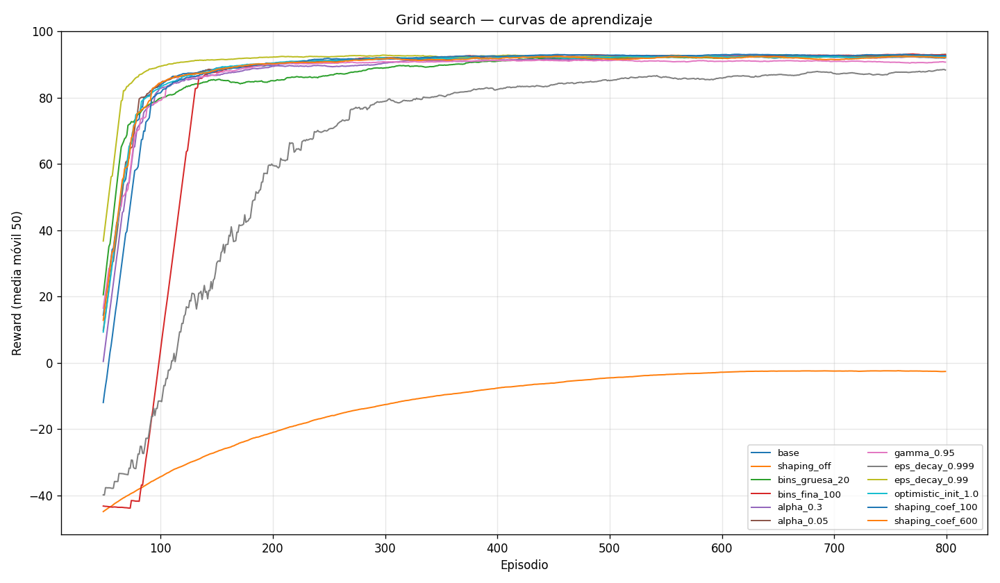
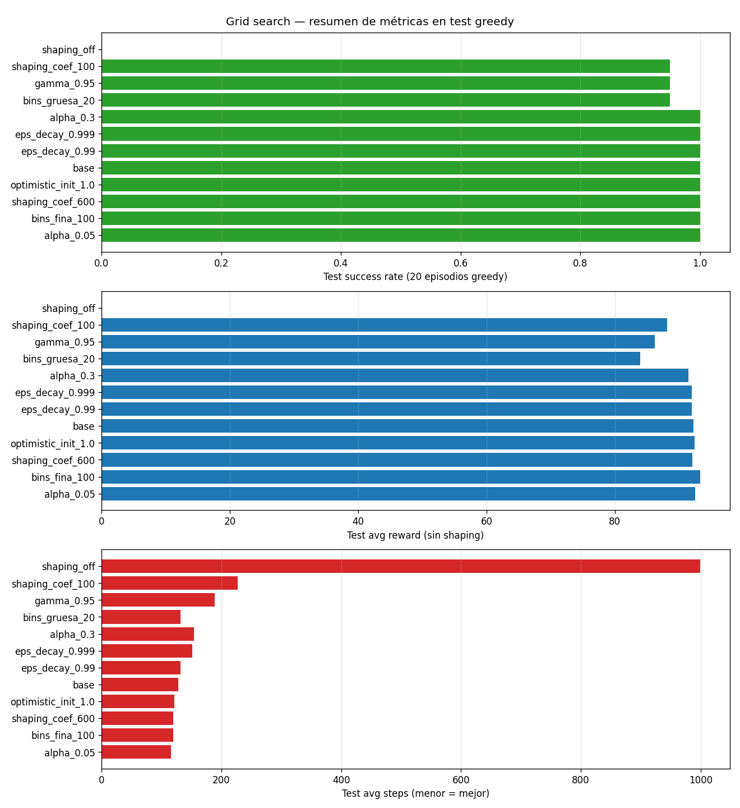
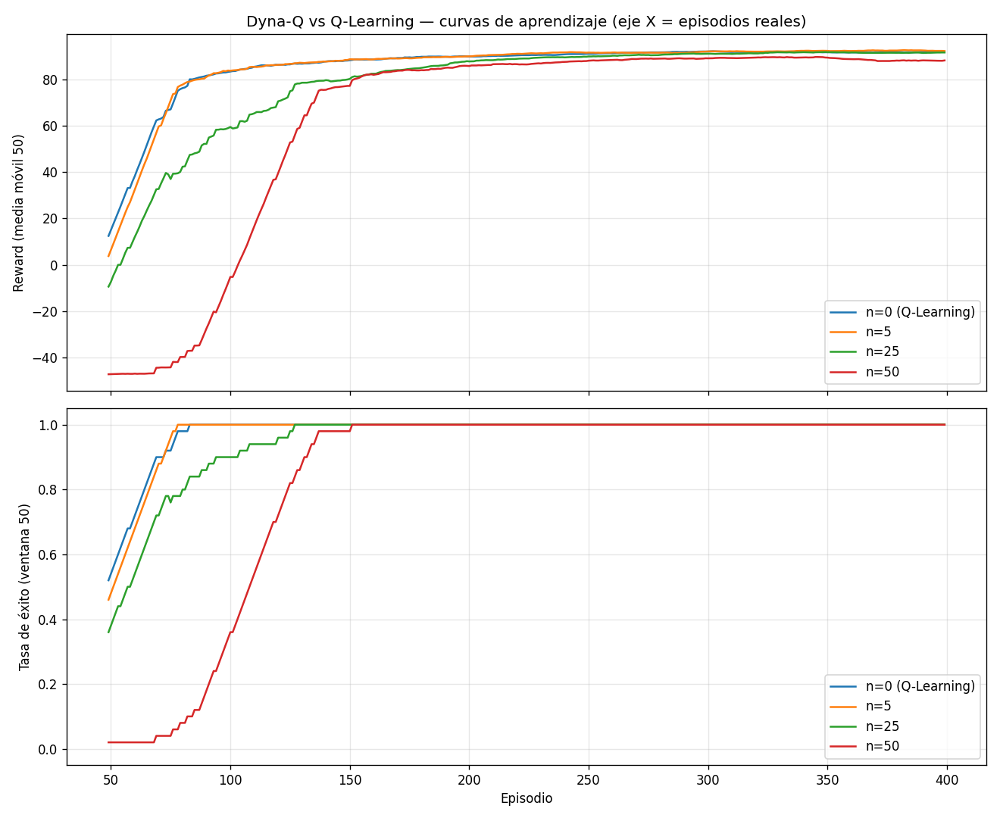
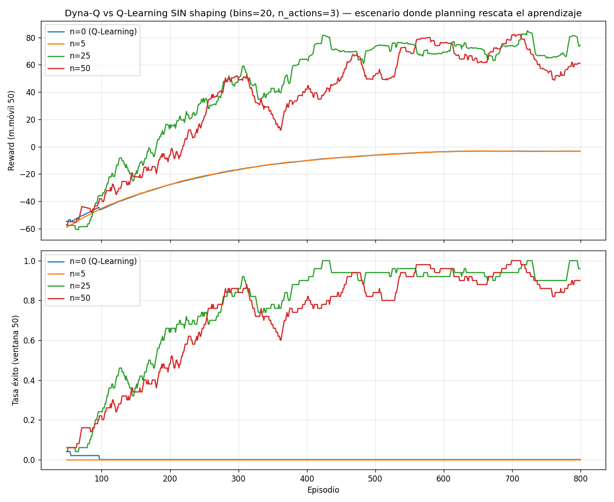

# Documentación Final — Obligatorio de Inteligencia Artificial (Marzo 2026)

**Materia:** Inteligencia Artificial — Ingeniería en Sistemas — Universidad ORT
**Proyecto:** Agente inteligente del rover marciano *"Out for Delivery"* (empresa ficticia *Red Destination™*)
**Integrantes:** equipo de 2 personas (por tamaño del grupo, no aplica la tarea adicional de Stochastic Q-Learning / MCTS)

> Este documento es la documentación de entrega. Reúne **todo** lo relevante de la resolución: qué hace cada agente, **cómo** se resolvió, **por qué** se tomó cada decisión, **qué caminos y errores** hubo y cómo se resolvieron, y **qué resultados** se obtuvieron. Cada afirmación está respaldada por el código y los artefactos del repositorio, y se puede **reproducir y verificar** con los comandos del Anexo B.

## Índice

- **0.** Resumen ejecutivo
- **1.** Contexto y consigna
- **2.** Proyecto LOST — Mountain Car Continuous (Q-Learning)
  - 2.1 Problema · 2.2 MDP · 2.3 Discretización · 2.4 Q-Learning · 2.5 Reward shaping · 2.6 Hiperparámetros · 2.7 Resultados · 2.8 Visualización de la política · 2.9 Dyna-Q · 2.10 Errores y auditorías · 2.11 Conclusiones
- **3.** Proyecto MATE — Isolation (Minimax / Expectimax)
  - 3.1 Problema · 3.2 Teoría · 3.3 Minimax + Alpha-Beta · 3.4 Funciones de evaluación · 3.5 Expectimax · 3.6 Metodología · 3.7 Resultados E1–E6 · 3.8 Modelo computado · 3.9 Errores y notas · 3.10 Conclusiones
- **4.** Tecnologías y librerías
- **5.** Entregables y estado
- **6.** Uso de IA generativa
- **Anexo A** — Cumplimiento de la consigna (checklist)
- **Anexo B** — Reproducibilidad y verificación (comandos y salidas reales)

---

# 0. Resumen ejecutivo

El obligatorio tiene **dos proyectos independientes**, de naturaleza distinta:

| | **LOST** | **MATE** |
|---|---|---|
| Ambiente | `MountainCarContinuous-v0` (Gymnasium) | Juego de mesa *Isolation* (4×4) |
| Paradigma | **Aprendizaje por refuerzo** | **Búsqueda adversarial** |
| Técnica | Q-Learning tabular + Dyna-Q | Minimax + Alpha-Beta + Expectimax |
| El agente… | **aprende** una política por prueba y error | **calcula** la mejor jugada simulando el árbol de juego |
| Resultado titular | Resuelve el ambiente al **100 %** (entrena en ~2–3 s) | A profundidad igualada, **Minimax > Expectimax** (46 % vs 34 %) contra el rival fuerte |

Cada proyecto vive en su propia carpeta con su **entorno Poetry separado**: `MountainCarContinuous/` (LOST) e `Isolation/` (MATE).

---

# 1. Contexto y consigna

*Red Destination™* contrata al equipo para implementar el agente del rover. La consigna pide dos proyectos:

- **LOST** (*Learning-based Orientation and Steering for Traversal*): controlar el rover en `MountainCarContinuous-v0` con **Q-Learning**, justificando la **discretización** y la **búsqueda de hiperparámetros**, e implementando **Dyna-Q** (Sutton & Barto, cap. 8.1–8.2) como componente de investigación.
- **MATE** (*Martian Adversarial Tactics Engine*): un agente para *Isolation* con **Minimax (con Alpha-Beta) y Expectimax**, decidiendo cuál conviene, con **funciones de evaluación** experimentables y un **registro completo** de resultados.

La entrega pide: código (`.py` + `.ipynb`), modelos computados (`.pkl`), un informe en PDF (≤ 20 págs. + anexos) y todo en un único `.zip`, con entornos Poetry separados.

---

# 2. Proyecto LOST — Mountain Car Continuous

## 2.1 El problema y por qué es difícil

En `MountainCarContinuous-v0` un auto en un valle debe llegar a la bandera de la cima. El motor **no tiene fuerza suficiente** para subir de frente: la única solución es **balancearse** (ir hacia atrás para tomar impulso y luego subir). La recompensa es **muy escasa (sparse)**:

- `−0.1·a²` por cada paso (penalización por gastar energía),
- `+100` solo al llegar a la meta (`x ≥ 0.45`).

Con una política aleatoria el auto casi nunca llega a la cima → la tabla Q queda en cero y el agente no aprende nada. Esto justifica las decisiones centrales del proyecto: **discretización adecuada**, **exploración prolongada** y, sobre todo, **reward shaping** bien hecho.

## 2.2 Modelado como MDP

| Componente | Decisión |
|---|---|
| Estado | observación continua `(x, v)` → discretizada a índices de grilla |
| Acciones | fuerza continua `a ∈ [−1, 1]` → discretizada a N acciones |
| Transición | desconocida para Q-Learning; **Dyna-Q la aprende** como modelo tabular |
| Reward | el real del ambiente (las métricas se reportan **sin shaping** para que sean comparables) |
| Fin | `terminated` = llegó a la meta; `truncated` = corte por límite de pasos (999) |

## 2.3 Discretización — `discretization.py`

Q-Learning tabular necesita espacios finitos. La clase `Discretizer` parametriza `n_bins_x`, `n_bins_v` y `n_actions`.

**Decisiones y por qué:**
- **Cortes uniformes** con `np.linspace` + `np.digitize`: es el método más simple, predecible y reproducible. Alternativas como cuantiles (sklearn) tendrían sentido si la distribución de estados fuese muy desbalanceada, pero el auto recorre todo el rango con razonable uniformidad.
- **`state_shape = (n_bins + 1, …)`**: `np.digitize` puede devolver el índice `len(bins)` en el extremo; el `+1` evita un *off-by-one* en el tamaño de Q.
- **Número impar de acciones** (3, 5, …): garantiza que exista la acción **`0.0` (no empujar)**, útil para no gastar energía cuando no hace falta.
- Se parametriza en una **clase** (no constantes globales) para poder comparar resoluciones en el grid search sin reescribir el agente.

El trade-off central: **más bins ⇒ tabla más expresiva pero más dispersa ⇒ necesita más exploración**. Por eso se compararon configuraciones gruesa (20×20), media (40×40) y fina (100×100). **La media (40×40, 5 acciones) ganó.**

## 2.4 Q-Learning — `q_learning_agent.py`

Regla de actualización off-policy TD (QL.pdf slide 6; Sutton & Barto 6.5):

```
Q(s,a) ← Q(s,a) + α·[ r + γ·max_a' Q(s',a') − Q(s,a) ]
```

**El código que la implementa** (núcleo del loop de entrenamiento — para que no haga falta abrir el archivo):

```python
def _epsilon_greedy(self, state):
    if random.random() < self.epsilon:                       # explorar
        return random.randint(0, self.discretizer.n_actions - 1)
    return int(np.argmax(self.Q[state]))                     # explotar (greedy)

# ... dentro del loop, por cada paso real:
action_idx = self._epsilon_greedy(state)
next_obs, reward, terminated, truncated, _ = env.step(self.discretizer.action_from_idx(action_idx))
next_state = self.discretizer.get_state(next_obs)
shaped     = self._shape(reward, obs, next_obs, terminated)
future     = 0.0 if terminated else float(np.max(self.Q[next_state]))   # ← clave (ver abajo)
td_error   = (shaped + self.gamma * future) - self.Q[state][action_idx]
self.Q[state][action_idx] += self.alpha * td_error           # ← regla de Q-Learning
```

Se ve la correspondencia **línea a línea** con el pseudocódigo del curso: la última línea es exactamente `Q(s,a) ← Q(s,a) + α·[ ... ]`.

**Decisiones de diseño:**
- **Q-Learning (off-policy) y no SARSA**: permite explorar con ε alto (necesario por el reward escaso) sin que esa exploración deteriore la política objetivo, que es siempre la greedy.
- **ε-greedy con decay exponencial por episodio** (no por paso): decaer por paso apaga la exploración demasiado rápido, antes de que el agente vea la meta siquiera una vez. Con `ε₀=1.0`, `decay=0.995`, la exploración tiene vida media de ~139 episodios.
- **`epsilon_min`** conserva exploración residual durante todo el entrenamiento.
- **`optimistic_init`** queda como flag para experimentar (Sutton & Barto 2.6); el mejor resultado no depende de ella.

**Decisión técnica clave — `terminated` vs `truncated`.** El slide del curso usa un único `done`. La API de Gymnasium ≥0.26 los separa, y la diferencia es teórica:

| Flag | Significado | Bootstrap futuro correcto |
|---|---|---|
| `terminated` | estado terminal del MDP (llegó a la meta) | `0` (no hay más decisiones) |
| `truncated` | timeout artificial (999 pasos) | `γ·max Q(s')` — sigue siendo un estado normal |

```python
# bootstrap = 0 SOLO si terminated; si truncated, s' NO es terminal → bootstrappear normal
future = 0.0 if terminated else float(np.max(self.Q[next_state]))
```

Tratar `truncated` como `terminated` es un **bug clásico** que sesga Q hacia abajo (lo tuvimos; ver §2.10, Bug 1).

**Persistencia:** `save()` guarda `Q` + config del discretizer + hiperparámetros, así `load()` reconstruye el agente completo. Tras cargar, ε queda en `epsilon_min` (para evaluar sin explorar).

## 2.5 Reward shaping — la decisión más determinante

El reward es tan escaso que sin ayuda el aprendizaje tabular casi no arranca. Se agregó **reward shaping**, y el *cómo* resultó más importante que el *cuánto*.

**El camino recorrido (un error real y su corrección):**
1. **Primer intento — shaping aditivo simple** (`reward += c·|v|`): el agente **colapsaba**: aprendía un poco y después se "olvidaba", porque podía acumular recompensa **oscilando indefinidamente** sin llegar a la meta. El shaping aditivo **cambia la política óptima**.
2. **Solución — shaping *potential-based*** (Ng, Harada & Russell, 1999):

   ```
   F(s,s') = γ·Φ(s') − Φ(s),   con Φ(s) = coef·|v|
   reward_shaped = reward + F(s,s')
   ```

   El teorema NHR-99 garantiza que esta forma **no cambia la política óptima**, solo acelera el aprendizaje. Premiar **aumentos** de `|v|` empuja a acumular momento — la estrategia física correcta. Con este cambio el agente pasó de **0 % a 100 % de éxito** en menos de 100 episodios.

**El código (función `_shape`):**

```python
def _shape(self, reward, obs, next_obs, terminated):
    if not self.reward_shaping:
        return reward
    _, v = obs;  _, v_next = next_obs
    phi      = self.shaping_coef * abs(v)
    phi_next = 0.0 if terminated else self.shaping_coef * abs(v_next)   # Φ(terminal) = 0
    return reward + self.gamma * phi_next - phi                          # r + γ·Φ(s') − Φ(s)
```

**Sutileza del estado terminal (otro error corregido, ver §2.10 Bug 5):** por convención NHR, `Φ(terminal) = 0` (la línea `phi_next = 0.0 if terminated ...`), así que en el paso final se aplica `r + γ·0 − Φ(s) = r − Φ(s)`, **no** `r` puro. Devolver `r` puro sobre-premia los estados pre-meta con velocidad alta.

**Decisión metodológica:** las curvas y métricas usan el **reward real sin shaping**, para que las corridas con y sin shaping sean comparables.

## 2.6 Búsqueda de hiperparámetros — `grid_search.py`

**Estrategia One-At-A-Time (OAT):** partir de una **config base** validada por el smoke test y variar **un hiperparámetro a la vez** (12 corridas en vez de cientos).
- **Ventaja:** interpretable (cada mejora/empeora se atribuye a un cambio concreto) y rápida.
- **Costo aceptado:** no detecta *interacciones* entre hiperparámetros (queda asentado como limitación).

**Métricas definidas *a priori*:** `train_success_rate_last100`, `train_avg_reward_last100`, `convergence_ep` (primer episodio con ventana móvil de 50 ≥ 90 % éxito), `test_success_rate`, `test_avg_reward`, `test_avg_steps`.

**Criterio de "mejor":** (1) maximizar `test_success_rate`, (2) entre empates, **minimizar `test_avg_steps`** (política más eficiente), (3) desempate por `test_avg_reward`. Razón: entre configs que resuelven, llegar en menos pasos es un proxy más limpio de calidad y reduce el costo acumulado de acciones.

## 2.7 Resultados del grid y elección final

**Config base:** `bins=40, n_actions=5, α=0.1, γ=0.99, ε_decay=0.995, shaping coef=300`.

Resultados (post-corrección de bugs, ordenados por eficiencia):

| Run | conv@ | test_succ | test_reward | test_steps |
|---|---|---|---|---|
| **alpha_0.05** ⭐ | 73 | 100 % | 92.48 | **115.8** |
| bins_fina_100 | 128 | 100 % | **93.27** | 119.2 |
| shaping_coef_600 | 72 | 100 % | 92.06 | 120.1 |
| optimistic_init_1.0 | 73 | 100 % | 92.43 | 121.4 |
| base | 72 | 100 % | 92.25 | 127.9 |
| eps_decay_0.99 | 62 | 100 % | 92.03 | 131.5 |
| eps_decay_0.999 | 175 | 100 % | 91.99 | 151.2 |
| alpha_0.3 | 77 | 100 % | 91.48 | 153.8 |
| bins_gruesa_20 | 64 | **95 %** | 83.94 | 131.5 |
| gamma_0.95 | 75 | **95 %** | 86.22 | 189.2 |
| shaping_coef_100 | 86 | 95 % | 88.11 | 226.8 |
| **shaping_off** | — | **0 %** | 0.00 | 999.0 |





**Lecturas clave:**
- **Sin shaping no aprende** (`shaping_off`: 0 % éxito). Es el resultado más contundente.
- `coef=300` es el mejor coeficiente (100 demasiado débil, 600 ya no mejora).
- La discretización **fina (100×100)** logra reward levemente mayor pero **converge casi 2× más lento** (tabla más dispersa); en este ambiente no compensa.
- `α`, `optimistic_init`, `ε_decay=0.99`: entre las que resuelven, son de segundo orden.

**Config ganadora:** `bins=40, n_actions=5, α=0.05, γ=0.99, ε_decay=0.995, shaping coef=300`. Re-entrenada con **2000 episodios** (`train_best.py`) y guardada en `MountainCarContinuous/models/q_learning_best.pkl` (verificado abriendo el `.pkl`: `Q.shape=(41,41,5)`, ~65 % de celdas no-cero):

| Métrica | Valor |
|---|---|
| Tiempo de entrenamiento | **~2–3 s** |
| Test success (greedy) | **100 %** |
| Test avg reward | **~92** |
| Test avg steps | **~120** |


Que el ambiente se resuelva al 100 % entrenando en segundos confirma que el cuello de botella nunca fue la complejidad del problema, sino tener el **shaping matemáticamente correcto** y una **discretización adecuada**.

## 2.8 Verificación visual de la política — `visualize_policy.py`

Más allá de las métricas, se **inspeccionó** la política en el espacio `(x, v)`:


- **V(s)** dibuja una "banana" cuyo valor crece siguiendo la trayectoria real del agente.
- **π(s)** (solo en estados visitados — las celdas no visitadas se **enmascaran honestamente**) muestra el patrón clásico **"pump-and-go"**: cuando `v < 0` predomina la acción **−1** (76.7 %, empujar hacia atrás para acumular momento) y cuando `v > 0` predomina **+1** (54.9 %), con un 29.3 % de acción **0** (no gastar energía cuando la gravedad ya ayuda).

Este hallazgo solo se descubre **mirando** la política, no en las métricas escalares, y confirma que la política aprendida es razonable y no un artefacto del shaping.

## 2.9 Dyna-Q — componente de investigación — `dyna_q_agent.py`

`DynaQAgent` **hereda de `QLearningAgent`** y agrega un **modelo del ambiente** + **planning** (Sutton & Barto §8.2):
- guarda `Model(s,a) → (reward_shaped, s', terminated)`;
- por cada paso real, hace `planning_steps` actualizaciones **simuladas** con la **misma regla** de Q-Learning.

**El código (lo que se agrega por cada paso real, sobre el loop de Q-Learning):**

```python
self._q_update(state, action_idx, shaped, next_state, terminated)   # (d) update con experiencia REAL
self.model[(state, action_idx)] = (shaped, next_state, terminated)  # (e) guardar transición en el modelo
self._planning()                                                    # (f) n updates SIMULADOS

def _planning(self):
    keys = list(self.model.keys())
    for _ in range(self.planning_steps):
        (s, a) = random.choice(keys)               # (s,a) ya observado, al azar
        shaped_r, s2, term = self.model[(s, a)]    # recupero la transición guardada
        self._q_update(s, a, shaped_r, s2, term)   # MISMA regla que la experiencia real
```

La clave del algoritmo es que `_q_update` es **idéntico** para la experiencia real y para el planning: las simulaciones del modelo se tratan exactamente igual que las observaciones reales.

**Decisiones:**
- **El modelo guarda el reward *shaped*** (lo que el agente vio), no el crudo: así el planning repite la misma señal de aprendizaje, sin re-aplicar shaping (que requeriría las observaciones continuas, no los índices discretos).
- **Modelo determinista (overwrite)**: el ambiente es determinista, así que sobrescribir la última transición de cada `(s,a)` es correcto. Para ambientes estocásticos haría falta Dyna-Q+ (fuera de alcance).

**Experimento 1 — con shaping** (misma config que el mejor Q-Learning, `n ∈ {0,5,25,50}`):

| n | conv@ | test_succ | test_reward | test_steps | tiempo |
|---|---|---|---|---|---|
| 0 (Q-Learning) | 73 | 100 % | **94.00** | **89.4** | 0.9 s |
| 5 | 73 | 100 % | 93.18 | 94.3 | 3.1 s |
| 25 | 104 | 100 % | 93.34 | 112.9 | 9.7 s |
| 50 | 133 | 100 % | 90.11 | 153.6 | 19.3 s |



**Con shaping efectivo, Dyna-Q no aporta** (incluso más planning empeora): cada paso real ya lleva una señal fuerte, y replicar transiciones de un modelo incompleto amplifica Q-values ruidosas. El costo crece lineal en `n`, como predice el libro.

**Experimento 2 — sin shaping** (escenario "hard", reward escaso, bins 20×20):

| n | conv@ | train_succ | test_succ | test_steps |
|---|---|---|---|---|
| 0 (Q-Learning) | — | 0 % | 0 % | 999 |
| 5 | — | 0 % | 0 % | 999 |
| 25 | 306 | 93 % | 0 % | 999 |
| 50 | 459 | 88 % | **75 %** | 389 |



**Sin shaping, Q-Learning puro nunca aprende, pero Dyna-Q con n=50 llega a 75 % de éxito**: el planning amortiza la experiencia escasa, propagando cada llegada accidental a la meta. Esto valida la hipótesis de Sutton & Barto en el régimen donde el libro la formula.

**Lectura crítica (la conclusión fina, no la naïve):** *el valor de Dyna-Q depende de cuán informativa sea cada transición real.* Con shaping potential-based efectivo, Q-Learning solo alcanza y es más rápido; sin shaping, Dyna-Q con mucho planning es necesario.

**Modelo Dyna-Q final:** `n=5` con shaping (mejor Dyna-Q con planning real), en `models/dyna_q_best.pkl` (verificado: `planning_steps=5`, modelo con 5299 transiciones).

**Comparación final entregables:**

| Modelo | test_succ | test_reward | test_steps | Episodios |
|---|---|---|---|---|
| q_learning_best (n=0, α=0.05) | 100 % | ~92 | ~120 | 2000 |
| dyna_q_best (n=5, α=0.05) | 100 % | **~93** | **~100** | **400** |

Dyna-Q logra una política igual o mejor con **5× menos episodios reales** — porque con 400 ep × 5 planning ve un volumen de updates similar al Q-Learning de 2000 ep. En *episodios reales* gana Dyna-Q; en *updates totales* están a la par.

## 2.10 Errores encontrados y cómo se resolvieron (3 auditorías)

Se hicieron **tres rondas de auditoría**. Esta trazabilidad es parte del trabajo: varios "ganadores" iniciales lo eran por bugs.

**Auditoría 1 — lógica de entrenamiento vs API Gymnasium:**
- **Bug 1 (alto) — bootstrap incorrecto al `truncated`:** se hacía `done = terminated or truncated` y se bootstrappeaba 0. Corregido a bootstrappear 0 **solo** con `terminated`. *Impacto:* `gamma_0.95` pasó de **10 % a 100 %** de éxito; todas las configs mejoraron o se mantuvieron.
- **Bug 2 (bajo) — detección de meta por valor mágico:** se usaba `reward >= 99.0`; se cambió a usar el flag canónico `terminated` (robusto si cambiara la magnitud del reward).
- **Bug 3 (medio) — ε no se reseteaba entre llamadas a `train_agent`:** se agregó `reset_epsilon=True` (default) para reproducibilidad.
- **Bug 4 (claridad) — `max_steps`:** se subió a 10000 para que el `TimeLimit` del env sea la fuente de verdad del timeout y `max_steps` solo sea red de seguridad.
- **Mejoras:** docstring con el pseudocódigo del curso; criterio de "mejor" por pasos; visualización de la política con enmascarado honesto.

**Auditoría 2 — aplicación correcta de NHR-99:**
- **Bug 5 (alto) — shaping no se aplicaba al paso terminal:** el código devolvía `r` puro en el terminal en vez de `r − Φ(s)`. *Consecuencia:* **sobre-premiaba estados pre-meta** con velocidad alta, y varias configs "ganaban por casualidad" (`bins_gruesa_20` pasó de 72.8 a 131.5 pasos / de 100 % a 95 % tras el fix; el modelo ganador cambió de `bins=20,α=0.1` a `bins=40,α=0.05`). **Lección metodológica:** un bug que produce métricas plausibles (100 % éxito, curva convergente) sobrevive a las defensas obvias; solo la **revisión teórica cruzada con el material original** lo detectó.
- También se completó el notebook end-to-end (8 secciones) y se re-ejecutaron todos los experimentos.

**Auditoría 3 — consistencia y ergonomía del repo:**
- **Issue 9/10 — docstrings/referencias desactualizadas** (config vieja, referencia a la sección equivocada): alineados con el código.
- **Issue 11 (alto, ergonomía) — colisión de paths:** `grid_search.py` y `train_best.py` guardaban en el mismo `.pkl`; correr uno pisaba el modelo del otro. Se separó: el grid guarda en `q_learning_grid_best.pkl` y `train_best.py` queda dueño de `q_learning_best.pkl`.
- **Hallazgo (no fix):** cargar el modelo + re-entrenar 100 ep con `reset_epsilon=True` **mejora** la política (de 127 a 85 pasos): la re-exploración escapa de óptimos locales. Documentado como mejora futura; no se aplicó para no dispersar el foco.

## 2.11 Conclusiones de LOST

- La decisión **más determinante** fue el **reward shaping potential-based correctamente implementado** (con `Φ(terminal)=0`).
- La discretización **40×40, 5 acciones** es el mejor equilibrio resolución/dispersión.
- El mejor Q-Learning es `α=0.05`; resuelve el ambiente al **100 %** entrenando en segundos.
- **Dyna-Q** no supera a Q-Learning cuando el shaping ya hace densa la señal, pero **es indispensable sin shaping** — la lección fina del componente de investigación.
- El proyecto quedó **matemáticamente correcto, API-correcto, reproducible y consistente** tras las tres auditorías.

---

# 3. Proyecto MATE — Isolation

## 3.1 El problema y el simulador

*Isolation* es un juego **adversarial, de suma cero, dos jugadores alternados**, sobre un tablero **4×4**. En su turno, cada jugador **mueve su ficha** a una casilla adyacente libre **y destruye** una casilla. **Pierde quien se queda sin movimientos.**

El simulador viene **dado y completo** en `Isolation/` (no se modifica). Mapeo al formalismo del teórico:

| Concepto | Implementación dada |
|---|---|
| Estado inicial | `Board((4,4))` con dos fichas colocadas al azar |
| `Acciones(s)` | `board.get_possible_actions(player)` → `(dirección, celda_a_destruir)` |
| `Suc(s,a)` | `board.clone()` + `board.play(action, player)` |
| `EsFinal(s)` | `board.is_end(player) -> (bool, ganador)` |
| `Utilidad(s)` | +1 / −1 según el ganador |

**Interfaz del agente** (`agent.py`): `next_action(obs)` y `heuristic_utility(board)`.

**Oponentes provistos:** `RandomAgent` (estocástico) y `Stratagem` (ofuscado; deofuscado resulta ser un **Minimax de profundidad 3** — el **baseline fuerte** a vencer).

**Por qué es difícil:** cada acción combina **dirección × celda a destruir**, así que en apertura hay **~100 acciones por jugada**; a profundidad 3 son ~10⁶ nodos. Esto motiva **Alpha-Beta** y **profundidad acotada**.

## 3.2 Marco teórico

Basado en `MiniMax.md` (S. Yovine, ORT) y AIMA cap. 5:
- **Minimax con profundidad limitada** (lám. 13): el agente maximiza, el rival minimiza, y al corte se usa `Eval(s)`.
- **Alpha-Beta** (AIMA 5.3): poda ramas que no afectan la decisión; devuelve **la misma jugada** que Minimax con menos nodos.
- **Expectimax** (lám. 8): si el rival es estocástico, sus nodos son **de azar** (`Σ σ·V`).
- **Buena evaluación** (lám. 16): ordena terminales como la utilidad real, barata, y correlaciona con ganar.

## 3.3 Minimax con Alpha-Beta — `minimax_agent.py`, `search.py`

`search.py` provee el núcleo funcional (`successors`, `is_terminal`, `utility`, `NodeCounter`). Sobre él, `MinimaxAgent` implementa `V_max,min(s,d)` con un método `_minimax` que devuelve `(mejor_acción, valor)`.

**Decisiones y por qué:**
- **Profundidad fija** (no iterative deepening): es el modelo del teórico (lám. 13); en 4×4 una profundidad 3–4 ya da buen juego. Iterative deepening + límite de tiempo agregaría código y riesgo sin estar pedido → queda como mejora opcional. Se priorizó **fidelidad al material**.
- **Alpha-Beta como flag** (`use_alpha_beta`) sobre el mismo núcleo, con **ordenamiento de movimientos** (explora primero las jugadas de mayor/menor evaluación según el nodo): la poda es máxima cuando se ven primero las jugadas prometedoras.

**El código (recursión Alpha-Beta — el mismo núcleo sirve para Minimax puro quitando los `break`):**

```python
def _alphabeta(self, board, player_to_move, depth, alpha, beta):
    done, winner = is_terminal(board, player_to_move)
    if done:      return None, utility(winner, self.player)     # ±1 (perspectiva del agente)
    if depth == 0: return None, self.heuristic_utility(board)   # corte: Eval(s)

    if player_to_move == self.player:                  # nodo MAX (juega el agente)
        best_val, best_action = float("-inf"), None
        for action, child in self._ordered_successors(board, player_to_move):
            _, v = self._alphabeta(child, other(player_to_move), depth-1, alpha, beta)
            if v > best_val: best_val, best_action = v, action
            if best_val > beta: break                  # ← poda β
            alpha = max(alpha, best_val)
        return best_action, best_val
    else:                                              # nodo MIN (juega el rival)
        best_val, best_action = float("inf"), None
        for action, child in self._ordered_successors(board, player_to_move):
            _, v = self._alphabeta(child, other(player_to_move), depth-1, alpha, beta)
            if v < best_val: best_val, best_action = v, action
            if best_val < alpha: break                 # ← poda α
            beta = min(beta, best_val)
        return best_action, best_val
```

Es exactamente `V_max,min(s,d)` del teórico (utilidad terminal / `Eval` al corte / `max` en el agente / `min` en el rival), con la ventana `(alpha, beta)` que poda las ramas que no pueden cambiar la decisión.

**Verificación de corrección (clave para el análisis de impacto).** Sobre **292 estados** (40 seeds × 4 aperturas × profundidades {2,3}):
- **0** diferencias de valor (la poda nunca cambia la decisión),
- **0** diferencias de acción con el ordenamiento desactivado,
- **0** casos con `nodos(AB) > nodos(Minimax)`,
- poda global del **89.8 %**.

> Sutileza documentada: con ordenamiento activo, ante **empates de valor** Alpha-Beta puede elegir otra jugada **igualmente óptima**. Por eso la equivalencia *de acción* se exige solo con el ordenamiento apagado; la equivalencia *de valor* se cumple siempre.

**Experimento E1 — impacto de Alpha-Beta** (`plots/e1_alpha_beta.png`):

| Profundidad | Nodos Minimax | Nodos Alpha-Beta | Reducción |
|---|---|---|---|
| 2 | 436 | 87 | **80 %** |
| 3 | 3 653 | 934 | **74 %** |
| 4 | 13 785 | 1 235 | **91 %** |


La reducción **crece con la profundidad** (a d=4, ~11× menos nodos y ~4× menos tiempo). Alpha-Beta es la palanca que vuelve viable buscar más hondo.

## 3.4 Funciones de evaluación — `evaluation.py`

Cuatro componentes combinables por pesos (`Eval(s) = Σ wᵢ·hᵢ(s)`), todas desde la perspectiva del jugador:

| ID | Heurística | Definición |
|---|---|---|
| h1 | Movilidad propia | casillas adyacentes libres del agente |
| h2 | Diferencia de movilidad | `mov_propia − mov_rival` |
| h3 | Control de centro | `−dist_Manhattan(agente, centro)` |
| h4 | Acorralar | celdas destruidas alrededor del rival − alrededor mío |

**Por qué estas componentes:** en Isolation **perder = quedarse sin movimientos**, así que la **movilidad** es la señal más correlacionada con ganar; **h2** captura la suma cero; **h3** preserva movilidad futura; **h4** ataca la condición de derrota del rival. Las cuatro **replican y generalizan la heurística de `Stratagem`**, dando un punto de comparación honesto.

**El código (una heurística + el combinador):**

```python
def h2_mobility_diff(board, player):       # diferencia de movilidad (captura la suma cero)
    return float(free_adjacent(board, player) - free_adjacent(board, _other(player)))

def weighted_eval(weights):                # devuelve una eval_fn(board, player) = Σ wᵢ·hᵢ(s)
    active = [(HEURISTICS[k], float(w)) for k, w in weights.items() if w != 0]
    def eval_fn(board, player):
        return sum(w * h(board, player) for h, w in active)
    return eval_fn
```

`weighted_eval` se **inyecta** al agente (`MinimaxAgent(..., eval_fn=weighted_eval(pesos))`), lo que permite comparar ponderaciones sin tocar el código de búsqueda.

**Decisión de medida:** la movilidad se cuenta como **casillas adyacentes libres** (estilo `has_valid_moves`), **no** `len(get_possible_actions)`, que infla el valor al multiplicar por cada celda destruible.

## 3.5 Expectimax — `expectimax_agent.py`

Igual estructura que Minimax, pero los nodos del rival son **de azar** con `σ` **uniforme**:

```python
prob = 1.0 / len(succ)             # σ uniforme sobre las acciones legales
expected = sum(prob * V(child) for _, child in succ)
```

**Sin Alpha-Beta**: los nodos de azar **promedian** todas las ramas (no hay corte por cota), así que la poda no aplica.

**Hipótesis a confirmar (no asumir):** Minimax supone rival óptimo (cota inferior garantizada); Expectimax supone rival uniforme. → vs Random (estocástico) ambos bien; vs Stratagem (determinista) el modelo uniforme es **incorrecto**, se espera **Minimax ≥ Expectimax**.

## 3.6 Metodología experimental — `match.py` + `isolation.ipynb`

**Diseño apareado (decisión de rigor).** Como existe una **ventaja de primer jugador** fuerte y la colocación es aleatoria, **cada seed se juega dos veces** (nuestro agente de jugador 1 y de jugador 2) **sobre la misma posición**. Así la comparación no depende de quién arrancó ni de qué posiciones tocaron. Es más riguroso que solo alternar lados con seeds distintos (el enfoque inicial).

**Métricas:** win rate; **nodos y tiempo por jugada de NUESTRO agente** (`a_nodes_per_move`, `a_avg_move_time`) — medidos por separado de cada jugador, para que el costo no quede contaminado por el del rival (p. ej. el lento Minimax d=3 de Stratagem).

**Parámetros finales:** `N_RANDOM=100`, `N_SELF=100`, `N_STRAT=40`, `N_HEUR=30` **seeds** (cada seed = 2 partidas). Registro completo en `results.csv` (**1568 filas**); corrida ≈ 15 min.

> **Por qué los pesos base `{1,2,0.5,1}` en E1–E5 no sesgan la decisión:** son una ponderación neutra elegida *antes* de conocer el torneo. La comparación de técnicas y el análisis de Alpha-Beta son **robustos** a esa elección (ambos agentes comparten la misma `eval_fn`). E6 explora **por separado** cuál ponderación es la mejor.

## 3.7 Resultados E1–E6 y la decisión técnica

**E2 — vs Random:** Minimax **96 %**, Expectimax **94.5 %**. Ambos dominan al azar.

**E3 — vs Stratagem, por profundidad** (`plots/e2_e3_winrate.png`):

| Técnica | d=2 | d=3 (parejo con Stratagem) |
|---|---|---|
| Minimax | 39 % | **46 %** |
| Expectimax | 48 % | 34 % |


**E4 — directo (d=2):** Minimax 44 % / Expectimax 56 %.

**Costo por agente a d=3:** Expectimax cuesta **0.59 s y ~24 100 nodos/jugada** vs **0.13 s y ~1 300** de Minimax (~4.5× más lento, ~18× más nodos: **no poda**).

**E5 — profundidad:** Minimax vs Stratagem **27 % → 39 % → 46 %** (d=1,2,3): buscar más hondo ayuda, monótono.


**E6 — torneo de heurísticas** (`plots/e6_heatmap.png`):

| Ponderación | Win rate prom. |
|---|---|
| **`solo_mov_diff`** (solo h2) | **0.700** |
| `mov+centro` | 0.578 |
| `balanceada` | 0.483 |
| `mov+acorralar` | 0.239 |


**La diferencia de movilidad sola (h2) es la mejor**: agregarle otras componentes la **diluye**.

**Conclusión — "¿cuál técnica es mejor?": depende del oponente y de la profundidad.**
- vs rival **estocástico** (Random): ambas dominan.
- vs rival **determinista** (Stratagem), **a profundidad igualada (d=3) gana Minimax** (46 % vs 34 %) y además es mucho más barato. Profundizar **mejora** a Minimax y **empeora** a Expectimax (propagar más hondo un modelo de rival uniforme, incorrecto para Stratagem, degrada el juego). **Confirma la predicción teórica.**

## 3.8 Modelo computado — `mate_best_config.pkl`

Minimax/Expectimax **no entrenan** un modelo, pero la experimentación **computa** la mejor configuración. Se serializa un dict (verificado abriendo el `.pkl`):

```python
{'tecnica': 'minimax', 'profundidad': 3, 'pesos': {'h2': 1.0},
 'metricas': {'win_rate_vs_stratagem_dmax': 0.463, 'win_rate_vs_random': 0.96, 'e6_mejor_winrate_promedio': 0.7}}
```

**Por qué entregamos `.pkl`:** la *Auditoría* pide, **en general**, "modelos computados (.pkl o similares)"; la penalización estricta solo nombra LOST. Ante la ambigüedad y por costo mínimo, se entrega igual; serializar la mejor configuración hace **reproducible** el agente ganador. Se descartó precalcular una tabla de toda la posición 4×4 **por sobrecomplicación**.

## 3.9 El camino recorrido: errores y cómo se resolvieron

- **Entorno Poetry roto (en una de las máquinas):** `poetry` fallaba (`packaging` viejo) y `poetry install` "a secas" no instalaba (proyecto sin paquete). **Solución:** actualizar `packaging`/`platformdirs` en el intérprete de Poetry, e instalar con `poetry install --no-root`. Documentado para el equipo.
- **Pasada rápida y un hallazgo sorpresa (resuelto):** una primera corrida con N chico y nuestros agentes a d=2 (contra el d=3 de Stratagem) mostró a **Expectimax superando a Minimax** vs Stratagem, lo que **contradecía la hipótesis**. En vez de forzar la teoría, se midió **a profundidad igualada (d=3)** y se vio que era un **artefacto de profundidad**: a d=3 Minimax gana. *Las conclusiones se ajustaron a la evidencia, no al revés.*
- **Bug al reconstruir el notebook:** un script de edición matcheaba el texto `"BASE_SEED"`, que también aparecía en la celda de funciones auxiliares, y la pisó (dejó `make_board` indefinido). **Solución:** restaurar desde Git y reconstruir el notebook con un único script que **solo agrega** celdas. Lección: editar celdas de notebook por contenido es frágil.
- **Pesos/duplicación y métricas:** se agregaron `pandas` y `matplotlib` al entorno de MATE (necesarios para el CSV y los gráficos que pide la consigna) vía `poetry add`, ajustando versiones para Python 3.10.
- **Mejoras de rigor aplicadas (segunda corrida):** se reemplazó el "alternar lados" por **diseño apareado**, y se agregó **medición de tiempo por agente** (`match.py` devuelve el tiempo de cada jugador). Las conclusiones **no cambiaron**, pero quedaron más rigurosas y se sumó el argumento de **costo** a favor de Minimax.

**Notas de advertencia:**
- **Bug del oponente `Stratagem` como jugador 2 (no es nuestro código):** su Minimax interno evalúa **su propia derrota como 0 en vez de −1** cuando juega de jugador 2 (verificado con un test directo). Lo hace algo **más débil de segundo**; no se corrige (no se tocan archivos dados), pero el **diseño apareado balancea** el efecto.
- **Ventaja de primer jugador (medida, controlada):** nuestro agente gana **48 % arrancando** vs **35 % de segundo**; el diseño apareado lo neutraliza.
- **Costo de `get_possible_actions`:** el simulador clona el tablero por cada dirección; en búsqueda profunda este costo domina. Limitación del simulador dado, mitigada con Alpha-Beta y profundidad acotada.

## 3.10 Conclusiones de MATE

- **Alpha-Beta** poda hasta el **91 %** de los nodos (a d=4) **sin cambiar la decisión** (verificado sobre 292 estados): es el análisis de impacto pedido.
- **Minimax es la mejor técnica** contra el rival determinista a profundidad igualada (46 % vs 34 %), y además **mucho más barato** que Expectimax (que no poda). La respuesta a "cuál conviene" es **"depende del oponente y la profundidad"**, con evidencia.
- La **diferencia de movilidad sola (h2)** es la mejor función de evaluación.
- El framework experimental (diseño apareado, métricas por agente, registro a CSV) hace las comparaciones **justas y reproducibles**.

---

# 4. Tecnologías y librerías

| Tecnología | Dónde | Para qué |
|---|---|---|
| **Python ~3.10** | ambos | Lenguaje base |
| **Poetry** | ambos (entornos **separados**) | Gestión de dependencias/entornos |
| **Gymnasium** | LOST (dep. en MATE) | Ambiente `MountainCarContinuous-v0`; API `reset/step`, `terminated`/`truncated` |
| **NumPy** | ambos | Tabla Q, discretización (`linspace`, `digitize`), grilla del tablero |
| **Matplotlib** | ambos | Gráficos (curvas, política, win rates, heatmaps) |
| **Pygame** | LOST | Render del ambiente |
| **pandas** | MATE | Tablas y `results.csv` de experimentos |
| **tabulate** | MATE | Render del tablero en consola |
| **pickle** | ambos | Modelos `.pkl` (Q + config en LOST; dict de config en MATE) |
| **Jupyter / ipykernel / notebook** | ambos | Notebooks `.ipynb` |
| **JSON / CSV** | LOST / MATE | Registro de resultados |

> Nota: LOST usa la convención `[tool.poetry]` (Poetry clásico) y MATE `[project]` (PEP 621) — coherente con el reparto del trabajo entre los integrantes.

---

# 5. Entregables y estado

**LOST (`MountainCarContinuous/`):** código `.py` (discretizer, agentes, scripts), notebook `continuous_mountain_car.ipynb` (28 celdas, corre end-to-end), modelos en `models/` (`q_learning_best.pkl`, `dyna_q_best.pkl`, `q_learning_grid_best.pkl`, `smoke_test.pkl`), resultados `.json` y 8 gráficos en `plots/`.

**MATE (`Isolation/`):** código `.py` (`search`, `minimax_agent`, `expectimax_agent`, `evaluation`, `match`), notebook `isolation.ipynb` (32 celdas, corre end-to-end), `results.csv` (1568 filas), 4 gráficos en `plots/`, y `mate_best_config.pkl`.

**Pendiente / a revisar antes del `.zip`:**
- **Informe en PDF:** esta documentación está en markdown; falta exportarla a **PDF** (formato que pide la consigna).
- **Duplicación de modelos de LOST:** los `.pkl` aparecen en varias carpetas (`models/` raíz, `MountainCarContinuous/models/`, `resultados_lost/`, `resultados_lost_tmp/`) con nombres distintos. La fuente canónica es `MountainCarContinuous/models/` (donde escriben los scripts); conviene **dejar un solo set** en el `.zip`.
- **`mate_best_config.pkl` está en `.gitignore`** (`*.pkl`): existe en disco; recordar **incluirlo en el `.zip`**.

---

# 6. Uso de IA generativa

Conforme exige la consigna, se declara el uso de IA generativa (Claude, de Anthropic, vía Claude Code):
- **Redacción** de la documentación a partir de la planificación y los PDFs de teoría.
- **Generación de código** de LOST (`Discretizer`, `QLearningAgent`, `DynaQAgent`) y de MATE (`MinimaxAgent` con Alpha-Beta, `ExpectimaxAgent`, `evaluation.py`, `match.py` y el framework de experimentos), consumiendo la API del simulador provisto sin modificarlo.
- **Análisis y discusión** de resultados (grid search de LOST; experimentos E1–E6 de MATE).

Todo el contenido producido por la IA fue **revisado, ejecutado y verificado** por el equipo antes de incorporarlo. Los errores que pueda haber son responsabilidad del equipo.

---

# Anexo A — Cumplimiento de la consigna (checklist)

Cada punto de la consigna, con su estado y **dónde se demuestra** en este documento.

### Proyecto LOST
| Requisito de la consigna | Estado | Dónde se demuestra |
|---|---|---|
| Discretización de observaciones y acciones, **justificando la elección y su impacto** | ✅ | §2.3 (decisiones) + §2.7 (impacto medido: gruesa/media/fina en el grid) |
| Técnica: **Q-Learning** | ✅ | §2.4 (regla + código + correspondencia con el pseudocódigo del curso) |
| **Exploración de hiperparámetros**, justificando la evaluación y la elección final | ✅ | §2.6 (método OAT + métricas + criterio) y §2.7 (resultados + elección) |
| Componente de investigación: **Dyna-Q** + análisis/experimentación | ✅ | §2.9 (implementación + 2 experimentos: con y sin shaping) |
| **Al menos un modelo computado** para el primer ejercicio (obligatorio) | ✅ | `MountainCarContinuous/models/q_learning_best.pkl` (+ `dyna_q_best.pkl`) |

### Proyecto MATE
| Requisito de la consigna | Estado | Dónde se demuestra |
|---|---|---|
| **Minimax con Alpha-Beta** + **análisis de su impacto** | ✅ | §3.3 (código + verificación de equivalencia sobre 292 estados + experimento E1) |
| **Expectimax** + decidir cuál técnica es mejor | ✅ | §3.5 + §3.7 (E2–E4: conclusión con evidencia) |
| **Funciones de evaluación** + combinaciones y **ponderaciones** | ✅ | §3.4 (h1–h4 + `weighted_eval`) + §3.7 (torneo E6) |
| **Definir pruebas + registro completo** de resultados | ✅ | §3.6 (metodología) + `Isolation/results.csv` (1568 filas) |

### Contenido del informe y entrega
| Requisito | Estado | Dónde |
|---|---|---|
| Resumen del abordaje: **interacción con el simulador, parámetros, tiempo de ejecución, resultados** | ✅ | §2.4/§3.6 (interacción y parámetros), §2.7/§2.9/§3.7 (tiempos y resultados), Anexo B (tiempos consolidados) |
| **Apoyo visual** (gráficos claros + comentarios) | ✅ | 10 gráficos incrustados en §2 y §3 |
| **Notas de advertencia** (dificultades y por qué) | ✅ | §2.10 (bugs de LOST) y §3.9 (errores y notas de MATE) |
| Código `.py` + `.ipynb` | ✅ | ambos proyectos |
| Modelos computados (`.pkl`) | ✅ | LOST `models/` + MATE `mate_best_config.pkl` |
| Entornos **Poetry separados** | ✅ | `MountainCarContinuous/pyproject.toml` y `Isolation/pyproject.toml` |

---

# Anexo B — Reproducibilidad y verificación (comandos y salidas reales)

Todo es reproducible con semillas fijas. Acá están los comandos exactos y las **salidas reales** que **demuestran** las afirmaciones del informe, sin necesidad de leer el código.

## B.1 Preparación del entorno (una vez por proyecto)

```bash
# En cada carpeta (MountainCarContinuous/ y Isolation/):
poetry install --no-root        # instala dependencias (el proyecto es de archivos planos, sin paquete)
```

> Si Poetry falla con `No module named 'packaging.licenses'`, actualizar en el intérprete de Poetry:
> `<python-de-poetry> -m pip install --upgrade "packaging>=24.2" "platformdirs>=4.3.6"`.

## B.2 LOST — comandos

```bash
cd MountainCarContinuous
poetry run python smoke_test.py        # valida la pipeline (500 ep): ~100% éxito, reward ~+92
poetry run python grid_search.py       # 12 configuraciones (OAT) → grid_search_results.json + plots
poetry run python train_best.py        # re-entrena la ganadora (2000 ep) → models/q_learning_best.pkl
poetry run python compare_dyna_q.py    # Dyna-Q vs Q-Learning (con y sin shaping)
poetry run python visualize_policy.py  # mapas de V(s) y π(s)
```

Reproducibilidad: todos usan **semilla 42** (`random`, `numpy` y `env.reset(seed=42)` en el primer reset). Los resultados reportados en §2.7 y §2.9 provienen de `grid_search_results.json`, `dyna_q_comparison.json` y `dyna_q_no_shaping.json`, y los modelos guardados (`*.pkl`) fueron abiertos y verificados: `q_learning_best.pkl` tiene la config ganadora (`40×40`, `5` acciones, `α=0.05`, `γ=0.99`, shaping `coef=300`, `Q.shape=(41,41,5)`, ~65 % de celdas no-cero) y `dyna_q_best.pkl` tiene `planning_steps=5` con un modelo de 5299 transiciones.

## B.3 MATE — comandos y salidas reales

Cada archivo `.py` trae un *smoke test* con aserciones. **Salida real:**

```text
$ poetry run python search.py
OK Paso 1

$ poetry run python evaluation.py        # heurísticas verificadas con tableros de valor conocido
OK Paso 4

$ poetry run python minimax_agent.py
[Paso 2] MinimaxAgent(d=2) vs RandomAgent: 29/30 = 97% win rate
[Paso 3] Equivalencia OK en 7 estados (d=3). Nodos Minimax=37988, Alpha-Beta=6554 -> poda 83%
OK Paso 3: Alpha-Beta da el mismo valor que Minimax expandiendo menos nodos

$ poetry run python expectimax_agent.py
[Paso 5] ExpectimaxAgent(d=2) vs RandomAgent: 29/30 = 97% win rate
[Paso 5] Expectimax vs Stratagem: corrio sin errores
OK Paso 5: Expectimax vence a Random y corre frente a Stratagem

$ poetry run python match.py             # misma seed → mismo resultado (reproducible)
OK Paso 0: partidas reproducibles con misma seed

# El notebook completo (experimentos E1–E6 + gráficos + .pkl) corre de punta a punta:
$ poetry run jupyter nbconvert --to notebook --execute --inplace isolation.ipynb   # 0 errores, ~15 min
```

## B.4 Demostración: Alpha-Beta es correcto (no solo más rápido)

Comparación exhaustiva Minimax vs Alpha-Beta sobre **292 estados** (40 semillas × 4 aperturas × profundidades {2,3}). **Salida real:**

```text
Estados probados: 292
Diferencias de valor (AB vs Minimax): 0          ← la poda NUNCA cambia la decisión
Diferencias de accion (AB sin orden vs Minimax): 0
Casos nodos(AB) > nodos(Minimax): 0              ← AB nunca expande más que Minimax
Nodos: Minimax=1637094, Alpha-Beta=166193, reduccion=89.8%
```

Esto es el **análisis de impacto** pedido por la consigna: misma jugada, ~90 % menos nodos.

## B.5 Demostración: el bug del oponente `Stratagem` (no es nuestro código)

`Stratagem` (oponente dado) evalúa mal su propia derrota cuando juega de jugador 2. *Probe directo sobre su función interna deofuscada,* **salida real:**

```text
Stratagem(1) en su derrota: -1   (correcto: -1)
Stratagem(2) en su derrota:  0   (debería ser -1, da 0 = BUG)
```

Por eso `Stratagem` es algo más débil de jugador 2. No se corrige (no se tocan archivos dados); el **diseño apareado** (§3.6) balancea el efecto entre las variantes comparadas.

## B.6 Tiempos de ejecución (consolidado)

| Tarea | Tiempo aprox. |
|---|---|
| LOST — smoke test (500 ep) | segundos |
| LOST — entrenamiento del modelo final (2000 ep) | **~2–3 s** |
| LOST — grid search completo (12 × 800 ep) | ~minutos |
| MATE — un `next_action` de Minimax a d=4 (Alpha-Beta) | ~0.08 s |
| MATE — corrida completa de experimentos E1–E6 | **~15 min** (dominada por los ~560 partidos vs Stratagem) |
