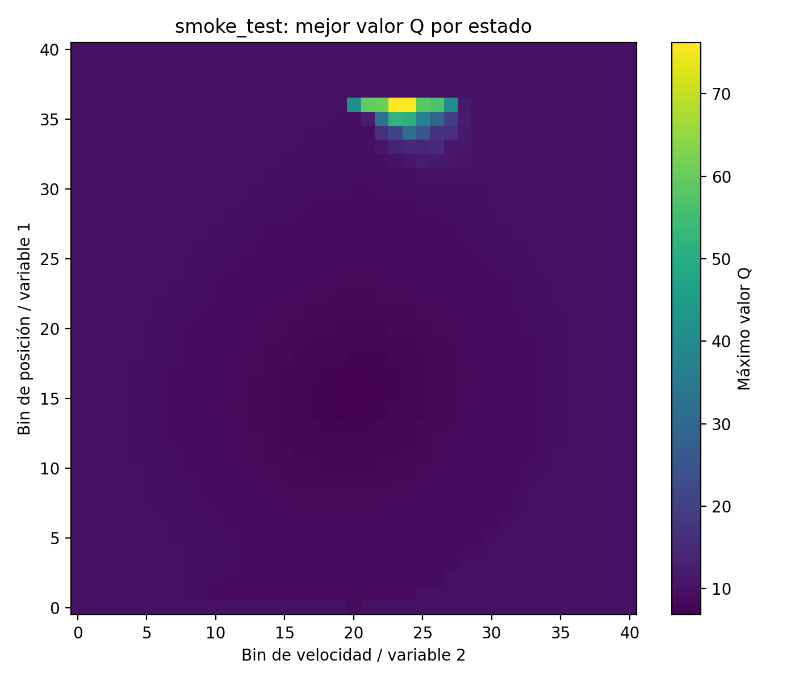
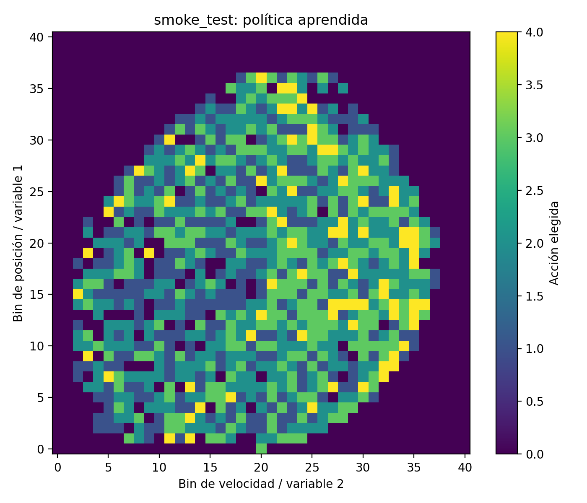
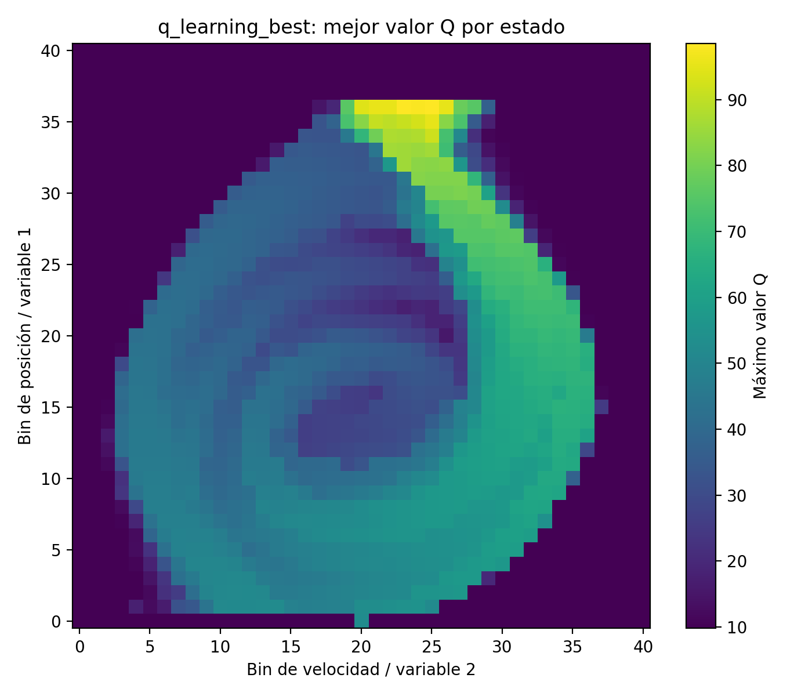
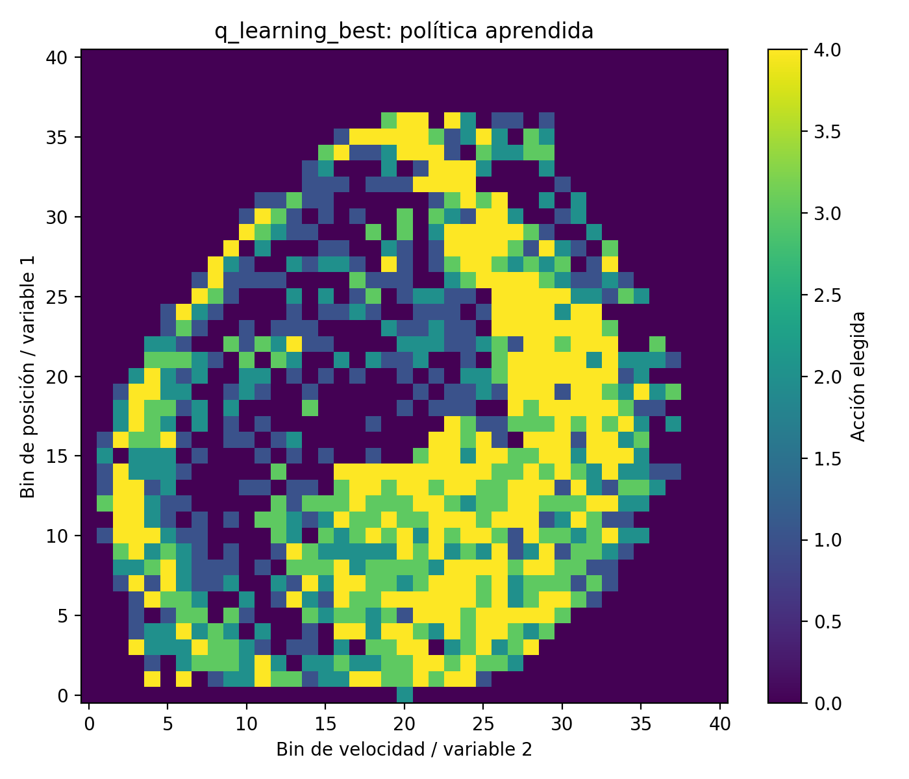
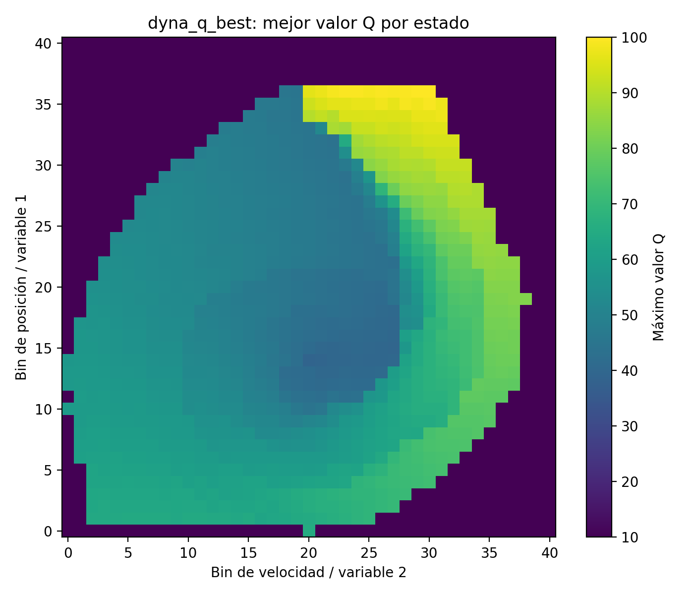
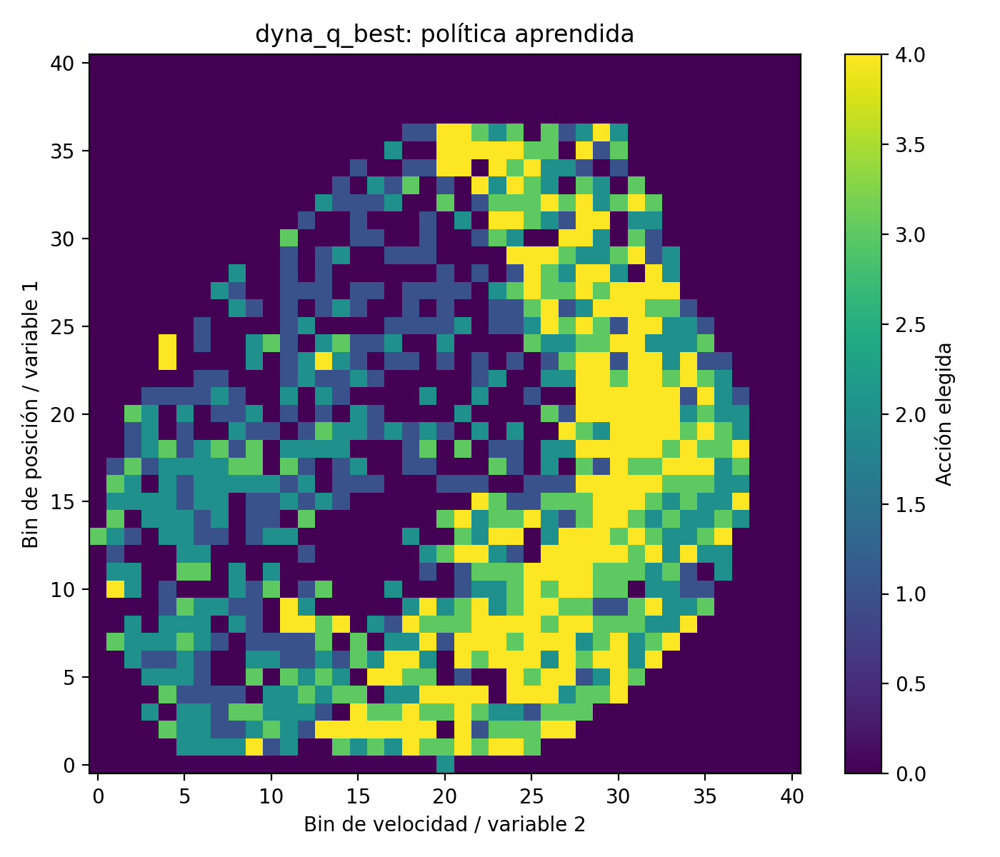
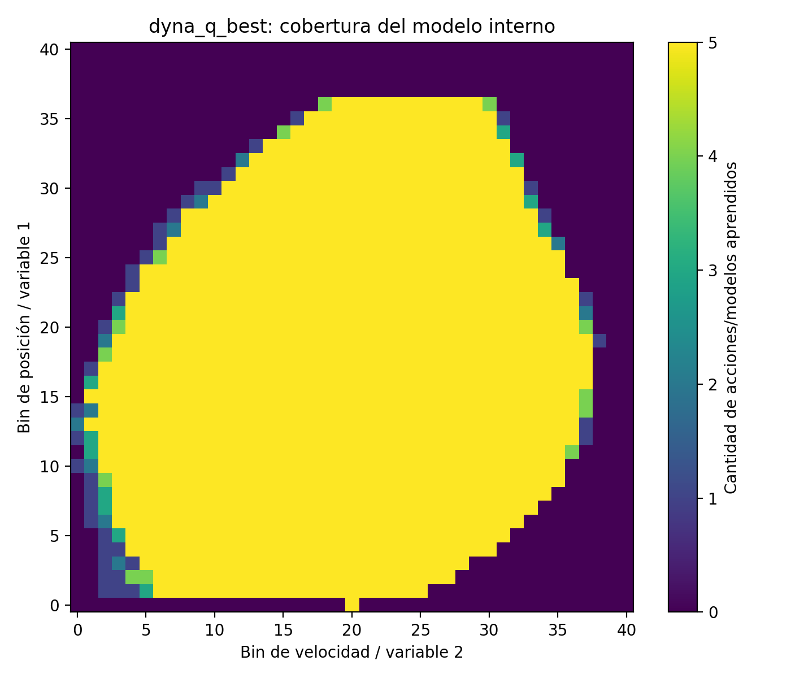

# Visualización de modelos entrenados

Los archivos `.pkl` contienen los modelos entrenados utilizados en el proyecto. En particular, guardan las tablas Q aprendidas por los algoritmos de aprendizaje por refuerzo.

Se agregan imágenes `.png` generadas a partir de esos modelos. Estas visualizaciones permiten inspeccionar el comportamiento aprendido sin tener que ejecutar el código.

## Archivos incluidos

- `smoke_test.pkl`: modelo utilizado para prueba inicial.
- `q_learning_best.pkl`: mejor modelo entrenado con Q-Learning.
- `dyna_q_best.pkl`: mejor modelo entrenado con Dyna-Q.

## Smoke test

### Mejor valor Q por estado

Esta imagen muestra, para cada estado discretizado, el valor Q máximo entre todas las acciones posibles.

### Política aprendida

Esta imagen muestra qué acción elige el modelo en cada estado, tomando la acción con mayor valor Q.

## Q-Learning

### Mejor valor Q por estado

### Política aprendida

## Dyna-Q

### Mejor valor Q por estado

### Política aprendida

### Cobertura del modelo interno

Esta imagen muestra cuántas transiciones fueron aprendidas por el modelo interno de Dyna-Q para cada estado discretizado.

## Nota

Los archivos `.pkl` se mantienen en el repositorio porque son los modelos entrenados. Las imágenes `.png` se agregan únicamente para facilitar la visualización desde GitHub.
